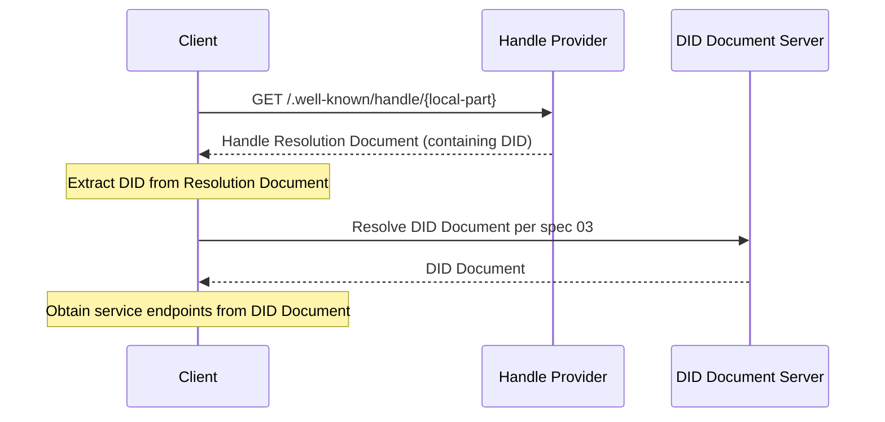
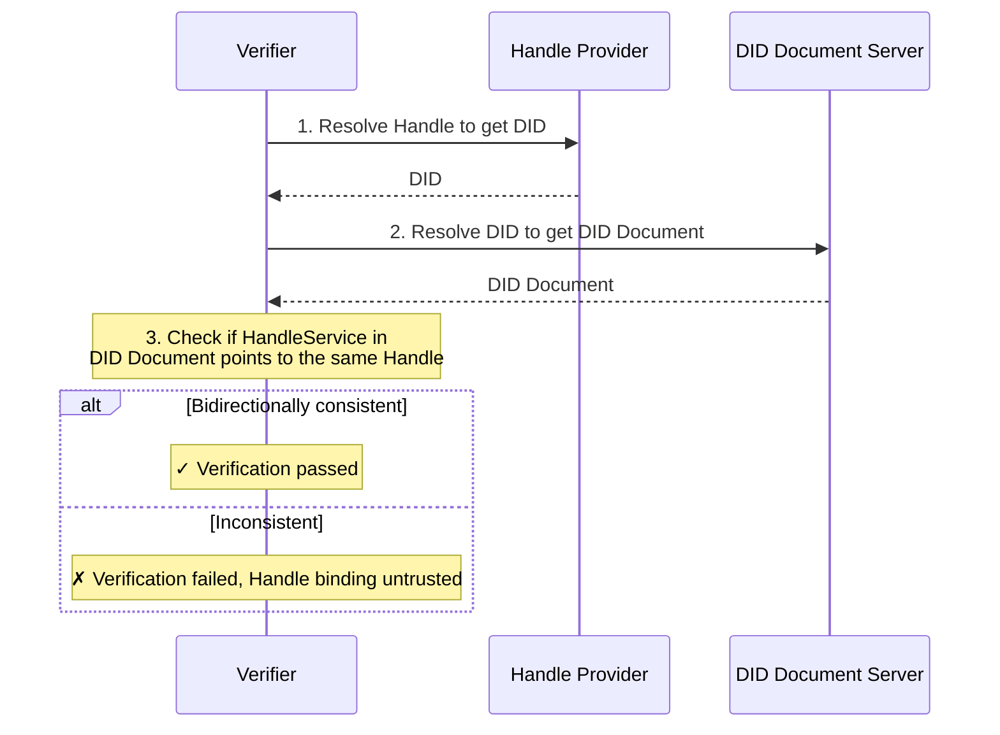

# ANP-DID:WBA Name Space Specification (Draft)

Abbreviation: WNS (WBA Name Space)

Note: This specification is still in draft status and will undergo further optimization and iteration.

## Abstract

This specification defines WNS (WBA Name Space), a human-readable namespace based on did:wba. WNS introduces Handles (e.g., `alice.example.com`) as readable aliases for `did:wba` DIDs. Through a standardized resolution process, Handles are mapped to DIDs, which are then resolved to DID Documents and service capabilities according to the [did:wba Method Specification](03-did-wba-method-design-specification.md).

Handles address the human-unfriendliness of DID identifiers—identifiers like `did:wba:example.com:user:alice` are machine-friendly but difficult to remember and share. WNS provides an experience similar to email addresses or social platform usernames while maintaining full integration with the ANP protocol stack.

## 1. Background and Motivation

### 1.1 Problem Statement

The `did:wba` method provides decentralized identity capabilities for agents (see [did:wba Method Specification](03-did-wba-method-design-specification.md)), but its identifier format is not human-friendly:

- **Hard to remember**: `did:wba:example.com:user:alice` contains method prefixes, domain names, and path structures, resulting in lengthy identifiers
- **Hard to share**: Sharing DID identifiers through social channels is inconvenient and error-prone
- **Hard to input**: The user experience of manually entering DID identifiers is poor

These problems are particularly acute in scenarios such as:
- Sharing agent identifiers through social channels
- Entering recipients in instant messaging
- Referencing agent identities in business cards, documents, or verbal communication

### 1.2 Design Goals

The design goals of WNS include:

1. **Human-readable**: Provide short, memorable, and easy-to-type aliases like `alice.example.com`
2. **Domain-independent**: Any entity with a domain name and TLS certificate can host a Handle service, without depending on a specific centralized platform
3. **Deterministic resolution**: The mapping from Handle to DID is explicit, and the resolution process is standardized
4. **Bidirectional binding**: Handles and DIDs support bidirectional verification to prevent unilateral tampering
5. **Protocol integration**: Seamless integration with the existing ANP protocol stack (specifications 03/07/08/09)
6. **Minimal design**: Only defines the core naming and resolution mechanisms, without specifying Handle registration, management, or other business processes

### 1.3 Relationship with Existing Protocols

- **03-did:wba Method Specification**: WNS Handles are readable aliases for did:wba DIDs; Handle resolution ultimately relies on specification 03 to obtain the DID Document
- **07-Agent Description Protocol**: After Handle resolution, the DID Document's service section leads to the Agent Description document
- **08-Agent Discovery Protocol**: Handle Providers can serve as supplementary entry points for agent discovery
- **09-End-to-End Instant Messaging Protocol**: Handles can be used for displaying and inputting recipients; message routing remains DID-based

## 2. Terminology

| Term | Definition |
|------|------------|
| **Handle** | A human-readable short identifier in the format `local-part.domain`, e.g., `alice.example.com` |
| **Handle Provider** | The domain party that hosts the Handle resolution service and maintains Handle-to-DID mappings |
| **Local Part** | The user identifier portion of a Handle, e.g., `alice` in `alice.example.com` |
| **Domain** | The domain portion of a Handle, e.g., `example.com` in `alice.example.com` |
| **DID Binding** | The one-to-one mapping relationship from a Handle to a DID |
| **Handle Resolution** | The process of resolving a Handle to a DID |
| **WNS** | WBA Name Space, the namespace system defined by this specification |
| **Handle Resolution Document** | The JSON document returned by the Handle Resolution Endpoint, containing Handle-to-DID mapping information |

## 3. Handle Format Specification

### 3.1 Handle Syntax

Handles use DNS-style syntax in the format `local-part.domain`.

**ABNF Definition:**

```abnf
handle     = local-part "." domain
local-part = (ALPHA / DIGIT) *61(ALPHA / DIGIT / "-") (ALPHA / DIGIT)
domain     = ; A valid Fully Qualified Domain Name (FQDN), see RFC 1035
```

**Syntax Rules:**

- The local-part MUST contain only ASCII lowercase letters `a-z`, digits `0-9`, and hyphens `-`
- The local-part MUST begin and end with a letter or digit
- The local-part MUST NOT contain consecutive hyphens `--`
- The local-part MUST be 1 to 63 characters in length
- The domain MUST be a valid FQDN protected by a TLS/SSL certificate
- All input MUST be normalized to lowercase before processing

**Examples:**

```
alice.example.com          ✓ Valid
bob-smith.example.com      ✓ Valid
agent-42.example.com       ✓ Valid
a.example.com              ✓ Valid (single-character local-part)
-alice.example.com         ✗ Invalid (starts with hyphen)
alice-.example.com         ✗ Invalid (ends with hyphen)
al--ice.example.com        ✗ Invalid (consecutive hyphens)
Alice.Example.com          → Normalized to alice.example.com
```

### 3.2 URI Representation

To clearly identify Handles in sharing contexts, the `wba://` prefix MAY be used:

```
wba://alice.example.com
```

The `wba://` prefix is used solely for sharing and identification purposes and is semantically equivalent to the Handle itself. Clients MUST strip the `wba://` prefix before performing standard resolution.

> Note: `wba://` has not been registered with IANA as a formal URI scheme. Implementers MAY also use the following Web URL as an alternative:
> ```
> https://{domain}/.well-known/handle/{local-part}
> ```

### 3.3 Reserved Word Principles

Handle Providers SHOULD maintain reserved word lists to prevent certain local-parts from being registered. The protocol defines the following reserved word categories; specific lists are determined by each Handle Provider:

**a) Protocol reserved words**: Words that conflict with ANP protocol keywords, such as `did`, `agent`, `well-known`, `service`, etc.

**b) System reserved words**: Words that conflict with common system functions, such as `admin`, `root`, `system`, `api`, etc.

**c) Anti-phishing reserved words**: Words that could be used for phishing or confusion attacks, such as `support`, `security`, `official`, etc.

Handle Providers SHOULD publish their reserved word lists.

## 4. Handle Resolution Protocol

### 4.1 Resolution Flow

Handle resolution follows this flow:

```
Handle → Handle Resolution Endpoint → DID → DID Document → service
```



### 4.2 Handle Resolution Endpoint

The Handle Resolution Endpoint is a standardized HTTP endpoint provided by the Handle Provider:

- **URL**: `https://{domain}/.well-known/handle/{local-part}`
- **Method**: `GET`
- **Response Content-Type**: `application/json`

Where `{domain}` is the domain portion of the Handle and `{local-part}` is the user identifier portion.

**Example Request:**

```http
GET /.well-known/handle/alice HTTP/1.1
Host: example.com
Accept: application/json
```

### 4.3 Handle Resolution Document

The JSON document returned by the Handle Resolution Endpoint has the following format:

```json
{
  "handle": "alice.example.com",
  "did": "did:wba:example.com:user:alice",
  "status": "active",
  "updated": "2025-01-01T00:00:00Z"
}
```

**Field Descriptions:**

| Field | Required/Optional | Description |
|-------|-------------------|-------------|
| `handle` | Required | The complete Handle identifier |
| `did` | Required | The did:wba DID bound to this Handle |
| `status` | Required | The current Handle status; see Section 4.7 |
| `updated` | Optional | Last update time in ISO 8601 format |

### 4.4 Handle-to-DID Mapping Rules

Handles and DIDs have a one-to-one correspondence maintained by the Handle Provider. The mapping follows these rules:

1. **Domain consistency**: The domain portion of the Handle MUST match the domain in the DID
2. **Unique binding**: A Handle MUST be bound to exactly one DID
3. **Local-part uniqueness**: The local-part MUST be unique within the same domain

**Mapping Example:**

```
Handle:  alice.example.com
DID:     did:wba:example.com:user:alice
```

**Optional Public Key Fingerprint Extension:**

Handle Providers MAY include a public key fingerprint in the DID path, allowing users to verify that the DID has not been tampered with by the platform:

```
Handle:  alice.example.com
DID:     did:wba:example.com:user:alice:k1_7bBxAgQKofnbXCCWruQP8rarUZpHmQzTssCTTapbn2w
```

The `k1_` prefix indicates a key identifier, followed by the public key fingerprint. The specific hash algorithm and encoding are defined by the Handle Provider. The fingerprint mechanism allows users to independently verify that the DID bound to a Handle corresponds to their expected public key, preventing the Handle Provider from pointing the Handle to a tampered DID.

### 4.5 did:wba Standard Resolution

After obtaining the DID, the DID Document MUST be resolved according to the [did:wba Method Specification](03-did-wba-method-design-specification.md).

Implementers MUST NOT bypass the DID Document and directly infer service endpoints or other DID-related information from the Handle. The DID Document is the authoritative source for agent capabilities and services.

### 4.6 Handle Uniqueness Constraints

- A Handle MUST be bound to exactly one DID
- The local-part MUST be unique within the same domain
- Different domains MAY have the same local-part (decentralized model)

For example, `alice.example.com` and `alice.other.com` are two different Handles pointing to different DIDs.

### 4.7 Handle Status

Handles have three possible states:

| Status | Description |
|--------|-------------|
| `active` | Normal state; the Handle can be resolved |
| `suspended` | Suspended; temporarily unresolvable, can be restored |
| `revoked` | Revoked; permanently unresolvable |

### 4.8 Error Responses

The Handle Resolution Endpoint SHOULD return the following standard HTTP status codes:

| Status Code | Meaning | Description |
|-------------|---------|-------------|
| `200 OK` | Resolution successful | Returns the Handle Resolution Document |
| `404 Not Found` | Handle does not exist | The local-part has never been registered or has been deleted |
| `410 Gone` | Handle permanently revoked | The Handle previously existed but has been revoked |
| `301 Moved Permanently` | Handle has migrated | The Location header points to the new Resolution Endpoint |

**Error Response Example:**

```json
{
  "error": "handle_not_found",
  "message": "The handle 'bob.example.com' does not exist"
}
```

## 5. Profile URL

### 5.1 Profile Entry Point

Handle Providers MAY provide a Profile entry point for each Handle. The following URL formats are recommended:

- Subdomain style: `https://{local-part}.{domain}/`
- Path style: `https://{domain}/{local-part}/`

### 5.2 Profile Format

Profiles are business-level documents. This specification only defines the URL entry point for Profiles and does not constrain their content format. The specific content and presentation of Profiles are defined by Handle users and Handle Providers.

## 6. Reverse Verification (Bidirectional Binding)

To prevent malicious Handle Providers from mapping arbitrary Handles to others' DIDs, WNS defines a bidirectional binding verification mechanism.

### 6.1 Handle Provider Declaration (Forward)

The Handle Provider declares the Handle-to-DID mapping through the Resolution Endpoint. This is part of the standard resolution flow (Section 4).

### 6.2 DID Document Declaration (Reverse)

The DID holder adds a `HandleService` type entry in the `service` section of their DID Document, declaring their associated Handle:

```json
{
  "id": "did:wba:example.com:user:alice#handle",
  "type": "HandleService",
  "serviceEndpoint": "https://example.com/.well-known/handle/alice"
}
```

**Field Descriptions:**

- `id`: Unique identifier for the service; using the `#handle` suffix is recommended
- `type`: MUST be `HandleService`
- `serviceEndpoint`: URL pointing to the Handle Resolution Endpoint

### 6.3 Verification Flow

Verifiers SHOULD check declarations in both directions to ensure consistency:



**Verification Steps:**

1. Resolve the Handle via the Handle Resolution Endpoint to obtain the DID
2. Resolve the DID according to specification 03 to obtain the DID Document
3. Find entries of type `HandleService` in the DID Document's `service` section
4. Check whether the entry's `serviceEndpoint` points to the same Handle's Resolution Endpoint

If both directions are consistent, the binding relationship is trusted; otherwise, it SHOULD be treated as untrusted and the user SHOULD be warned.

## 7. Integration with the ANP Protocol Stack

### 7.1 Integration with DID Document (Spec 03)

A new `HandleService` type is added to the DID Document's `service` section to support reverse verification (Section 6).

```json
{
  "service": [
    {
      "id": "did:wba:example.com:user:alice#ad",
      "type": "AgentDescription",
      "serviceEndpoint": "https://example.com/agents/alice/ad.json"
    },
    {
      "id": "did:wba:example.com:user:alice#handle",
      "type": "HandleService",
      "serviceEndpoint": "https://example.com/.well-known/handle/alice"
    }
  ]
}
```

### 7.2 Integration with Agent Description Protocol (Spec 07)

Agent Description documents MAY include an optional `handle` field:

```json
{
  "protocolType": "ANP",
  "protocolVersion": "1.0.0",
  "type": "AgentDescription",
  "did": "did:wba:example.com:user:alice",
  "handle": "alice.example.com",
  "name": "Alice's Agent",
  "description": "..."
}
```

The `handle` field is optional and facilitates other agents in obtaining a human-readable identifier.

### 7.3 Integration with Agent Discovery Protocol (Spec 08)

In the collection returned by `.well-known/agent-descriptions`, each entry MAY include an optional `handle` field:

```json
{
  "@type": "ad:AgentDescription",
  "name": "Alice's Agent",
  "@id": "https://example.com/agents/alice/ad.json",
  "handle": "alice.example.com"
}
```

Additionally, the Handle Provider's `/.well-known/handle/` path MAY serve as a supplementary entry point for agent discovery.

### 7.4 Integration with Instant Messaging Protocol (Spec 09)

Handles can be used for displaying and inputting recipients in instant messaging scenarios:

- Users can specify message recipients by entering a Handle (e.g., `alice.example.com`)
- Clients resolve the Handle to a DID for message routing
- Message interfaces can display Handles instead of DIDs for improved readability

Message routing and transport remain DID-based; Handles are used only at the human-computer interaction level for display and input.

## 8. Handle Provider Requirements

### 8.1 Resolution Service Requirements

Handle Providers MUST meet the following requirements:

- MUST provide the resolution service over HTTPS
- MUST implement the `/.well-known/handle/{local-part}` endpoint
- SHOULD support HTTP caching headers (`Cache-Control`, `ETag`); Handle resolution is a high-frequency operation, and caching can significantly reduce server load
- SHOULD implement rate limiting to prevent abuse

### 8.2 Handle Management

- Handle Providers are responsible for Handle allocation and lifecycle management
- Handle registration processes, identity verification methods, and length policies are defined by each Handle Provider
- Handle Providers MUST ensure Handle uniqueness within the same domain

### 8.3 Handle Migration

Users may need to migrate their Handle from one Handle Provider to another. During migration:

- The old Handle Provider SHOULD return a `301 Moved Permanently` redirect, with the `Location` header pointing to the new Handle Provider's Resolution Endpoint
- Both old and new Handle Providers SHOULD maintain resolution capability during the migration period
- The DID holder needs to update the `HandleService` in their DID Document to point to the new Handle Provider

## 9. Security Considerations

### 9.1 Domain Security

The security model of WNS is consistent with the did:wba method, relying on the TLS/SSL certificate system. The domain portion of a Handle MUST be protected by a valid TLS certificate. The security of a Handle Provider is equivalent to the security of its domain and TLS configuration.

### 9.2 Phishing and Confusion Attacks

WNS mitigates phishing and confusion risks through the following mechanisms:

- The local-part is restricted to ASCII lowercase letters, digits, and hyphens, avoiding Unicode homograph attacks
- Handle Providers SHOULD maintain reserved word lists (see Section 3.3)
- Clients SHOULD visually emphasize the domain portion when displaying Handles to help users identify the source

### 9.3 Handle Squatting

Handle Providers SHOULD take measures to prevent malicious squatting, including but not limited to:

- Maintaining reserved word lists
- Implementing registration review mechanisms
- Providing dispute resolution processes

Specific policies are defined by each Handle Provider.

### 9.4 Privacy Considerations

- The Handle Resolution Endpoint reveals Handle existence (through 200 vs 404 responses); Handle Providers SHOULD implement rate limiting to slow down enumeration attacks
- Handle Providers SHOULD NOT return sensitive information beyond the mapping relationship in the Resolution Endpoint

### 9.5 Anti-Tampering

The optional public key fingerprint extension (see Section 4.4) provides users with the ability to independently verify DID integrity. Combined with bidirectional binding verification (Section 6), this effectively prevents Handle Providers from unilaterally tampering with Handle-to-DID mappings.

## 10. Use Cases

### 10.1 Social Sharing

User Alice can share `wba://alice.example.com` on social media. Other users who see it can:

1. Recognize the `wba://` prefix and strip it to get the Handle `alice.example.com`
2. Resolve the Handle to obtain the DID
3. Obtain Alice's agent description and service endpoints through the DID Document
4. Establish interaction with Alice's agent

### 10.2 Inter-Agent Communication

Agent A needs to communicate with Agent B whose Handle is `bob.example.com`:

1. Resolve the Handle `bob.example.com` to obtain the DID
2. Resolve the DID Document per specification 03
3. Obtain the AgentDescription endpoint from the DID Document's service section
4. Fetch the Agent Description document to understand Agent B's capabilities and interfaces
5. Initiate communication based on the interface definition

### 10.3 Instant Messaging

A user enters the recipient Handle `carol.example.com` in an instant messaging application:

1. The client resolves the Handle to obtain the DID
2. Obtains the messaging service endpoint through the DID Document
3. Sends a message using the instant messaging protocol defined in specification 09
4. The message interface displays the recipient's Handle rather than the DID

## 11. Normative Requirements Summary

The following summarizes all MUST/SHOULD/MAY requirements in this specification (terminology defined per [RFC 2119](https://www.rfc-editor.org/rfc/rfc2119)):

### MUST

1. The local-part of a Handle MUST begin and end with a letter or digit
2. The local-part MUST NOT contain consecutive hyphens
3. The domain of a Handle MUST be a valid FQDN protected by a TLS/SSL certificate
4. All Handle input MUST be normalized to lowercase
5. Clients MUST strip the `wba://` prefix before resolution
6. The domain portion of the Handle MUST match the domain in the DID
7. A Handle MUST be bound to exactly one DID
8. The local-part MUST be unique within the same domain
9. After obtaining the DID, the DID Document MUST be resolved per specification 03
10. Implementers MUST NOT bypass the DID Document to infer service endpoints from the Handle
11. Handle Providers MUST provide the resolution service over HTTPS
12. Handle Providers MUST implement the `/.well-known/handle/{local-part}` endpoint
13. Handle Providers MUST ensure Handle uniqueness within the same domain

### SHOULD

1. Handle Providers SHOULD maintain and publish reserved word lists
2. Handle Resolution Endpoints SHOULD support HTTP caching headers
3. Handle Resolution Endpoints SHOULD implement rate limiting
4. Verifiers SHOULD check both directions of the bidirectional binding
5. During Handle migration, the old Provider SHOULD return a 301 redirect
6. Clients SHOULD visually emphasize the domain portion when displaying Handles
7. Handle Providers SHOULD NOT return sensitive information in the Resolution Endpoint

### MAY

1. Handle Providers MAY include a public key fingerprint in the DID path
2. Handle Providers MAY provide a Profile entry point for Handles
3. Agent Description documents MAY include a handle field
4. Agent discovery collection entries MAY include a handle field

## References

- [W3C DID Core Specification](https://www.w3.org/TR/did-core/)
- [RFC 2119 - Key words for use in RFCs to Indicate Requirement Levels](https://www.rfc-editor.org/rfc/rfc2119)
- [RFC 1035 - Domain Names - Implementation and Specification](https://www.rfc-editor.org/rfc/rfc1035)
- [RFC 8615 - Well-Known URIs](https://tools.ietf.org/html/rfc8615)
- [ANP Technical White Paper](01-agentnetworkprotocol-technical-white-paper.md)
- [DID:WBA Method Design Specification](03-did-wba-method-design-specification.md)
- [Agent Description Protocol Specification](07-anp-agent-description-protocol-specification.md)
- [Agent Discovery Protocol Specification](08-anp-agent-discovery-protocol-specification.md)
- [End-to-End Instant Messaging Protocol Specification](09-ANP-end-to-end-instant-messaging-protocol-specification.md)

## Copyright Notice

Copyright (c) 2024 ANP Community
This file is released under the [MIT License](LICENSE). You are free to use and modify it, but you must retain this copyright notice.
