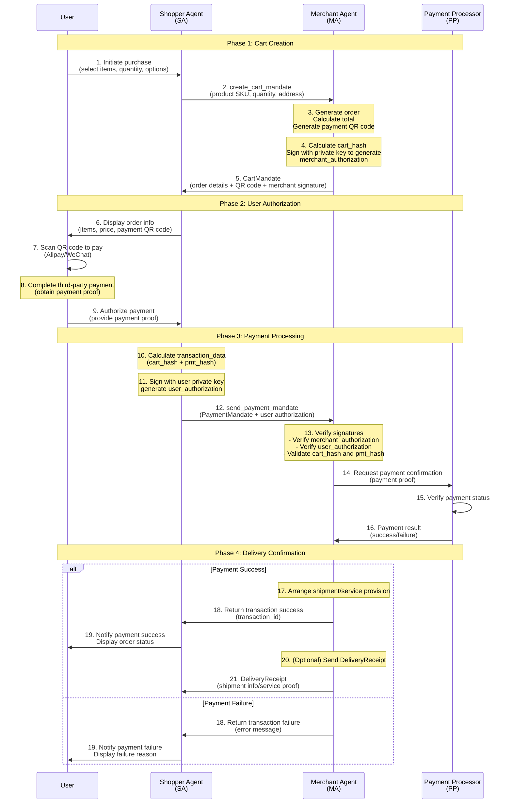

# ANP Agent Payment Protocol Specification (AP2)

## Abstract

This specification defines the Agent Payment Protocol (AP2), a standardized protocol for payment and transaction interactions between intelligent agents. AP2 is an application layer protocol based on ANP (Agent Network Protocol) that enables secure, efficient peer-to-peer payment transactions between agents.

**Original AP2 Protocol**: An open protocol released by Google in September 2025, designed to enable AI agents to safely complete payments on behalf of users. Official website: [https://ap2-protocol.org/](https://ap2-protocol.org/)

**This Specification's Position**: This document is an adapted and extended version of the AP2 protocol within the ANP framework, optimized for decentralized agent network scenarios.

The core content of this specification includes:
1. Defining four core roles in payment scenarios: Shopper Agent, Merchant Agent, Credentials Provider, and Payment Processor
2. Defining three key credential types: CartMandate, PaymentMandate, and DeliveryReceipt
3. Using JWT/JWS standard for authorization signatures to ensure transaction integrity and security
4. Supporting multiple payment methods including QR code payments (Alipay, WeChat Pay)
5. Integrating with ANP's DID-based identity authentication mechanism

This specification aims to provide a standardized payment interaction solution for agent networks, supporting commerce, service procurement, and other transaction scenarios.

## 1. Overview

### 1.1 Background

As agent networks develop, agents need to complete various commercial transactions and payment operations on behalf of users. Traditional payment systems are primarily designed for human-computer interaction and lack native support for agent-to-agent payment scenarios. AP2 protocol is designed to address this gap by providing a payment solution specifically for agent interactions.

### 1.2 Design Principles

- **Security**: Use cryptographic signatures (JWS/JWT) to ensure transaction content integrity and non-repudiation
- **Privacy Protection**: Support selective disclosure and minimize unnecessary information leakage
- **Standardization**: Based on existing standards (JWT, Payment Request API, etc.)
- **Extensibility**: Support multiple payment methods and future protocol extensions
- **User Control**: Require explicit user authorization for payments, ensuring user sovereignty

### 1.3 Relationship with Google AP2 and Key Adaptations

This specification is based on Google's AP2 protocol (official website: [https://ap2-protocol.org/](https://ap2-protocol.org/)) and has been significantly adapted for ANP's decentralized agent network scenarios:

#### 1.3.1 Original Google AP2 Design

Google AP2 uses three Mandate types:
- **IntentMandate**: For "Human-Not-Present" (HNP) scenarios, where agents autonomously complete transactions based on user pre-authorization
- **CartMandate**: For "Human-Present" (HP) scenarios, where users confirm shopping carts in real-time and authorize payments
- **PaymentMandate**: Provides visibility signals of agent transactions to payment networks

All Mandates are based on W3C Verifiable Credentials (VC) standards.

#### 1.3.2 Key Adaptations in ANP/AP2

We have made the following critical adaptations to AP2 within the ANP framework:

| Adaptation | Google AP2 | ANP/AP2 | Rationale |
|------------|------------|---------|-----------|
| **Identity Authentication** | Relies on existing payment network identity systems | Uses DID:WBA decentralized identity | Enable cross-platform, decentralized agent identity authentication |
| **Communication Protocol** | Based on A2A (Agent-to-Agent) and MCP protocol extensions | Based on ANP meta-protocol and message format | Unify agent communication standards, support richer negotiation capabilities |
| **Credential Format** | Strictly follows W3C VC specification | Uses JWT/JWS as lightweight implementation | Simplify implementation complexity while maintaining cryptographic security |
| **Payment Methods** | Primarily for credit/debit cards (Pull payments) | Prioritizes QR code payments (Alipay/WeChat) | Adapt to mainstream payment methods in China and Asian markets |
| **IntentMandate** | Supports pre-authorized autonomous agent shopping | **Not supported** (planned) | Focus on minimum viable implementation (M1), expand in future versions |
| **Role Separation** | Emphasizes four-party model (user, merchant, payment processor, issuer) | Supports simplified implementation with merged roles | M1 phase allows Shopper Agent to integrate CP and PP functions |
| **Agent Discovery** | Not explicitly defined | Capabilities declared through ANP Agent Description Protocol (ADP) | Enable automatic discovery and negotiation of agent capabilities |

#### 1.3.3 Retained Core Features

- ✅ Cryptographic signatures ensure transaction non-repudiation
- ✅ Support for explicit user authorization (User Authorization)
- ✅ Merchant signature guarantee for cart contents (Merchant Authorization)
- ✅ Auditable transaction credential chain
- ✅ Privacy protection and minimum information disclosure principles

#### 1.3.4 Future Evolution Directions

- [ ] Introduce IntentMandate in M2 version to support "Human-Not-Present" scenarios
- [ ] Support SD-JWT (Selective Disclosure JWT) for finer-grained privacy protection
- [ ] Align with W3C VC standards to support full verifiable credential interoperability
- [ ] Expand payment methods: cryptocurrencies, central bank digital currencies (CBDCs), etc.

### 1.4 Protocol Positioning

AP2 is an application layer protocol in ANP, building upon:
- **Identity Layer**: Using did:wba for agent identity authentication
- **Meta-Protocol Layer**: Using ANP message format for agent communication
- **Agent Description**: Declaring AP2 support in agent description documents

## 2. Core Concepts

### 2.1 Roles

AP2 defines four core roles:

#### 2.1.1 Shopper Agent (SA)
- Represents the buyer/consumer
- Responsible for interacting with users, displaying order information, obtaining payment authorization
- Sends purchase requests and payment mandates

#### 2.1.2 Merchant Agent (MA)
- Represents the seller/service provider
- Responsible for generating shopping cart information, creating orders, issuing delivery receipts
- Receives payment mandates and processes transactions

#### 2.1.3 Credentials Provider (CP)
- Provides user identity credentials
- Responsible for user authentication and authorization signature generation
- Ensures payment operations are explicitly authorized by users

#### 2.1.4 Payment Processor (PP)
- Processes actual payment operations
- Responsible for interfacing with payment channels (Alipay, WeChat Pay, bank cards, etc.)
- Returns payment results

**Note**: In the Minimum Implementation (M1), Shopper Agent may integrate CP and PP functionalities.

### 2.2 Core Credentials

#### 2.2.1 CartMandate (Shopping Cart Authorization)
- Generated by Merchant Agent
- Contains order details, product information, total amount, payment methods
- Signed by Merchant Agent to ensure order information integrity
- Direction: MA → SA

#### 2.2.2 PaymentMandate (Payment Authorization)
- Generated by Shopper Agent
- Contains user's payment authorization for specific order
- Signed by user private key to ensure authorization authenticity
- Direction: SA → MA

#### 2.2.3 DeliveryReceipt (Delivery Receipt)
- Generated by Merchant Agent
- Confirms order completion, delivery status, or service provision
- Used for transaction record keeping and dispute resolution
- Direction: MA → SA

### 2.3 Transaction Flow

ANP/AP2 protocol defines a complete agent payment transaction flow, including four main phases: cart creation, user authorization, payment processing, and delivery confirmation.

#### 2.3.1 Complete Transaction Flow Diagram



#### 2.3.2 Flow Description

**Phase 1: Cart Creation** (Steps 1-5)
- User selects items and submits order through Shopper Agent
- Shopper Agent sends cart creation request to Merchant Agent
- Merchant Agent generates CartMandate, including order details and payment QR code
- Merchant signs cart contents with its private key (merchant_authorization)

**Phase 2: User Authorization** (Steps 6-9)
- Shopper Agent displays order information and payment QR code to user
- User completes payment through third-party payment platform (Alipay/WeChat)
- User obtains payment proof and authorizes transaction to Shopper Agent

**Phase 3: Payment Processing** (Steps 10-16)
- Shopper Agent generates PaymentMandate
- Signs transaction data with user's private key (user_authorization)
- Merchant Agent verifies all signatures and hash values
- Merchant confirms payment status through Payment Processor

**Phase 4: Delivery Confirmation** (Steps 17-21)
- After successful payment, merchant arranges shipment or provides service
- Merchant optionally sends DeliveryReceipt as delivery proof
- User receives transaction completion notification

#### 2.3.3 Key Security Mechanisms

| Security Mechanism | Implementation | Purpose |
|-------------------|----------------|---------|
| **Data Integrity** | cart_hash = SHA-256(JCS(contents)) | Ensure cart contents are not tampered |
| **Merchant Authentication** | merchant_authorization (RS256/ES256K signature) | Prove order generated by legitimate merchant |
| **User Authorization** | user_authorization (contains transaction_data) | Prove user explicitly authorized this transaction |
| **Replay Attack Prevention** | jti (JWT ID) globally unique identifier | Prevent authorization credentials from being reused |
| **Time Constraints** | iat/exp fields control validity period | Limit credential time window (recommended 15 minutes) |
| **Identity Binding** | cnf field binds holder DID | Ensure credentials can only be used by specific agents |

## 3. Agent Description Protocol Integration

### 3.1 Declaring AP2 Support in AD Document

Agents supporting AP2 protocol should declare it in their Agent Description document:

```json
{
  "protocolType": "ANP",
  "protocolVersion": "1.0.0",
  "type": "AgentDescription",
  "name": "Grand Hotel Assistant",
  "did": "did:wba:grand-hotel.com:service:hotel-assistant",
  "interfaces": [
    {
      "type": "NaturalLanguageInterface",
      "protocol": "AP2/ANP",
      "version": "0.0.1",
      "url": "https://grand-hotel.com/api/ap2.json",
      "description": "An implementation of the AP2 protocol based on the ANP protocol, used for payment and transactions between agents."
    }
  ]
}
```

### 3.2 AP2 Interface Description

The `ap2.json` file describes the roles and endpoints supported by the agent:

```json
{
  "ap2/anp": "0.0.1",
  "roles": {
    "merchant": {
      "description": "Merchant Agent - generates cart, creates QR orders, issues delivery receipts",
      "endpoints": {
        "create_cart_mandate": "/ap2/merchant/create_cart_mandate",
        "send_payment_mandate": "/ap2/merchant/send_payment_mandate"
      }
    },
    "shopper": {
      "description": "Shopper Agent - handles user interaction, PIN validation, QR code display",
      "endpoints": {
        "receive_delivery_receipt": "/ap2/shopper/receive_delivery_receipt"
      }
    }
  }
}
```

### 3.3 Inline Interface Description

Alternatively, detailed interface information can be described directly in the AD document:

```json
{
  "type": "NaturalLanguageInterface",
  "protocol": "AP2/ANP",
  "version": "0.0.1",
  "description": "AP2 protocol implementation supporting payment and transaction operations",
  "content": {
    "roles": {
      "merchant": {
        "description": "Merchant Agent - hotel booking service provider",
        "create_cart_mandate": {
          "description": "Create a cart mandate for a hotel booking",
          "endpoint": "/ap2/merchant/create_cart_mandate",
          "item_schema": {
            "type": "object",
            "properties": {
              "hotel_id": {"type": "integer", "description": "Hotel ID"},
              "rate_plan_id": {"type": "string", "description": "Rate plan ID"},
              "room_num": {"type": "integer", "description": "Number of rooms"},
              "check_in_date": {"type": "string", "format": "date", "description": "Check-in date (YYYY-MM-DD)"},
              "check_out_date": {"type": "string", "format": "date", "description": "Check-out date (YYYY-MM-DD)"}
            },
            "required": ["hotel_id", "rate_plan_id", "room_num", "check_in_date", "check_out_date"]
          }
        }
      }
    }
  }
}
```

## 4. Credential Definitions

### 4.1 CartMandate (Shopping Cart Authorization)

**Direction**: MA → SA

**Complete Message Structure**:

```json
{
  "contents": {
    "id": "cart_shoes_123",
    "user_signature_required": false,
    "payment_request": {
      "method_data": [
        {
          "supported_methods": "QR_CODE",
          "data": {
            "channel": "ALIPAY",
            "qr_url": "https://pay.example.com/qrcode/abc123",
            "out_trade_no": "order_20250117_123456",
            "expires_at": "2025-01-17T09:15:00Z"
          }
        },
        {
          "supported_methods": "QR_CODE",
          "data": {
            "channel": "WECHAT",
            "qr_url": "https://pay.example.com/qrcode/abc123",
            "out_trade_no": "order_20250117_123456",
            "expires_at": "2025-01-17T09:15:00Z"
          }
        }
      ],
      "details": {
        "id": "order_shoes_123",
        "displayItems": [
          {
            "id": "sku-id-123",
            "sku": "Nike-Air-Max-90",
            "label": "Nike Air Max 90",
            "quantity": 1,
            "options": {"color": "red", "size": "42"},
            "amount": {"currency": "CNY", "value": 120.0},
            "pending": null,
            "remark": "Please ship as soon as possible"
          }
        ],
        "shipping_address": {
          "recipient_name": "Zhang San",
          "phone": "13800138000",
          "region": "Beijing",
          "city": "Beijing",
          "address_line": "Chaoyang District, Street 123",
          "postal_code": "100000"
        },
        "shipping_options": null,
        "modifiers": null,
        "total": {
          "label": "Total",
          "amount": {"currency": "CNY", "value": 120.0},
          "pending": null
        }
      },
      "options": {
        "requestPayerName": false,
        "requestPayerEmail": false,
        "requestPayerPhone": false,
        "requestShipping": true,
        "shippingType": null
      }
    }
  },
  "merchant_authorization": "eyJhbGciOiJSUzI1NiIsInR5cCI6IkpXVCJ9...",
  "timestamp": "2025-08-26T19:36:36.377022Z"
}
```

**Key Points**:
- `contents` contains shopping cart content, payment request, and QR code information
- `merchant_authorization` is a JWS signature (RS256 or ES256K) on the `cart_hash`
- `cart_hash = b64url(sha256(JCS(contents)))`

### 4.2 Merchant Authorization

#### 4.2.1 Overview

The `merchant_authorization` field is a **short-term digital signature authorization credential** from the merchant on the shopping cart contents (`CartContents`), ensuring the authenticity and integrity of cart contents.

This field replaces the legacy `merchant_signature` and adopts the **JSON Web Signature (JWS)** container format compliant with JOSE/JWT standards.

#### 4.2.2 Data Type

- **Type**: Base64URL-encoded compact JWS string (`header.payload.signature`)
- **Algorithm**: `RS256` or `ES256K`
- **Field**: `CartMandate.merchant_authorization`

#### 4.2.3 Header Format

```json
{
  "alg": "RS256",
  "kid": "MA-key-001",
  "typ": "JWT"
}
```

Or:

```json
{
  "alg": "ES256K",
  "kid": "MA-es256k-key-001",
  "typ": "JWT"
}
```

#### 4.2.4 Payload Format

```json
{
  "iss": "did:wba:a.com:MA",
  "sub": "did:wba:a.com:MA",
  "aud": "did:wba:a.com:TA",
  "iat": 1730000000,
  "exp": 1730000900,
  "jti": "uuid",
  "cart_hash": "<b64url>",
  "cnf": {"kid": "did:wba:a.com:TA#keys-1"},
  "extensions": ["anp.ap2.qr.v1", "anp.human_presence.v1"]
}
```

**Field Descriptions**:
- `iss`: Issuer (Merchant Agent DID)
- `sub`: Subject (can be same as iss)
- `aud`: Audience (Transaction Agent or Payment Processor)
- `iat`: Issued at time (seconds)
- `exp`: Expiration time (recommended 180 days)
- `jti`: Globally unique identifier (prevents replay attacks)
- `cart_hash`: Hash of CartMandate.contents
- `cnf`: (Recommended) Holder binding information
- `extensions`: Supported protocol extensions

#### 4.2.5 cart_hash Calculation

```text
cart_hash = Base64URL(SHA-256(JCS(CartMandate.contents)))
```

- Use [RFC 8785 JSON Canonicalization Scheme (JCS)](https://datatracker.ietf.org/doc/rfc8785/) to canonicalize `CartMandate.contents`
- Perform `SHA-256` hash on the canonicalized UTF-8 bytes
- Base64URL encode the result (remove "=" padding)

#### 4.2.6 Signature Generation Process (Merchant MA)

1. Calculate `cart_hash`
2. Construct JWT Payload (with iss/sub/aud/iat/exp/jti/cart_hash/cnf/extensions)
3. Construct Header (alg=RS256 or alg=ES256K, kid=<merchant public key identifier>)
4. Sign payload with merchant private key to generate compact JWS
5. Write generated JWS as `merchant_authorization` into CartMandate object

#### 4.2.7 Verification Process (Transaction TA)

1. Recalculate `cart_hash'` from `CartMandate.contents`
2. Parse `merchant_authorization`:
   - Extract Header → `kid`
   - Obtain MA's public key through DID document or registry
   - Verify JWS signature (RS256 or ES256K, matching Header)
3. Verify claims:
   - `iss/aud/iat/exp/jti` all comply with specifications
   - Current time is within `[iat, exp]`
   - `jti` has not been reused
4. Verify data binding:
   - `payload.cart_hash == cart_hash'`, otherwise reject
5. Identify extensions:
   - If `cnf` exists, can be used for subsequent holder verification

#### 4.2.8 Reference Implementation (Python)

```python
import json, base64, hashlib, uuid, time
import jwt  # pip install pyjwt

def jcs_canonicalize(obj):
    return json.dumps(obj, ensure_ascii=False, separators=(",", ":"), sort_keys=True)

def b64url_no_pad(b: bytes) -> str:
    return base64.urlsafe_b64encode(b).decode("ascii").rstrip("=")

def compute_cart_hash(contents: dict) -> str:
    canon = jcs_canonicalize(contents)
    digest = hashlib.sha256(canon.encode("utf-8")).digest()
    return b64url_no_pad(digest)

def sign_merchant_authorization(contents: dict, ma_private_pem: str, kid: str,
                                iss: str, aud: str, cnf: dict = None,
                                ttl_seconds: int = 900) -> str:
    now = int(time.time())
    payload = {
        "iss": iss,
        "sub": iss,
        "aud": aud,
        "iat": now,
        "exp": now + ttl_seconds,
        "jti": str(uuid.uuid4()),
        "cart_hash": compute_cart_hash(contents),
        "extensions": ["anp.ap2.qr.v1", "anp.human_presence.v1"]
    }
    if cnf:
        payload["cnf"] = cnf
    headers = {"alg": "RS256", "kid": kid, "typ": "JWT"}
    return jwt.encode(payload, ma_private_pem, algorithm="RS256", headers=headers)
```

### 4.3 PaymentMandate (Payment Authorization)

**Direction**: SA → MA

**Message Structure**:

```json
{
  "payment_mandate_contents": {
    "payment_mandate_id": "pm_12345",
    "payment_details_id": "order_shoes_123",
    "payment_details_total": {
      "label": "Total",
      "amount": {"currency": "CNY", "value": 120.0},
      "pending": null,
      "refund_period": 30
    },
    "payment_response": {
      "request_id": "order_shoes_123",
      "method_name": "QR_CODE",
      "details": {
        "channel": "ALIPAY",
        "out_trade_no": "order_20250117_123456"
      },
      "shipping_address": null,
      "shipping_option": null,
      "payer_name": null,
      "payer_email": null,
      "payer_phone": null
    },
    "merchant_agent": "MerchantAgent",
    "timestamp": "2025-08-26T19:36:36.377022Z"
  },
  "user_authorization": "eyJhbGciOiJFUzI1NksiLCJraWQiOiJkaWQ6ZXhhbXBsZ..."
}
```

**Field Descriptions**:
- `payment_details_id`: ID of the detail in the Payment request from CartMandate
- `user_authorization`: User's authorization signature on the transaction

### 4.4 User Authorization

User authorization generation follows the Merchant Authorization pattern with these differences:

**Payload uses `transaction_data` instead of `cart_hash`**:

```json
{
  "iss": "did:wba:a.com:user",
  "sub": "did:wba:a.com:user",
  "aud": "did:wba:a.com:MA",
  "iat": 1730000000,
  "exp": 1730000900,
  "jti": "uuid",
  "transaction_data": [
    "<cart_hash>",
    "<pmt_hash>"
  ],
  "cnf": {"kid": "did:wba:a.com:MA#keys-1"}
}
```

**transaction_data Calculation**:
```text
cart_hash = Base64URL(SHA-256(JCS(CartMandate.contents)))
pmt_hash = Base64URL(SHA-256(JCS(PaymentMandate.payment_mandate_contents)))
```

## 5. Message Definitions

### 5.1 create_cart_mandate

**Direction**: Shopper (SA) → Merchant (MA)

**API Path**: `POST /ap2/merchant/create_cart_mandate`

**Request Message Structure**:

```json
{
  "messageId": "cart-request-001",
  "from": "did:wba:a.com:shopper",
  "to": "did:wba:a.com:merchant",
  "data": {
    "cart_mandate_id": "cart-mandate-id-123",
    "items": [
      {
        "id": "sku-id-123",
        "sku": "Nike-Air-Max-90",
        "quantity": 1,
        "options": {"color": "red", "size": "42"},
        "remark": "Please ship as soon as possible"
      }
    ],
    "shipping_address": {
      "recipient_name": "Zhang San",
      "phone": "13800138000",
      "region": "Beijing",
      "city": "Beijing",
      "address_line": "Chaoyang District, Street 123",
      "postal_code": "100000"
    },
    "remark": "Please ship as soon as possible"
  }
}
```

**Response Message Structure** (Returns CartMandate):

```json
{
  "messageId": "cart-response-001",
  "from": "did:wba:a.com:merchant",
  "to": "did:wba:a.com:shopper",
  "data": {
    "contents": {
      "id": "cart-mandate-id-123",
      "user_signature_required": false,
      "payment_request": {
        "method_data": [
          {
            "supported_methods": "QR_CODE",
            "data": {
              "channel": "ALIPAY",
              "qr_url": "https://pay.example.com/qrcode/abc123",
              "out_trade_no": "order_20250117_123456",
              "expires_at": "2025-01-17T09:15:00Z"
            }
          }
        ],
        "details": {
          "id": "order_shoes_123",
          "displayItems": [
            {
              "id": "sku-id-123",
              "sku": "Nike-Air-Max-90",
              "label": "Nike Air Max 90",
              "quantity": 1,
              "options": {"color": "red", "size": "42"},
              "amount": {"currency": "CNY", "value": 120.0},
              "pending": null
            }
          ],
          "total": {
            "label": "Total",
            "amount": {"currency": "CNY", "value": 120.0},
            "pending": null
          }
        }
      }
    },
    "merchant_authorization": "eyJhbGciOiJSUzI1NiIsInR5cCI6IkpXVCJ9...",
    "timestamp": "2025-01-17T09:00:01Z"
  }
}
```

### 5.2 send_payment_mandate

**Direction**: Shopper (SA) → Merchant (MA)

**API Path**: `POST /ap2/merchant/send_payment_mandate`

**Request Message Structure**:

```json
{
  "messageId": "payment-mandate-001",
  "from": "did:wba:a.com:shopper",
  "to": "did:wba:a.com:merchant",
  "data": {
    "payment_mandate_contents": {
      "payment_mandate_id": "pm_12345",
      "payment_details_id": "order_shoes_123",
      "payment_details_total": {
        "label": "Total",
        "amount": {"currency": "CNY", "value": 120.0},
        "pending": null,
        "refund_period": 30
      },
      "payment_response": {
        "request_id": "order_shoes_123",
        "method_name": "QR_CODE",
        "details": {
          "channel": "ALIPAY",
          "out_trade_no": "order_20250117_123456"
        },
        "shipping_address": null,
        "shipping_option": null,
        "payer_name": null,
        "payer_email": null,
        "payer_phone": null
      },
      "merchant_agent": "MerchantAgent",
      "timestamp": "2025-01-17T09:05:00Z"
    },
    "user_authorization": "eyJhbGciOiJFUzI1NksiLCJraWQiOiJkaWQ6ZXhhbXBsZ..."
  }
}
```

**Response Message Structure**:

```json
{
  "messageId": "payment-response-001",
  "from": "did:wba:a.com:merchant",
  "to": "did:wba:a.com:shopper",
  "data": {
    "status": "success",
    "payment_mandate_id": "pm_12345",
    "transaction_id": "txn_67890",
    "message": "Payment processed successfully"
  }
}
```

## 6. Message Flow Sequence

1. **SA Request** → MA: `create_cart_mandate` (shopping cart creation request)
2. **MA Response** → SA: `CartMandate` (shopping cart authorization + QR code) in HTTP response
3. **SA Request** → MA: `send_payment_mandate` (payment authorization)
4. **MA Response** → SA: Payment processing result

## 7. Security Considerations

### 7.1 Signature Verification

All critical credentials (CartMandate, PaymentMandate) must be signed and verified:
- Merchant Agent signs CartMandate with its private key
- User signs PaymentMandate with their private key
- Receiving party must verify signatures through DID document public keys

### 7.2 Timestamp and Expiration

- All credentials must include timestamps
- CartMandate should include QR code expiration time (expires_at)
- JWT tokens should set reasonable expiration times (recommended 15 minutes)

### 7.3 Replay Attack Prevention

- Use `jti` (JWT ID) to ensure each authorization credential is globally unique
- Receiving party should maintain used `jti` list to prevent replay attacks

### 7.4 HTTPS Transmission

- All API endpoints must use HTTPS protocol
- Ensure encrypted transmission of sensitive information during communication

### 7.5 User Authorization

- Payment operations must obtain explicit user authorization
- User private key should be stored securely and not leave user device
- Support hardware security modules or secure enclaves for key storage

## 8. Extension Mechanisms

### 8.1 Payment Method Extension

AP2 supports extending new payment methods through the `supported_methods` field:
- `QR_CODE`: QR code payment
- `CARD`: Bank card payment
- `CRYPTO`: Cryptocurrency payment
- Custom payment methods

### 8.2 Protocol Extension Field

JWT Payload supports `extensions` field to declare protocol extensions:
```json
{
  "extensions": [
    "anp.ap2.qr.v1",
    "anp.human_presence.v1",
    "anp.ap2.subscription.v1"
  ]
}
```

## 9. Implementation Recommendations

### 9.1 Minimum Implementation (M1)

Minimum implementation should include:
- Support for QR code payment method (Alipay or WeChat Pay)
- Implementation of CartMandate and PaymentMandate
- Basic signature generation and verification
- DID:WBA identity authentication

### 9.2 Complete Implementation

Complete implementation should additionally include:
- Support for multiple payment methods
- DeliveryReceipt implementation
- Role separation (SA, MA, CP, PP)
- Refund and dispute handling mechanisms

### 9.3 Library and Tool Recommendations

- JWT Processing: PyJWT (Python), jsonwebtoken (JavaScript)
- JSON Canonicalization: jcs (multiple language implementations)
- DID Resolution: Universal Resolver
- Cryptographic Operations: cryptography (Python), Web Crypto API (JavaScript)

## 10. Example Scenarios

### 10.1 E-commerce Purchase Scenario

1. User browses products through Shopper Agent
2. User selects product and submits order
3. Shopper Agent sends create_cart_mandate request to Merchant Agent
4. Merchant Agent returns CartMandate with payment QR code
5. Shopper Agent displays order information and QR code to user
6. User scans code to complete payment
7. Shopper Agent generates PaymentMandate and sends to Merchant Agent
8. Merchant Agent verifies payment and arranges shipment

### 10.2 Service Booking Scenario (Hotel Booking)

1. User searches for hotels through Shopper Agent
2. User selects hotel and room type
3. Shopper Agent sends booking request to Hotel Merchant Agent
4. Hotel Merchant Agent returns booking CartMandate with total cost
5. User confirms booking information and authorizes payment
6. Shopper Agent sends PaymentMandate to Hotel Merchant Agent
7. Hotel Merchant Agent confirms payment and generates booking confirmation

## 11. References

- [RFC 7519] JSON Web Token (JWT)
- [RFC 7515] JSON Web Signature (JWS)
- [RFC 8785] JSON Canonicalization Scheme (JCS)
- [W3C Payment Request API](https://www.w3.org/TR/payment-request/)
- [ANP Technical White Paper](../01-agentnetworkprotocol-technical-white-paper.md)
- [ANP Agent Description Protocol](../07-anp-agent-description-protocol-specification.md)
- [DID:WBA Method Specification](../03-did-wba-method-design-specification.md)

## Copyright Notice

Copyright (c) 2024 GaoWei Chang
This file is released under the [MIT License](../LICENSE). You are free to use and modify it, but you must retain this copyright notice.
