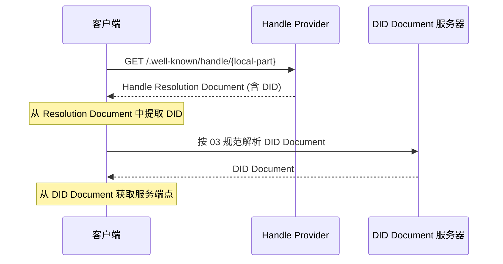
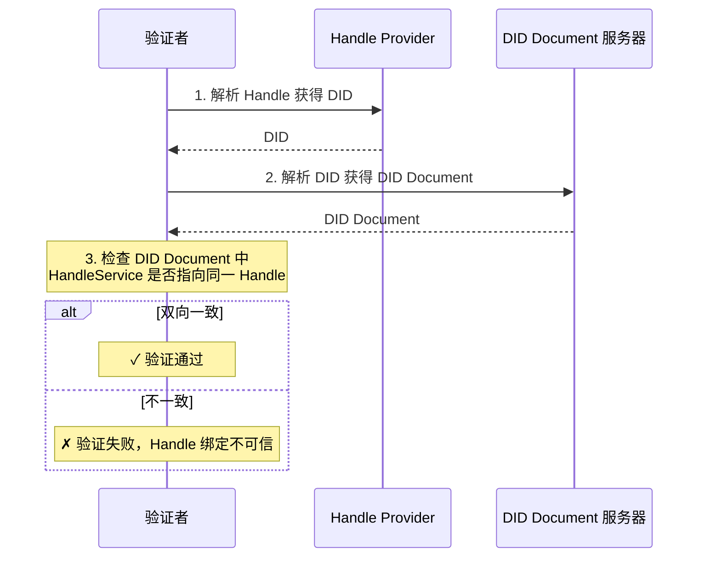

# ANP-基于DID:WBA的命名空间规范 (Draft)

简称：WNS (WBA Name Space)

备注：当前此规范仍是草案版本，会有进一步的优化与迭代。

## 摘要

本规范定义了 WNS（WBA Name Space），一个基于 did:wba 的人类可读命名空间。WNS 引入 Handle（如 `alice.example.com`）作为 `did:wba` DID 的可读别名，通过标准化解析流程将 Handle 映射到 DID，再按 [did:wba 方法规范](03-did-wba方法规范.md) 解析到 DID Document 与服务能力。

Handle 解决了 DID 标识符对人类不友好的问题——`did:wba:example.com:user:alice` 这样的标识符对机器友好但难以记忆和传播。WNS 提供类似 email 地址或社交平台用户名的体验，同时保持与 ANP 协议栈的完整集成。

## 1. 背景与动机

### 1.1 问题陈述

`did:wba` 方法为智能体提供了去中心化的身份标识能力（详见 [did:wba 方法规范](03-did-wba方法规范.md)），但其标识符格式对人类并不友好：

- **难以记忆**：`did:wba:example.com:user:alice` 包含方法前缀、域名、路径等结构化信息，长度较长
- **难以传播**：在社交场景中分享 DID 标识符不便，容易出错
- **难以输入**：用户手动输入 DID 标识符的体验很差

这些问题在以下场景中尤为突出：
- 用户之间通过社交渠道分享智能体标识
- 在即时消息中输入收件人
- 在名片、文档、口头交流中引用智能体身份

### 1.2 设计目标

WNS 的设计目标包括：

1. **人类可读**：提供简短、易记、易输入的别名，如 `alice.example.com`
2. **域名无关**：任何拥有域名和 TLS 证书的实体都可以托管 Handle 服务，不依赖特定中心化平台
3. **确定性解析**：Handle 到 DID 的映射关系明确，解析过程标准化
4. **双向绑定**：Handle 和 DID 之间支持双向验证，防止单方面篡改
5. **协议集成**：与现有 ANP 协议栈（03/07/08/09 规范）无缝集成
6. **最小化设计**：仅定义命名和解析的核心机制，不规定 Handle 的注册、管理等业务流程

### 1.3 与已有协议的关系

- **03-did:wba 方法规范**：WNS Handle 是 did:wba DID 的可读别名，Handle 解析最终依赖 03 规范完成 DID Document 的获取
- **07-智能体描述协议**：Handle 解析后通过 DID Document 的 service 到达 Agent Description 文档
- **08-智能体发现协议**：Handle Provider 可作为智能体发现的补充入口
- **09-端到端即时消息协议**：Handle 可用于收件人的展示和输入，消息路由仍基于 DID

## 2. 术语定义

| 术语 | 定义 |
|------|------|
| **Handle** | 人类可读的短标识符，格式为 `local-part.domain`，如 `alice.example.com` |
| **Handle Provider** | 托管 Handle 解析服务的域名方，负责维护 Handle 到 DID 的映射 |
| **Local Part** | Handle 中的用户标识部分，如 `alice.example.com` 中的 `alice` |
| **Domain** | Handle 的域名部分，如 `alice.example.com` 中的 `example.com` |
| **DID Binding** | Handle 到 DID 的一对一映射关系 |
| **Handle Resolution** | 将 Handle 解析为 DID 的过程 |
| **WNS** | WBA Name Space，本规范定义的命名空间体系 |
| **Handle Resolution Document** | Handle 解析端点返回的 JSON 文档，包含 Handle 到 DID 的映射信息 |

## 3. Handle 格式规范

### 3.1 Handle 语法

Handle 采用 DNS 风格的语法，格式为 `local-part.domain`。

**ABNF 定义：**

```abnf
handle     = local-part "." domain
local-part = (ALPHA / DIGIT) *61(ALPHA / DIGIT / "-") (ALPHA / DIGIT)
domain     = ; 合法的完全限定域名 (FQDN)，参见 RFC 1035
```

**语法规则：**

- local-part 仅允许 ASCII 小写字母 `a-z`、数字 `0-9` 和连字符 `-`
- local-part 必须（MUST）以字母或数字开头和结尾
- local-part 中不允许（MUST NOT）出现连续的连字符 `--`
- local-part 长度为 1 到 63 个字符
- domain 必须（MUST）是由 TLS/SSL 证书保护的合法 FQDN
- 所有输入在处理前必须（MUST）归一化为小写

**示例：**

```
alice.example.com          ✓ 有效
bob-smith.example.com      ✓ 有效
agent-42.example.com       ✓ 有效
a.example.com              ✓ 有效（单字符 local-part）
-alice.example.com         ✗ 无效（以连字符开头）
alice-.example.com         ✗ 无效（以连字符结尾）
al--ice.example.com        ✗ 无效（连续连字符）
Alice.Example.com          → 归一化为 alice.example.com
```

### 3.2 URI 表示

为了在传播中明确标识 Handle，可使用 `wba://` 前缀：

```
wba://alice.example.com
```

`wba://` 前缀仅用于传播和识别场景，语义等价于 Handle 本身。客户端在解析时必须（MUST）去除 `wba://` 前缀后按标准流程解析。

> 注意：`wba://` 尚未在 IANA 注册为正式 URI scheme。实现者也可以使用以下 Web URL 作为替代：
> ```
> https://{domain}/.well-known/handle/{local-part}
> ```

### 3.3 保留字原则

Handle Provider 应当（SHOULD）维护保留字列表，防止特定 local-part 被注册。协议定义以下保留字分类原则，具体列表由 Handle Provider 自行决定：

**a) 协议保留字**：与 ANP 协议关键字冲突的词汇，如 `did`、`agent`、`well-known`、`service` 等。

**b) 系统保留字**：与常见系统功能冲突的词汇，如 `admin`、`root`、`system`、`api` 等。

**c) 攻击防护保留字**：可能用于钓鱼或混淆攻击的词汇，如 `support`、`security`、`official` 等。

Handle Provider 应当（SHOULD）公开其保留字列表。

## 4. Handle 解析协议

### 4.1 解析流程

Handle 解析遵循以下流程：

```
Handle → Handle Resolution Endpoint → DID → DID Document → service
```



### 4.2 Handle Resolution Endpoint

Handle Resolution Endpoint 是 Handle Provider 提供的标准化 HTTP 端点：

- **URL**: `https://{domain}/.well-known/handle/{local-part}`
- **方法**: `GET`
- **响应 Content-Type**: `application/json`

其中 `{domain}` 为 Handle 的域名部分，`{local-part}` 为用户标识部分。

**示例请求：**

```http
GET /.well-known/handle/alice HTTP/1.1
Host: example.com
Accept: application/json
```

### 4.3 Handle Resolution Document

Handle Resolution Endpoint 返回的 JSON 文档格式如下：

```json
{
  "handle": "alice.example.com",
  "did": "did:wba:example.com:user:alice",
  "status": "active",
  "updated": "2025-01-01T00:00:00Z"
}
```

**字段说明：**

| 字段 | 必须/可选 | 说明 |
|------|----------|------|
| `handle` | 必须 | 完整的 Handle 标识符 |
| `did` | 必须 | 该 Handle 绑定的 did:wba DID |
| `status` | 必须 | Handle 当前状态，取值见 4.7 节 |
| `updated` | 可选 | 最后更新时间，ISO 8601 格式 |

### 4.4 Handle 到 DID 映射规则

Handle 与 DID 之间存在唯一对应关系，由 Handle Provider 维护。映射遵循以下规则：

1. **域名一致性**：Handle 的 domain 部分必须（MUST）与 DID 中的域名一致
2. **唯一绑定**：一个 Handle 必须（MUST）只绑定一个 DID
3. **local-part 唯一**：同一 domain 内的 local-part 必须（MUST）唯一

**映射示例：**

```
Handle:  alice.example.com
DID:     did:wba:example.com:user:alice
```

**可选的公钥指纹扩展：**

Handle Provider 可以（MAY）在 DID 路径中包含公钥指纹，用于让用户验证 DID 未被平台篡改：

```
Handle:  alice.example.com
DID:     did:wba:example.com:user:alice:k1_7bBxAgQKofnbXCCWruQP8rarUZpHmQzTssCTTapbn2w
```

其中 `k1_` 前缀表示密钥标识，后面的部分为公钥指纹。具体哈希算法与编码方式由 Handle Provider 定义。公钥指纹机制使得用户可以独立验证 Handle 所绑定的 DID 是否对应其预期的公钥，从而防止 Handle Provider 将 Handle 指向篡改的 DID。

### 4.5 did:wba 标准解析

获得 DID 后，必须（MUST）按照 [did:wba 方法规范](03-did-wba方法规范.md) 解析 DID Document。

实现者不得（MUST NOT）绕过 DID Document，直接由 Handle 推断服务端点或其他 DID 相关信息。DID Document 是智能体能力和服务的权威来源。

### 4.6 Handle 唯一性约束

- 一个 Handle 必须（MUST）只绑定一个 DID
- 同一 domain 内 local-part 必须（MUST）唯一
- 不同 domain 可以有相同的 local-part（去中心化模型）

例如 `alice.example.com` 和 `alice.other.com` 是两个不同的 Handle，指向不同的 DID。

### 4.7 Handle 状态

Handle 有以下三种状态：

| 状态 | 说明 |
|------|------|
| `active` | 正常状态，Handle 可被解析 |
| `suspended` | 暂停状态，暂时不可解析，可恢复 |
| `revoked` | 已撤销，不可恢复 |

### 4.8 错误响应

Handle Resolution Endpoint 应当（SHOULD）返回以下标准 HTTP 状态码：

| 状态码 | 含义 | 说明 |
|--------|------|------|
| `200 OK` | 解析成功 | 返回 Handle Resolution Document |
| `404 Not Found` | Handle 不存在 | 该 local-part 从未注册或已删除 |
| `410 Gone` | Handle 已永久撤销 | 该 Handle 曾经存在但已被 revoked |
| `301 Moved Permanently` | Handle 已迁移 | Location 头指向新的 Resolution Endpoint |

**错误响应示例：**

```json
{
  "error": "handle_not_found",
  "message": "The handle 'bob.example.com' does not exist"
}
```

## 5. Profile URL

### 5.1 Profile 入口

Handle Provider 可以（MAY）为每个 Handle 提供 Profile 访问入口。推荐以下 URL 格式：

- 子域名方式：`https://{local-part}.{domain}/`
- 路径方式：`https://{domain}/{local-part}/`

### 5.2 Profile 格式

Profile 是业务性文档，本规范仅定义 Profile 的 URL 访问入口，不限定其内容格式。Profile 的具体内容和呈现方式由 Handle 使用者和 Handle Provider 自行定义。

## 6. 反向验证（双向绑定）

为防止恶意 Handle Provider 将任意 Handle 映射到他人 DID，WNS 定义了双向绑定验证机制。

### 6.1 Handle Provider 声明（正向）

Handle Provider 通过 Resolution Endpoint 声明 Handle 到 DID 的映射关系。这是标准解析流程的一部分（第 4 节）。

### 6.2 DID Document 声明（反向）

DID 持有者在其 DID Document 的 `service` 中添加 `HandleService` 类型的条目，声明其关联的 Handle：

```json
{
  "id": "did:wba:example.com:user:alice#handle",
  "type": "HandleService",
  "serviceEndpoint": "https://example.com/.well-known/handle/alice"
}
```

**字段说明：**

- `id`：服务的唯一标识符，建议使用 `#handle` 后缀
- `type`：必须为 `HandleService`
- `serviceEndpoint`：指向 Handle Resolution Endpoint 的 URL

### 6.3 验证流程

验证者应当（SHOULD）同时检查两个方向的声明，确保一致性：



**验证步骤：**

1. 通过 Handle Resolution Endpoint 解析 Handle，获得 DID
2. 按 03 规范解析该 DID，获得 DID Document
3. 在 DID Document 的 `service` 中查找 `HandleService` 类型的条目
4. 检查该条目的 `serviceEndpoint` 是否指向同一 Handle 的 Resolution Endpoint

若两个方向的声明一致，则绑定关系可信；否则应当（SHOULD）视为不可信并向用户告警。

## 7. 与 ANP 协议栈的集成

### 7.1 与 DID Document（03 规范）

DID Document 的 `service` 中新增 `HandleService` 类型，用于支持反向验证（第 6 节）。

```json
{
  "service": [
    {
      "id": "did:wba:example.com:user:alice#ad",
      "type": "AgentDescription",
      "serviceEndpoint": "https://example.com/agents/alice/ad.json"
    },
    {
      "id": "did:wba:example.com:user:alice#handle",
      "type": "HandleService",
      "serviceEndpoint": "https://example.com/.well-known/handle/alice"
    }
  ]
}
```

### 7.2 与智能体描述协议（07 规范）

Agent Description 文档中可以（MAY）包含可选的 `handle` 字段：

```json
{
  "protocolType": "ANP",
  "protocolVersion": "1.0.0",
  "type": "AgentDescription",
  "did": "did:wba:example.com:user:alice",
  "handle": "alice.example.com",
  "name": "Alice's Agent",
  "description": "..."
}
```

`handle` 字段为可选项，用于方便其他智能体获取人类可读的标识。

### 7.3 与智能体发现协议（08 规范）

在 `.well-known/agent-descriptions` 返回的集合中，每个条目可以（MAY）包含可选的 `handle` 字段：

```json
{
  "@type": "ad:AgentDescription",
  "name": "Alice's Agent",
  "@id": "https://example.com/agents/alice/ad.json",
  "handle": "alice.example.com"
}
```

此外，Handle Provider 的 `/.well-known/handle/` 路径可作为智能体发现的补充入口。

### 7.4 与即时消息协议（09 规范）

Handle 可用于即时消息场景中收件人的展示和输入：

- 用户可以通过输入 Handle（如 `alice.example.com`）来指定消息接收者
- 客户端将 Handle 解析为 DID 后进行消息路由
- 消息界面中可以将 DID 替换为 Handle 展示，提升可读性

消息路由和传输仍基于 DID，Handle 仅用于人机交互层面的展示和输入。

## 8. Handle Provider 要求

### 8.1 解析服务要求

Handle Provider 必须（MUST）满足以下要求：

- 必须（MUST）通过 HTTPS 提供解析服务
- 必须（MUST）实现 `/.well-known/handle/{local-part}` 端点
- 应当（SHOULD）支持 HTTP 缓存头（`Cache-Control`、`ETag`），Handle 解析是高频操作，缓存可以显著降低服务器负载
- 应当（SHOULD）实施速率限制，防止滥用

### 8.2 Handle 管理

- Handle Provider 负责 Handle 的分配和生命周期管理
- Handle 的注册流程、身份验证方式、长度策略等由 Handle Provider 自行定义
- Handle Provider 必须（MUST）保证同一 domain 下 Handle 的唯一性

### 8.3 Handle 迁移

用户可能需要将 Handle 从一个 Handle Provider 迁移到另一个。在迁移过程中：

- 旧 Handle Provider 应当（SHOULD）返回 `301 Moved Permanently` 重定向，`Location` 头指向新 Handle Provider 的 Resolution Endpoint
- 迁移期间应当（SHOULD）同时维持新旧 Handle Provider 的解析能力
- DID 持有者需要更新 DID Document 中的 `HandleService` 指向新的 Handle Provider

## 9. 安全考虑

### 9.1 域名安全

WNS 的安全模型与 did:wba 方法一致，依赖 TLS/SSL 证书体系。Handle 的域名部分必须（MUST）由有效的 TLS 证书保护。Handle Provider 的安全性等同于其域名和 TLS 配置的安全性。

### 9.2 钓鱼与混淆攻击

WNS 通过以下机制降低钓鱼和混淆风险：

- local-part 限制为 ASCII 小写字母、数字和连字符，避免 Unicode 同形攻击
- Handle Provider 应当（SHOULD）维护保留字列表（见 3.3 节）
- 客户端应当（SHOULD）在展示 Handle 时突出显示域名部分，帮助用户识别来源

### 9.3 Handle 抢注

Handle Provider 应当（SHOULD）采取措施防止恶意抢注，包括但不限于：

- 维护保留字列表
- 实施注册审核机制
- 提供争议解决流程

具体策略由 Handle Provider 自行定义。

### 9.4 隐私考虑

- Handle Resolution Endpoint 会暴露 Handle 的存在性（通过 200 vs 404 响应），Handle Provider 应当（SHOULD）实施速率限制以减缓枚举攻击
- Handle Provider 不应当（SHOULD NOT）在 Resolution Endpoint 中返回除映射关系之外的敏感信息

### 9.5 防篡改

可选的公钥指纹扩展（见 4.4 节）为用户提供了独立验证 DID 完整性的能力。结合双向绑定验证（第 6 节），可以有效防止 Handle Provider 单方面篡改 Handle 到 DID 的映射关系。

## 10. 用例

### 10.1 社交传播

用户 Alice 可以在社交媒体上分享 `wba://alice.example.com`，其他用户看到后：

1. 识别 `wba://` 前缀，去除前缀得到 Handle `alice.example.com`
2. 解析 Handle 获得 DID
3. 通过 DID Document 获取 Alice 的智能体描述和服务端点
4. 与 Alice 的智能体建立交互

### 10.2 智能体间通信

智能体 A 需要与 Handle 为 `bob.example.com` 的智能体 B 通信：

1. 解析 Handle `bob.example.com` 获得 DID
2. 按 03 规范解析 DID Document
3. 从 DID Document 的 service 中获取 AgentDescription 端点
4. 获取 Agent Description 文档，了解智能体 B 的能力和接口
5. 根据接口定义发起通信

### 10.3 即时消息

用户在即时消息应用中输入收件人 Handle `carol.example.com`：

1. 客户端解析 Handle 获得 DID
2. 通过 DID Document 获取消息服务端点
3. 使用 09 规范定义的即时消息协议发送消息
4. 消息界面中显示收件人的 Handle 而非 DID

## 11. 规范性要求摘要

以下整理本规范中所有 MUST/SHOULD/MAY 要求（术语定义遵循 [RFC 2119](https://www.rfc-editor.org/rfc/rfc2119)）：

### MUST（必须）

1. Handle 的 local-part 必须以字母或数字开头和结尾
2. Handle 的 local-part 中不得出现连续连字符
3. Handle 的 domain 必须是由 TLS/SSL 证书保护的合法 FQDN
4. 所有 Handle 输入必须归一化为小写
5. 客户端解析时必须去除 `wba://` 前缀
6. Handle 的 domain 部分必须与 DID 中的域名一致
7. 一个 Handle 必须只绑定一个 DID
8. 同一 domain 内 local-part 必须唯一
9. 获得 DID 后必须按 03 规范解析 DID Document
10. 不得绕过 DID Document 直接由 Handle 推断服务端点
11. Handle Provider 必须通过 HTTPS 提供解析服务
12. Handle Provider 必须实现 `/.well-known/handle/{local-part}` 端点
13. Handle Provider 必须保证同一 domain 下 Handle 的唯一性

### SHOULD（应当）

1. Handle Provider 应维护并公开保留字列表
2. Handle Resolution Endpoint 应支持 HTTP 缓存头
3. Handle Resolution Endpoint 应实施速率限制
4. 验证者应同时检查双向绑定的一致性
5. Handle 迁移时旧 Provider 应返回 301 重定向
6. 客户端展示 Handle 时应突出显示域名部分
7. Handle Provider 不应在 Resolution Endpoint 中返回敏感信息

### MAY（可以）

1. Handle Provider 可以在 DID 路径中包含公钥指纹
2. Handle Provider 可以为 Handle 提供 Profile 入口
3. Agent Description 文档中可以包含 handle 字段
4. 智能体发现集合中的条目可以包含 handle 字段

## 参考文献

- [W3C DID Core Specification](https://www.w3.org/TR/did-core/)
- [RFC 2119 - Key words for use in RFCs to Indicate Requirement Levels](https://www.rfc-editor.org/rfc/rfc2119)
- [RFC 1035 - Domain Names - Implementation and Specification](https://www.rfc-editor.org/rfc/rfc1035)
- [RFC 8615 - Well-Known URIs](https://tools.ietf.org/html/rfc8615)
- [ANP 技术白皮书](01-AgentNetworkProtocol技术白皮书.md)
- [DID:WBA 方法设计规范](03-did-wba方法规范.md)
- [智能体描述协议规范](07-ANP-智能体描述协议规范.md)
- [智能体发现协议规范](08-ANP-智能体发现协议规范.md)
- [端到端即时消息协议规范](09-ANP-端到端即时消息协议规范.md)

## 版权声明

Copyright (c) 2024 ANP Community
本文件依据 [MIT 许可证](LICENSE) 发布，您可以自由使用和修改，但必须保留本版权声明。
