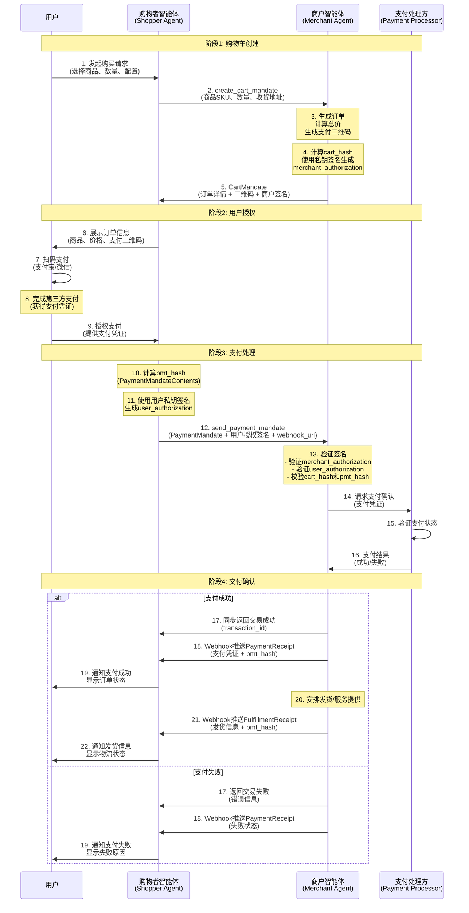

# ANP-智能体支付协议规范 (draft)

备注：当前此规范仍是草案版本，会有进一步的优化与迭代。

## 摘要

本规范定义了智能体支付协议(Agent Payment Protocol, AP2),这是一个用于智能体之间进行支付和交易交互的标准化协议。AP2是基于ANP(Agent Network Protocol)的应用层协议,旨在实现智能体之间安全、高效的点对点支付交易。

**AP2原始协议**: 由Google于2025年9月发布的开放协议,旨在让AI代理能够安全地代表用户完成支付。官方网站: [https://ap2-protocol.org/](https://ap2-protocol.org/)

**本规范的定位**: 本文档是AP2协议在ANP框架下的改造和扩展版本,针对去中心化智能体网络场景进行了优化和适配。

协议的核心内容包括:
1. 定义了支付场景中的四个核心角色:购物者智能体、商户智能体、凭证提供方、支付处理方
2. 定义了三种关键凭证类型:购物车授权(CartMandate)、支付授权(PaymentMandate)、交付收据
3. 使用JWT/JWS标准进行授权签名,确保交易的完整性和安全性
4. 支持多种支付方式,包括二维码支付(支付宝、微信支付)
5. 与ANP的DID身份认证机制深度集成

本规范旨在为智能体网络提供标准化的支付交互方案,支持商品交易、服务采购等多种交易场景。

## 1. 概述

### 1.1 背景

随着智能体网络的发展,智能体需要代表用户完成各种商业交易和支付操作。传统的支付系统主要是为人机交互设计的,缺乏对智能体之间支付场景的原生支持。AP2协议正是为了填补这一空白,为智能体交互提供专门的支付解决方案。

### 1.2 设计原则

- **安全性**:使用密码学签名(JWS/JWT)确保交易内容的完整性和不可抵赖性
- **隐私保护**:支持选择性披露,最小化不必要的信息泄露
- **标准化**:基于现有标准(JWT、Payment Request API等)
- **可扩展性**:支持多种支付方式和未来的协议扩展
- **用户主权**:支付操作需要用户明确授权,确保用户对资产的控制权

### 1.3 与Google AP2的关系及主要改造

本规范基于Google AP2协议(官方网站: [https://ap2-protocol.org/](https://ap2-protocol.org/)),并针对ANP去中心化智能体网络场景进行了重要改造:

#### 1.3.2 AP2当前存在的问题

在支持AP2协议的过程中,我们发现以下问题:

- AP2本身仍然处于早期,其协议设计尚不完善,比如时间戳的校验机制
- 没有完整的能够跑通的代码,代码和协议存在一些不一致的地方
- 可验证凭证是AP2的核心,不过签名私钥对应的公钥如何分发,是AP2没有回答的一个问题
- 原生AP2协议仅处理了支付流程,没有覆盖交易的全流程(如支付确认、履约确认)

#### 1.3.3 ANP/AP2的主要改造

针对AP2当前存在的问题,我们基于ANP做了以下关键改造:

**1. 在ANP的交互流程中支持AP2**

设计了多个消息用于发送AP2的凭证,实现完整的三阶段交易流程:创建订单→授权支付→交付凭证。

**2. 支持中国支付基础设施**

支持支付宝、微信等中国主流支付方式。目前优先支持二维码支付,这是目前跨平台支付最方便的方式。未来也可以和支付基础设施提供商共同探索更加方便的支付方式。

**3. 基于DID进行公钥分发**

基于ANP的智能体身份方案(DID:WBA)进行AP2可验证凭证的公钥分发。A2A并没有很好的解决智能体的身份互操作性问题,而ANP的DID方案能够非常方便的分发AP2的公钥。这也是基于ANP支持AP2要比基于MCP、A2A支持AP2成本更低的原因。

**4. 完善AP2没有考虑的点**

- 时间戳校验机制
- PaymentReceipt(支付凭证):确认支付状态,包含支付提供商的交易信息
- FulfillmentReceipt(履约凭证):确认订单完成、发货状态或服务提供,包含物流信息

这些凭证都包含前序PaymentMandate的哈希值(pmt_hash),形成完整的可追溯链条,为可能的纠纷提供证据支持。


#### 1.3.4 保留的核心特性

- ✅ 使用密码学签名确保交易不可抵赖
- ✅ 支持用户明确授权(User Authorization)
- ✅ 商户对购物车内容的签名保证(Merchant Authorization)
- ✅ 可审计的交易凭证链
- ✅ 隐私保护和最小信息披露原则

#### 1.3.5 未来演进方向

- [ ] 在M2版本中引入IntentMandate支持"人不在场"场景
- [ ] 支持SD-JWT(Selective Disclosure JWT)实现更细粒度的隐私保护
- [ ] 与W3C VC标准对齐,支持完整的可验证凭证互操作
- [ ] 扩展支付方式:央行数字货币(CBDC)等

### 1.4 协议定位

AP2是ANP中的应用层协议,构建在以下基础之上:
- **身份层**:使用did:wba进行智能体身份认证
- **智能体描述**:在智能体描述文档中声明AP2支持

## 2. 核心概念

### 2.1 角色定义

AP2定义了四个核心角色:

#### 2.1.1 购物者智能体 (Shopper Agent, SA)
- 代表买方/消费者
- 负责与用户交互,展示订单信息,获取支付授权
- 发送购买请求和支付授权

#### 2.1.2 商户智能体 (Merchant Agent, MA)
- 代表卖方/服务提供方
- 负责生成购物车信息,创建订单,发放交付收据
- 接收支付授权并处理交易

#### 2.1.3 凭证提供方 (Credentials Provider, CP)
- 提供用户身份凭证
- 负责用户身份认证和授权签名生成
- 确保支付操作得到用户明确授权

#### 2.1.4 支付处理方 (Payment Processor, PP)
- 处理实际的支付操作
- 负责对接支付渠道(支付宝、微信支付、银行卡等)
- 返回支付结果

**注意**:在最小实现(M1)中,购物者智能体可以集成CP和PP的功能。

### 2.2 核心凭证

#### 2.2.1 CartMandate(购物车授权)
- 由商户智能体生成
- 包含订单详情、商品信息、总金额、支付方式
- 由商户智能体签名,确保订单信息完整性
- 方向:MA → SA

#### 2.2.2 PaymentMandate(支付授权)
- 由购物者智能体生成
- 包含用户对特定订单的支付授权
- 由用户私钥签名,确保授权真实性
- 包含前序CartMandate的哈希值(cart_hash),形成哈希链
- 方向:SA → MA

#### 2.2.3 PaymentReceipt(支付凭证)
- 由商户智能体生成
- 确认支付状态(成功/失败)
- 包含支付提供商的交易信息
- 包含前序PaymentMandate的哈希值(pmt_hash)
- 方向:MA → SA (通过Webhook)

#### 2.2.4 FulfillmentReceipt(履约凭证)
- 由商户智能体生成
- 确认订单完成、发货状态或服务提供
- 包含物流信息(快递单号、预计送达时间等)
- 包含前序PaymentMandate的哈希值(pmt_hash)
- 用于交易记录和纠纷解决
- 方向:MA → SA (通过Webhook)

### 2.3 交易流程

ANP/AP2协议定义了完整的智能体支付交易流程,包含购物车创建、用户授权、支付处理和交付确认四个主要阶段。

#### 2.3.1 完整交易流程图



#### 2.3.2 流程说明

**阶段1: 购物车创建** (步骤1-5)
- 用户通过购物者智能体选择商品并提交订单
- 购物者智能体向商户智能体发送购物车创建请求
- 商户智能体生成CartMandate,包含订单详情和支付二维码
- 商户使用其私钥对购物车内容签名(merchant_authorization)

**阶段2: 用户授权** (步骤6-9)
- 购物者智能体向用户展示订单信息和支付二维码
- 用户通过第三方支付平台(支付宝/微信)完成扫码支付
- 用户获得支付凭证后,向购物者智能体授权交易

**阶段3: 支付处理** (步骤10-16)
- 购物者智能体生成PaymentMandate,包含cart_hash形成哈希链
- 使用用户私钥对PaymentMandateContents签名,生成pmt_hash
- 发送时提供mandate_webhook_url用于接收后续凭证
- 商户智能体验证所有签名和哈希值
- 商户通过支付处理方确认支付状态

**阶段4: 交付确认** (步骤17-22)
- 支付成功后,商户同步返回transaction_id
- 商户通过Webhook异步推送PaymentReceipt(支付凭证)
- 商户安排发货或提供服务
- 商户通过Webhook推送FulfillmentReceipt(履约凭证)
- 用户收到完整的交易和物流信息

#### 2.3.3 关键安全机制

| 安全机制 | 实现方式 | 作用 |
|---------|---------|------|
| **数据完整性** | cart_hash = SHA-256(JCS(contents)) | 确保购物车内容不被篡改 |
| **商户认证** | merchant_authorization (RS256/ES256K签名) | 证明订单由合法商户生成 |
| **用户授权** | user_authorization (包含pmt_hash) | 证明用户明确授权该交易 |
| **哈希链追溯** | CartMandate→PaymentMandate→Receipt | 形成完整的交易凭证链,可追溯验证 |
| **防重放攻击** | jti(JWT ID)全局唯一标识符 | 防止授权凭证被重复使用 |
| **时间限制** | iat/exp字段控制有效期 | 限制凭证的时间窗口(建议15分钟) |
| **身份绑定** | cnf字段绑定持有者DID | 确保凭证只能由特定智能体使用 |

## 3. 智能体描述协议集成

### 3.1 在AD文档中声明AP2支持

支持AP2协议的智能体应在其智能体描述文档中声明:

```json
{
  "protocolType": "ANP",
  "protocolVersion": "1.0.0",
  "type": "AgentDescription",
  "name": "Grand Hotel Assistant",
  "did": "did:wba:grand-hotel.com:service:hotel-assistant",
  "interfaces": [
    {
      "type": "StructuredInterface",
      "protocol": "AP2/ANP",
      "version": "0.0.1",
      "url": "https://grand-hotel.com/api/ap2.json",
      "description": "基于ANP协议的AP2协议实现,用于智能体之间的支付和交易"
    }
  ]
}
```

### 3.2 AP2接口描述

`ap2.json`文件描述了智能体支持的角色和端点:

```json
{
  "ap2/anp": "0.0.1",
  "roles": {
    "merchant": {
      "description": "商户智能体 - 生成购物车、创建二维码订单、推送支付凭证和履约凭证",
      "endpoints": {
        "create_cart_mandate": "/ap2/merchant/create_cart_mandate",
        "send_payment_mandate": "/ap2/merchant/send_payment_mandate"
      }
    },
    "shopper": {
      "description": "购物者智能体(Shopper Agent) - 处理用户交互、接收凭证推送",
      "endpoints": {
        "receive_payment_receipt": "/ap2/shopper/receive_payment_receipt",
        "receive_fulfillment_receipt": "/ap2/shopper/receive_fulfillment_receipt"
      }
    }
  }
}
```


```json
AP2Role = "merchant" | "shopper" | "credentials-provider" | "payment-processor"
```

### 3.3 内联接口描述

或者,可以直接在AD文档中详细描述接口信息:


```json
    {
      "type": "StructuredInterface",
      "type": "StructuredInterface",
      "protocol": "AP2/ANP",
      "version": "0.0.1",
      "description": "An implementation of the AP2 protocol based on the ANP protocol, used for payment and transactions between agents."
    },
    "content":{
        "roles": [
            "shopper": {
            "description": "shopper Agent - handles user interaction, PIN validation, QR code display",
            "endpoints": {
                "receive_delivery_receipt": "/ap2/shopper/receive_delivery_receipt"
            }
            },
            "merchant": {
            "description": "Merchant Agent - generates cart, creates QR orders, issues delivery receipts",
            "endpoints": {
                "create_cart_mandate": "/ap2/merchant/create_cart_mandate",
                "send_payment_mandate": "/ap2/merchant/send_payment_mandate",
            }
            }
        ]
    }
```

## 4. 凭证定义


### 4.1 CartMandate（购物车授权）

**方向**：MA → TA

**数据结构**：

```json
{
  "contents": {
    "id": "cart_shoes_123",
    "user_signature_required": false,
    "timestamp": "2025-01-17T09:00:00Z",
    "payment_request": {
      "method_data": [
        {
          "supported_methods": "QR_CODE",
          "data": {
            "channel": "ALIPAY",
            "qr_url": "https://pay.example.com/qrcode/abc123",
            "out_trade_no": "order_20250117_123456",
            "expires_at": "2025-01-17T09:15:00Z"
          }
        },
        {
          "supported_methods": "QR_CODE",
          "data": {
            "channel": "WECHAT",
            "qr_url": "https://pay.example.com/qrcode/abc123",
            "out_trade_no": "order_20250117_123456",
            "expires_at": "2025-01-17T09:15:00Z"
          }
        }
      ],
      "details": {
        "id": "order_shoes_123",
        "displayItems": [
          {
            "id": "sku-id-123",
            "label": "Nike Air Max 90",
            "quantity": 1,
            "options": {
              "color": "red",
              "size": "42"
            },
            "amount": {
              "currency": "CNY",
              "value": 120.0
            },
            "pending": null,
            "remark": "请尽快发货"
          }
        ],
        "shipping_address": {
          "recipient_name": "张三",
          "phone": "13800138000",
          "region": "北京市",
          "city": "北京市",
          "address_line": "朝阳区某某街道123号",
          "postal_code": "100000"
        },
        "shipping_options": null,
        "modifiers": null,
        "total": {
          "label": "Total",
          "amount": {
            "currency": "CNY",
            "value": 120.0
          },
          "pending": null
        }
      },
      "options": {
        "requestPayerName": false,
        "requestPayerEmail": false,
        "requestPayerPhone": false,
        "requestShipping": true,
        "shippingType": null
      }
    }
  },
  "merchant_authorization": "eyJhbGciOiJSUzI1NiIsInR5cCI6IkpXVCJ9..."
}
```

**字段说明**：

- `contents`: CartContents 对象，包含购物车完整信息
  - `id`: 购物车唯一标识符
  - `user_signature_required`: 是否需要用户签名（通常为 false）
  - `timestamp`: ISO-8601 格式的时间戳
  - `payment_request`: 支付请求详情，包含 method_data、details、options
- `merchant_authorization`: JWS 格式的商户授权签名（详见下节）

**关键点**：

- `merchant_authorization` 是对整个 `contents` 的 JWS 签名（RS256 或 ES256K）
- `cart_hash = b64url(sha256(JCS(contents)))`，cart_hash 包含在 JWT payload 中

### 4.2 商户授权凭证 (Merchant Authorization)

#### 4.2.1 概述

`merchant_authorization` 字段是商户对购物车内容 (`CartContents`) 的**短期数字签名授权凭证**,用于保证购物车内容的真实性与完整性。

该字段取代旧版的 `merchant_signature`,并采用符合 JOSE/JWT 标准的 **JSON Web Signature (JWS)** 容器格式。

#### 4.2.2 数据类型

- **类型**: base64url 编码的紧凑 JWS 字符串(`header.payload.signature`)
- **算法**: `RS256` 或 `ES256K`
- **字段**: `CartMandate.merchant_authorization`

#### 4.2.3 Header 格式

```json
{
  "alg": "RS256",
  "kid": "MA-key-001",
  "typ": "JWT"
}
```

或:

```json
{
  "alg": "ES256K",
  "kid": "MA-es256k-key-001",
  "typ": "JWT"
}
```

#### 4.2.4 Payload 格式

**基础实现（必需字段）**:

```json
{
  "iss": "did:wba:a.com:MA",
  "sub": "did:wba:a.com:MA",
  "aud": "did:wba:a.com:SA",
  "iat": 1730000000,
  "exp": 1730000900,
  "jti": "uuid",
  "cart_hash": "<b64url>"
}
```

**可选扩展字段**（当前基础实现未包含,保留用于未来扩展）:

```json
{
  "cnf": {"kid": "did:wba:a.com:SA#keys-1"},
  "sd_hash": "<b64url>",
  "extensions": ["anp.ap2.qr.v1"]
}
```

**字段说明**:
- `iss`: 签发者(商户智能体 DID)
- `sub`: 主体(可与 iss 相同)
- `aud`: 受众(交易智能体或支付处理方)
- `iat`: 签发时间(秒)
- `exp`: 过期时间(建议 15 分钟,即 900 秒)
- `jti`: 全局唯一标识符(防重放攻击)
- `cart_hash`: 对 CartMandate.contents 的哈希(见下节)
- `cnf`: (可选)持有者绑定信息
- `sd_hash`: (可选)SD-JWT / VC 哈希指针
- `extensions`: (可选)协议扩展标识

#### 4.2.5 cart_hash 计算规则

```text
cart_hash = Base64URL(SHA-256(JCS(CartMandate.contents)))
```

- 使用 [RFC 8785 JSON Canonicalization Scheme (JCS)](https://datatracker.ietf.org/doc/rfc8785/) 对 `CartMandate.contents` 进行规范化
- 对规范化后的 UTF-8 字节执行 `SHA-256` 哈希
- 将结果 Base64URL 编码(去掉"="填充)

#### 4.2.6 签名生成流程(商户端 MA)

1. 计算 `cart_hash`: 对 `CartMandate.contents` 执行 JCS 规范化后进行 SHA-256 哈希
2. 构造 JWT Payload(必需字段: `iss/sub/aud/iat/exp/jti/cart_hash`)
3. 构造 JWT Header(`alg=RS256` 或 `alg=ES256K`, `kid=<商户公钥标识>`, `typ=JWT`)
4. 用商户私钥对 Header 和 Payload 进行签名,生成紧凑 JWS(`header.payload.signature`)
5. 将生成的 JWS 作为 `merchant_authorization` 写入 `CartMandate` 对象

#### 4.2.7 验签流程(购物者端 SA)

1. 对 `CartMandate.contents` 重新计算 `cart_hash'`
2. 解析 `merchant_authorization`:
   - 提取 Header → `kid`
   - 通过 DID 文档或注册表获取 MA 的公钥
   - 验证 JWS 签名(RS256 或 ES256K,与 Header 匹配)
3. 校验声明:
   - `iss/aud/iat/exp/jti` 均符合规范
   - 当前时间在 `[iat, exp]` 内
   - `jti` 未被重复使用
4. 校验数据绑定:
   - `payload.cart_hash == cart_hash'`,否则拒绝
5. 识别扩展:
   - 如存在 `sd_hash`,进入 SD-JWT/VC 路径
   - 如存在 `cnf`,可用于后续持有者验证

#### 4.2.9 校验清单

| 校验项 | 要求 |
|--------|------|
| 签名算法 | RS256 或 ES256K(需与 Header.alg 一致) |
| 时间窗 | `iat ≤ now ≤ exp`,有效期 ≤ 15 分钟 |
| 重放防护 | `jti` 全局唯一 |
| 签发者与受众 | `iss=MA`,`aud=SA`(或 MPP) |
| 数据一致性 | `payload.cart_hash == computed_cart_hash` |
| DID 解析 | 通过 `kid` → DID 文档解析公钥 |
| 兼容扩展 | 支持解析 `cnf`、`sd_hash` 字段 |

### 4.3 PaymentMandate(支付授权)

**方向**: SA → MA

**消息结构**:

```json
{
  "payment_mandate_contents": {
    "payment_mandate_id": "pm_12345",
    "payment_details_id": "order_shoes_123",
    "payment_details_total": {
      "label": "Total",
      "amount": {
        "currency": "CNY",
        "value": 120.0
      },
      "pending": null,
      "refund_period": 30
    },
    "payment_response": {
      "request_id": "order_shoes_123",
      "method_name": "QR_CODE",
      "details": {
        "channel": "ALIPAY",
        "out_trade_no": "order_20250117_123456"
      },
      "shipping_address": null,
      "shipping_option": null,
      "payer_name": null,
      "payer_email": null,
      "payer_phone": null
    },
    "merchant_agent": "MerchantAgent",
    "timestamp": "2025-01-17T09:05:00Z",
    "cart_hash": "cart_hash"
  },
  "user_authorization": "eyJhbGciOiJFUzI1NksiLCJraWQiOiJkaWQ6ZXhhbXBsZ..."
}
```

**字段说明**：

- `payment_mandate_contents`: PaymentMandateContents 对象
  - `payment_mandate_id`: 支付授权唯一标识符
  - `payment_details_id`: 对应 CartMandate 中 payment_request.details.id
  - `payment_details_total`: 支付总金额及退款期限
  - `payment_response`: 支付响应详情（支付方式、渠道等）
  - `merchant_agent`: 商户代理标识
  - `timestamp`: ISO-8601 格式的时间戳
  - `cart_hash`: **前序 CartMandate 的哈希值**（哈希链关键）
- `user_authorization`: JWS 格式的用户授权签名（详见下节）

### 4.4 用户授权 (User Authorization)

user_authorization 是用户/购物者对支付内容的授权签名，采用与 merchant_authorization 相同的 JWS 格式。

**Header 格式**：

```json
{
  "alg": "RS256",
  "kid": "Shopper-key-001",
  "typ": "JWT"
}
```

或：

```json
{
  "alg": "ES256K",
  "kid": "Shopper-es256k-key-001",
  "typ": "JWT"
}
```

**Payload 格式**：

```json
{
  "iss": "did:wba:a.com:TA", // 签发者（购物者智能体 DID）
  "sub": "did:wba:a.com:TA", // 主体（可与 iss 相同）
  "aud": "did:wba:a.com:MA", // 受众（商户智能体）
  "iat": 1730000000, // 签发时间（秒）
  "exp": 1730000900, // 过期时间（建议 180天）
  "jti": "uuid", // 全局唯一标识符（防重放攻击）
  "pmt_hash": "<b64url>" // 对 PaymentMandateContents 的哈希
}
```

**pmt_hash 计算规则**:
```text
pmt_hash = Base64URL(SHA-256(JCS(PaymentMandate.payment_mandate_contents)))
```

**哈希链维护**:

PaymentMandateContents 包含前序 CartMandate 的 `cart_hash` 字段,从而形成哈希链:

```
CartMandate(cart_hash) → PaymentMandate(cart_hash, pmt_hash)
```

### 4.5 PaymentReceipt(支付凭证)

**方向**: MA → SA (通过Webhook)

**数据结构**:

```json
{
  "contents": {
    "credential_type": "PaymentReceipt",
    "version": 1,
    "id": "receipt_uuid_123",
    "timestamp": "2025-01-17T09:10:00Z",
    "payment_mandate_id": "pm_12345",
    "provider": "ALIPAY",
    "status": "SUCCEEDED",
    "transaction_id": "alipay_txn_789",
    "out_trade_no": "order_20250117_123456",
    "paid_at": "2025-01-17T09:08:30Z",
    "amount": {
      "currency": "CNY",
      "value": 120.0
    },
    "pmt_hash": "<b64url>"
  },
  "merchant_authorization": "eyJhbGciOiJSUzI1NiIsInR5cCI6IkpXVCJ9..."
}
```

**字段说明**:
- `credential_type`: 固定值 "PaymentReceipt"
- `version`: 凭证版本号,当前为 1
- `id`: 凭证唯一标识符(UUID)
- `timestamp`: 凭证签发时间(ISO-8601)
- `payment_mandate_id`: 对应的 PaymentMandate ID
- `provider`: 支付提供商(ALIPAY | WECHAT)
- `status`: 支付状态(SUCCEEDED | FAILED | PENDING | TIMEOUT)
- `transaction_id`: 支付提供商的交易 ID
- `out_trade_no`: 外部交易号
- `paid_at`: 支付完成时间(ISO-8601)
- `amount`: 支付金额
- `pmt_hash`: 前序 PaymentMandate 的哈希值
- `merchant_authorization`: JWS 格式的商户授权签名

**merchant_authorization Payload**:

```json
{
  "iss": "did:wba:a.com:MA",
  "sub": "did:wba:a.com:MA",
  "aud": "did:wba:a.com:SA",
  "iat": 1730000000,
  "exp": 1730000900,
  "jti": "receipt_uuid_123",
  "credential_type": "PaymentReceipt",
  "cred_hash": "<b64url(sha256(JCS(contents)))>"
}
```

**哈希链扩展**:

```
CartMandate(cart_hash) → PaymentMandate(cart_hash, pmt_hash) → PaymentReceipt(pmt_hash, cred_hash)
```

### 4.6 FulfillmentReceipt(履约凭证)

**方向**: MA → SA (通过Webhook)

**数据结构**:

```json
{
  "contents": {
    "credential_type": "FulfillmentReceipt",
    "version": 1,
    "id": "fulfillment_uuid_456",
    "timestamp": "2025-01-18T10:00:00Z",
    "order_id": "order_shoes_123",
    "items": [
      {
        "id": "sku-id-123",
        "quantity": 1
      }
    ],
    "fulfilled_at": "2025-01-18T09:45:00Z",
    "shipping": {
      "carrier": "顺丰速运",
      "tracking_number": "SF1234567890",
      "delivered_eta": "2025-01-20T18:00:00Z"
    },
    "pmt_hash": "<b64url>",
    "metadata": {
      "warehouse": "Beijing-001",
      "notes": "已发货,请注意查收"
    }
  },
  "merchant_authorization": "eyJhbGciOiJSUzI1NiIsInR5cCI6IkpXVCJ9..."
}
```

**字段说明**:
- `credential_type`: 固定值 "FulfillmentReceipt"
- `version`: 凭证版本号,当前为 1
- `id`: 凭证唯一标识符(UUID)
- `timestamp`: 凭证签发时间(ISO-8601)
- `order_id`: 订单 ID
- `items`: 履约商品列表
- `fulfilled_at`: 履约完成时间(ISO-8601)
- `shipping`: 物流信息(可选)
  - `carrier`: 物流公司
  - `tracking_number`: 快递单号
  - `delivered_eta`: 预计送达时间
- `pmt_hash`: 前序 PaymentMandate 的哈希值
- `metadata`: 业务特定的履约数据(可选)
- `merchant_authorization`: JWS 格式的商户授权签名

**merchant_authorization Payload**:

```json
{
  "iss": "did:wba:a.com:MA",
  "sub": "did:wba:a.com:MA",
  "aud": "did:wba:a.com:SA",
  "iat": 1730000000,
  "exp": 1730000900,
  "jti": "fulfillment_uuid_456",
  "credential_type": "FulfillmentReceipt",
  "cred_hash": "<b64url(sha256(JCS(contents)))>"
}
```

**完整哈希链**:

PaymentReceipt 和 FulfillmentReceipt 都包含 `pmt_hash` 字段(指向同一个 PaymentMandate),形成分支哈希链:

```
CartMandate(cart_hash)
    ↓
PaymentMandate(cart_hash, pmt_hash)
    ↓
    ├─→ PaymentReceipt(pmt_hash, cred_hash)
    └─→ FulfillmentReceipt(pmt_hash, cred_hash)
```

## 5. 消息定义

### 5.1 create_cart_mandate

**方向**: Shopper (SA) → Merchant (MA)

**API 路径**: `POST /ap2/merchant/create_cart_mandate`

**请求消息结构**:

```json
{
  "messageId": "cart-request-001",
  "from": "did:wba:a.com:shopper",
  "to": "did:wba:a.com:merchant",
  "data": {
    "cart_mandate_id": "cart-mandate-id-123",
    "items": [
      {
        "id": "sku-id-123",
        "sku": "Nike-Air-Max-90",
        "quantity": 1,
        "options": {"color": "red", "size": "42"},
        "remark": "请尽快发货"
      }
    ],
    "shipping_address": {
      "recipient_name": "张三",
      "phone": "13800138000",
      "region": "北京市",
      "city": "北京市",
      "address_line": "朝阳区某某街道123号",
      "postal_code": "100000"
    },
    "remark": "请尽快发货"
  }
}
```

**响应消息结构**(返回 CartMandate):

```json
{
  "messageId": "cart-response-001",
  "from": "did:wba:a.com:merchant",
  "to": "did:wba:a.com:shopper",
  "data": {
    "contents": {
      "id": "cart-mandate-id-123",
      "user_signature_required": false,
      "payment_request": {
        "method_data": [
          {
            "supported_methods": "QR_CODE",
            "data": {
              "channel": "ALIPAY",
              "qr_url": "https://pay.example.com/qrcode/abc123",
              "out_trade_no": "order_20250117_123456",
              "expires_at": "2025-01-17T09:15:00Z"
            }
          }
        ],
        "details": {
          "id": "order_shoes_123",
          "displayItems": [
            {
              "id": "sku-id-123",
              "sku": "Nike-Air-Max-90",
              "label": "Nike Air Max 90",
              "quantity": 1,
              "options": {"color": "red", "size": "42"},
              "amount": {"currency": "CNY", "value": 120.0},
              "pending": null
            }
          ],
          "total": {
            "label": "Total",
            "amount": {"currency": "CNY", "value": 120.0},
            "pending": null
          }
        }
      }
    },
    "merchant_authorization": "eyJhbGciOiJSUzI1NiIsInR5cCI6IkpXVCJ9...",
    "timestamp": "2025-01-17T09:00:01Z"
  }
}
```

### 5.2 send_payment_mandate

**方向**: Shopper (SA) → Merchant (MA)

**API 路径**: `POST /ap2/merchant/send_payment_mandate`

**请求消息结构**:

```json
{
  "messageId": "payment-mandate-001",
  "from": "did:wba:a.com:shopper",
  "to": "did:wba:a.com:merchant",
  "mandate_webhook_url": "https://shopper.example.com/ap2/webhook",
  "data": {
    "payment_mandate_contents": {
      "payment_mandate_id": "pm_12345",
      "payment_details_id": "order_shoes_123",
      "payment_details_total": {
        "label": "Total",
        "amount": {"currency": "CNY", "value": 120.0},
        "pending": null,
        "refund_period": 30
      },
      "payment_response": {
        "request_id": "order_shoes_123",
        "method_name": "QR_CODE",
        "details": {
          "channel": "ALIPAY",
          "out_trade_no": "order_20250117_123456"
        },
        "shipping_address": null,
        "shipping_option": null,
        "payer_name": null,
        "payer_email": null,
        "payer_phone": null
      },
      "merchant_agent": "MerchantAgent",
      "timestamp": "2025-01-17T09:05:00Z",
      "cart_hash": "<b64url>"
    },
    "user_authorization": "eyJhbGciOiJFUzI1NksiLCJraWQiOiJkaWQ6ZXhhbXBsZ..."
  }
}
```

**响应消息结构**:

```json
{
  "messageId": "payment-response-001",
  "from": "did:wba:a.com:merchant",
  "to": "did:wba:a.com:shopper",
  "data": {
    "status": "success",
    "payment_mandate_id": "pm_12345",
    "transaction_id": "txn_67890",
    "message": "支付处理成功"
  }
}
```

## 6. 消息流转顺序

完整的 AP2 交易流程包含以下步骤:

### 6.1 同步消息流转

1. **SA 请求** → MA: `create_cart_mandate`
   - SA 发送购物车请求,包含商品信息和配送地址
   - 请求示例见 5.1 节

2. **MA 响应** → SA: `CartMandate`
   - MA 返回签名的购物车授权,包含支付二维码
   - 包含 `merchant_authorization` 签名
   - 响应在 HTTP 同步返回

3. **SA 发送** → MA: `send_payment_mandate`
   - 用户完成支付后,SA 发送支付授权
   - 包含 `user_authorization` 签名和 `cart_hash`(指向前序 CartMandate)
   - **重要**: 包含 `mandate_webhook_url` 用于接收后续凭证推送
   - 请求示例见 5.2 节

4. **MA 响应** → SA: 支付处理结果
   - MA 同步返回 `transaction_id` 和处理状态
   - 响应示例见 5.2 节

### 6.2 异步Webhook推送

5. **MA 推送** → SA: `PaymentReceipt` (通过 Webhook)
   - MA 确认支付成功后,异步推送支付凭证到 `mandate_webhook_url`
   - 包含支付提供商的交易信息和 `pmt_hash`(指向前序 PaymentMandate)
   - 凭证格式见 4.5 节

6. **MA 推送** → SA: `FulfillmentReceipt` (通过 Webhook,可选)
   - MA 完成订单履约后,异步推送履约凭证到 `mandate_webhook_url`
   - 包含物流信息和 `pmt_hash`(指向前序 PaymentMandate)
   - 凭证格式见 4.6 节

### 6.3 完整哈希链

```
CartMandate(cart_hash)
    ↓ (同步)
PaymentMandate(cart_hash, pmt_hash)
    ↓ (异步Webhook)
    ├─→ PaymentReceipt(pmt_hash, cred_hash)
    └─→ FulfillmentReceipt(pmt_hash, cred_hash)
```

### 6.4 Webhook端点要求

购物者智能体(SA)必须实现以下Webhook端点:
- `POST {mandate_webhook_url}` - 接收PaymentReceipt和FulfillmentReceipt推送
- 端点必须验证推送消息的 `merchant_authorization` 签名
- 端点应返回 HTTP 200 表示成功接收,或适当的错误码

## 7. 安全性考虑

### 7.1 签名验证

所有关键凭证都必须进行签名和验证:
- 商户智能体使用其私钥对CartMandate、PaymentReceipt、FulfillmentReceipt签名
- 用户使用其私钥对PaymentMandate签名
- 接收方必须通过DID文档中的公钥验证签名
- Webhook推送的凭证必须验证merchant_authorization签名

### 7.2 时间戳和过期时间

- 所有凭证都必须包含时间戳
- CartMandate应包含二维码过期时间(expires_at)
- JWT令牌应设置合理的过期时间(建议15分钟)

### 7.3 重放攻击防护

- 使用`jti`(JWT ID)确保每个授权凭证全局唯一
- 接收方应维护已使用的`jti`列表,防止重放攻击

### 7.4 HTTPS传输

- 所有API端点必须使用HTTPS协议
- 确保通信过程中敏感信息的加密传输

### 7.5 用户授权

- 支付操作必须获得用户明确授权
- 用户私钥应安全存储,不离开用户设备
- 支持硬件安全模块或安全飞地进行密钥存储

### 7.6 Webhook安全

- Webhook端点必须使用HTTPS协议
- 必须验证推送消息的merchant_authorization签名
- 应实现幂等性处理,防止重复推送导致的问题
- 建议实现重试机制:推送失败时商户应进行重试(指数退避)
- 购物者智能体应验证推送消息的jti,防止重放攻击
- 建议实现Webhook签名验证的白名单机制

## 8. 扩展机制

### 8.1 支付方式扩展

AP2支持通过`supported_methods`字段扩展新的支付方式:
- `QR_CODE`: 二维码支付
- `CARD`: 银行卡支付
- `CRYPTO`: 加密货币支付
- 自定义支付方式

### 8.2 协议扩展字段

JWT Payload支持`extensions`字段声明协议扩展:
```json
{
  "extensions": [
    "anp.ap2.qr.v1",
    "anp.human_presence.v1",
    "anp.ap2.subscription.v1"
  ]
}
```

## 9. 实现建议

### 9.1 最小实现(M1)

最小实现应包括:
- 支持二维码支付方式(支付宝或微信支付)
- 实现CartMandate和PaymentMandate凭证
- 实现PaymentReceipt凭证(通过Webhook推送)
- 基本的签名生成和验证
- DID:WBA身份认证
- Webhook端点实现(接收支付凭证推送)

### 9.2 完整实现

完整实现还应包括:
- 支持多种支付方式
- FulfillmentReceipt实现(履约凭证推送)
- 角色分离(SA、MA、CP、PP)
- 退款和争议处理机制
- Webhook重试和幂等性处理
- 完整的哈希链验证

### 9.3 库和工具推荐

- JWT处理: PyJWT (Python)、jsonwebtoken (JavaScript)
- JSON规范化: jcs (多语言实现)
- DID解析: Universal Resolver
- 密码学操作: cryptography (Python)、Web Crypto API (JavaScript)

## 10. 示例场景

### 10.1 电商购物场景

1. 用户通过购物者智能体(SA)浏览商品
2. 用户选择商品并提交订单
3. SA向商户智能体(MA)发送create_cart_mandate请求
4. MA返回CartMandate,包含支付二维码和merchant_authorization签名
5. SA向用户展示订单信息和二维码
6. 用户扫码完成第三方支付(支付宝/微信)
7. SA生成PaymentMandate(包含cart_hash和webhook_url)并发送给MA
8. MA同步返回transaction_id
9. MA通过Webhook异步推送PaymentReceipt(包含pmt_hash)
10. MA安排发货后通过Webhook推送FulfillmentReceipt(包含物流信息)
11. 用户收到完整的支付和物流状态通知

### 10.2 服务预订场景(酒店预订)

1. 用户通过购物者智能体(SA)搜索酒店
2. 用户选择酒店和房型
3. SA向酒店商户智能体(MA)发送预订请求(create_cart_mandate)
4. MA返回预订CartMandate,包含总费用和支付二维码
5. 用户确认预订信息并扫码支付
6. SA发送PaymentMandate(包含cart_hash和webhook_url)给MA
7. MA同步返回预订确认transaction_id
8. MA通过Webhook推送PaymentReceipt确认支付成功
9. 酒店入住时,MA可通过Webhook推送FulfillmentReceipt作为服务凭证

## 11. 参考文献

- [RFC 7519] JSON Web Token (JWT)
- [RFC 7515] JSON Web Signature (JWS)
- [RFC 8785] JSON Canonicalization Scheme (JCS)
- [W3C Payment Request API](https://www.w3.org/TR/payment-request/)
- [ANP 技术白皮书](../../01-agentnetworkprotocol-technical-white-paper.md)
- [ANP 智能体描述协议](../../07-anp-agent-description-protocol-specification.md)
- [DID:WBA 方法规范](../../03-did-wba-method-design-specification.md)

## 版权声明

Copyright (c) 2024 GaoWei Chang
本文件依据 [MIT 许可证](../../LICENSE) 发布,您可以自由使用和修改,但必须保留本版权声明。
