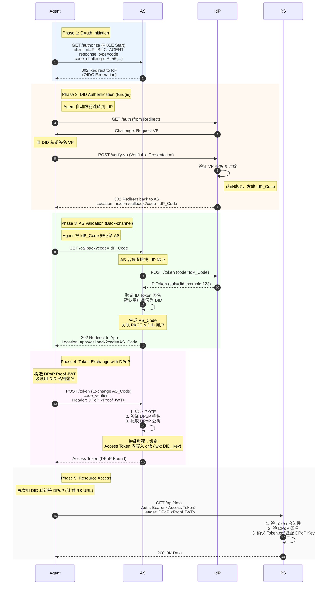

# DID–OAuth 兼容性讨论稿（正式版）

## 一、OAuth 的本质：Authn 与 Authz 的分层模型
OAuth 的核心可以拆分为两个逻辑层：

### 1. Authn（认证层）

负责确认“主体是谁”。

OAuth 本身不定义认证方式，而是依赖：

- 密码
- 短信
- 扫码
- SAML
- OIDC
- 等等

### 2. Authz（授权层）

负责：

> “将授权结果封装成 token，让 client 在访问资源时出示它，由资源服务器验证。”

Authz 的关键问题是 token 的安全持有与出示，因此 OAuth 生态发展出：

- token 有效期
- refresh token
- PKCE
- DPoP（Proof-of-Possession）
- RAR（结构化授权）
- UMA（用户管理访问策略）

**这些都是 OAuth 的授权工程问题，与认证方式无关。**

## 二、DID 的定位：增强 Authn，而非替代 Authz

DID/VC 的本质是：

- **DID**：可验证身份
- **VC**：可验证属性/授权依据
- **VP**：一次性可验证证明（可组合）

因此 DID 主要增强 Authn 层：

- 提供更强的主体识别
- 提供可验证的授权依据（VC）
- 提供可组合的动态增信能力（VP）

**但 DID 不替代 OAuth 的 token-based 授权模型。**

## 三、ANP 的 DID-auth 与 OAuth 的平滑兼容性

ANP 的 DID-auth 如果只做 Authn，本质上等价于：

> “OAuth 重定向到 DID 认证页面”

流程完全一致：

1. OAuth AS 重定向到 DID-auth
2. DID-auth 完成认证（DID + VC + personhood）
3. DID-auth 返回 VP
4. OAuth AS 验证 VP
5. OAuth AS 按标准流程颁发 token
6. RS 按标准 OAuth 验证 token（无需理解 DID）

**OAuth 的授权层完全不需要修改。**

## 四、兼容 OAuth 的 client pre-registration

OAuth 的安全模型要求：

- ⚠️ client 必须预注册 `client_id`
- 这是无法绕过的

### 解决方案：在 DID-auth 中引用 client 的 pre-reg 信息

DID-auth 完成后返回：

- DID（主体）
- VC（属性）
- personhood VC（可选）
- client_id（预注册）
- client metadata（redirect_uri、DPoP key 等）

OAuth AS 可以将：

- DID-auth 的主体信息
- client 的预注册信息

绑定在一起，然后按标准 OAuth 流程颁发 token。

### 结果

- ✅ DID-auth → OAuth token issuance 完全无缝
- ✅ OAuth RS 不需要理解 DID
- ✅ OAuth AS 只需要在 Authn 阶段理解 VP
- ✅ client 仍然是 OAuth client
- ✅ DID 只是替代了“用户如何被认证”

## 五、正式 Mermaid 序列图（DID-auth → OAuth Token → RS）




## 六、DPoP / RAR / UMA 的集成方式

### 1. DPoP：绑定 token 与客户端密钥

**DPoP 解决：**

- token 被窃取后无法重放
- token 与 client 的密钥绑定

**在 DID-auth 中：**

- client 可直接提供 DPoP 公钥
- OAuth AS 将其写入 token 的 `cnf.jwk`
- RS 验证 DPoP Proof

**DID 与 DPoP 天然契合，因为 DID 本身就是密钥体系。**

### 2. RAR：结构化授权容器

**RAR 解决：**

- scope 粒度太粗
- 无法表达复杂能力
- 无法审计

**在 ANP 中：**

- DID-auth 可根据 VC/关系生成 RAR 模板
- OAuth AS 将 RAR 写入 token 的 `authorization_details`
- RS 按 RAR 做细粒度授权

**RAR 是 ANP 能力模型的最佳承载方式。**

### 3. UMA：用户管理访问策略

**UMA 解决：**

- 用户可控的资源授权
- 跨域资源共享
- 细粒度策略

**在 ANP 中：**

- VC 可表达资源所有权
- personhood VC 可表达主体合法性
- UMA policy 可引用 DID/VC 作为条件

**UMA 是 DID-VC 的天然落地点。**

## 七、零信任场景：DID-VC 的动态增信能力

零信任要求：

> “每次访问都需要动态评估风险，并可能要求更强认证。”

### DID-VC 的优势：

#### 1. 高度自动化的增信机制

- 无需密码
- 无需额外跳转
- 可自动组合多个 VC
- 可按需增加认证强度（KYC、personhood、设备证明等）

#### 2. 多 VC 可合并为一次 VP

例如：

- DID 身份 VC
- personhood VC
- 设备绑定 VC
- 关系 VC
- 风险评估 VC

全部合并成一个 VP：

```javascript
VP = { DID, VC1, VC2, VC3, ... }
```

**OAuth AS：**

- 只需验证一次 VP
- 不需理解每个 VC 的格式
- 不需理解 DID
- 只需验证签名链
- 然后映射到 token claims / RAR / UMA

**这让零信任的动态增信变得高度自动化。**

## 八、ANP 的 RAR 类型体系（草案）

### RAR 的基本结构：

```json
{
  "authorization_details": [
    {
      "type": "anp.<capability>",
      "subject": "did:example:123",
      "resource": "...",
      "actions": [...],
      "constraints": {...},
      "evidence": {...}
    }
  ]
}
```

### 1. anp.social_graph_discovery

```json
{
  "type": "anp.social_graph_discovery",
  "subject": "did:example:user123",
  "resource": "social-graph",
  "actions": ["query", "distance", "neighbors"],
  "constraints": {
    "max_depth": 3,
    "max_nodes": 500,
    "relationship_types": ["friend", "colleague"]
  },
  "evidence": {
    "vp": "<embedded VP>",
    "personhood": true
  }
}
```

### 2. anp.long_distance_intro

```json
{
  "type": "anp.long_distance_intro",
  "subject": "did:example:agentA",
  "resource": "introduction",
  "actions": ["request", "forward"],
  "constraints": {
    "max_hops": 6,
    "trust_threshold": 0.7
  },
  "evidence": {
    "vp": "<embedded VP>",
    "relationship_proof": true
  }
}
```

### 3. anp.knowledge_query

```json
{
  "type": "anp.knowledge_query",
  "subject": "did:example:agentA",
  "resource": "knowledge-base",
  "actions": ["query"],
  "constraints": {
    "max_tokens": 2000,
    "domains": ["tech", "science"]
  },
  "evidence": {
    "vp": "<embedded VP>"
  }
}
```

### 4. anp.agent_task_execution

```json
{
  "type": "anp.agent_task_execution",
  "subject": "did:example:agentA",
  "resource": "task",
  "actions": ["execute"],
  "constraints": {
    "max_duration": "10m",
    "max_cost": 5
  },
  "evidence": {
    "vp": "<embedded VP>",
    "device_binding": true
  }
}
```

### 5. anp.resource_access

```json
{
  "type": "anp.resource_access",
  "subject": "did:example:agentA",
  "resource": "https://api.example.com/data",
  "actions": ["read", "write"],
  "constraints": {
    "rate_limit": "10/min",
    "valid_for": "300s"
  },
  "evidence": {
    "vp": "<embedded VP>"
  }
}
```

## 九、总结

### 核心要点

1. **DID 负责 Authn，OAuth 负责 Authz。**
2. **ANP 的 DID-auth 可以完全替代 OAuth 的认证页面，并与 OAuth 的 token 颁发流程无缝衔接。**
3. **client pre-registration 可以在 DID-auth 中引用，从而保持 OAuth 的安全模型不变。**
4. **DPoP、RAR、UMA 可以自然集成到授权层，增强 token 安全性与能力表达。**
5. **DID‑VC（包括 personhood 凭证）可以在零信任环境中作为动态增信层。多个凭证可以聚合为单个 VP，通过 DID‑Auth 一次性验证后，以 ID Token 的形式传递给 OAuth 授权服务器，作为统一的认证结果。**
6. **ANP 的 RAR 类型体系为跨域社交、知识、任务执行等能力提供标准化表达方式。**

### 关键结论

| 维度 | OAuth | DID | ANP 集成方案 |
|------|-------|-----|-------------|
| **认证方式** | 多种（密码、OIDC等） | DID/VC/VP | DID-auth 作为 Authn 插件 |
| **授权 Token** | scope-based | - | RAR-based + DPoP-bound |
| **Token 绑定** | 无 | - | DPoP 绑定到 DID keypair |
| **资源策略** | 粗粒度 | - | UMA + VC/DID 条件 |
| **动态增信** | 困难 | ✓ 多 VC 组合 | 自动化 VP 聚合 |
| **Client 身份** | client_id 预注册 | - | client_id + DPoP key 预注册 |

---

**✅ DID-auth 可作为 OAuth Authn 层的完全替代品**

**✅ 无需修改 OAuth 授权流程**

**✅ Client、RS 完全兼容现有 OAuth**

**✅ 只需在 AS 中理解 VP 验证**

**✅ RAR + DPoP + UMA 实现细粒度、动态、可审计的授权**

**✅ DID/VC 的增信能力自然融合零信任架构**