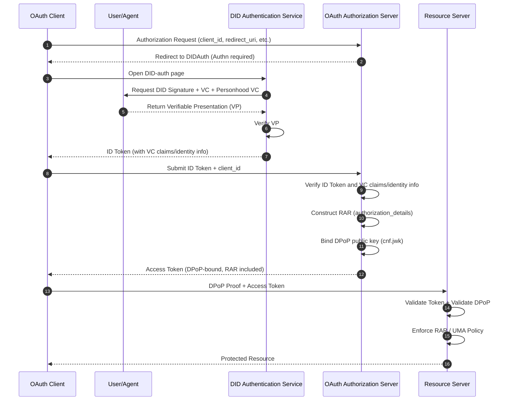

# DID-OAuth Compatibility Discussion (Official Proposal Version)

## 1. The Essence of OAuth: A Layered Model of Authn and Authz

The core of OAuth can be decomposed into two logical layers:

### 1. Authn (Authentication Layer)

Responsible for confirming "who the subject is."

OAuth itself does not define authentication methods, but relies on:

- Password
- SMS
- QR code scanning
- SAML
- OIDC
- etc.

### 2. Authz (Authorization Layer)

Responsible for:

> "Encapsulating authorization results into tokens, allowing clients to present them when accessing resources, which are then validated by resource servers."

The key issue in Authz is the secure possession and presentation of tokens, which is why the OAuth ecosystem has developed:

- Token expiration
- Refresh tokens
- PKCE
- DPoP (Proof-of-Possession)
- RAR (Rich Authorization Requests)
- UMA (User-Managed Access)

**These are all OAuth authorization engineering problems, independent of authentication methods.**

## 2. DID's Positioning: Enhancing Authn, Not Replacing Authz

The essence of DID/VC is:

- **DID**: Verifiable identity
- **VC**: Verifiable attributes/authorization basis
- **VP**: One-time verifiable presentation (composable)

Therefore, DID primarily enhances the Authn layer:

- Provides stronger subject identification
- Provides verifiable authorization basis (VC)
- Provides composable dynamic trust enhancement capability (VP)

**But DID does not replace OAuth's token-based authorization model.**

## 3. ANP's DID-auth and Smooth Compatibility with OAuth

If ANP's DID-auth only handles Authn, it is essentially equivalent to:

> "OAuth redirects to DID authentication page"

The flow is completely consistent:

1. OAuth AS redirects to DID-auth
2. DID-auth completes authentication (DID + VC + personhood)
3. DID-auth returns VP
4. OAuth AS verifies VP
5. OAuth AS issues token following standard flow
6. RS validates token following standard OAuth (no need to understand DID)

**OAuth's authorization layer requires no modification at all.**

## 4. Compatible with OAuth's Client Pre-registration

OAuth's security model requires:

- ⚠️ Client must pre-register `client_id`
- This cannot be bypassed

### Solution: Reference client's pre-reg information in DID-auth

After DID-auth completes, return:

- DID (subject)
- VC (attributes)
- personhood VC (optional)
- client_id (pre-registered)
- client metadata (redirect_uri, DPoP key, etc.)

OAuth AS can bind:

- Subject information from DID-auth
- Pre-registration information of client

together, then issue token following standard OAuth flow.

### Result

- ✅ DID-auth → OAuth token issuance completely seamless
- ✅ OAuth RS does not need to understand DID
- ✅ OAuth AS only needs to understand VP during Authn phase
- ✅ Client remains an OAuth client
- ✅ DID only replaces "how the user is authenticated"

## 5. Official Mermaid Sequence Diagram (DID-auth → OAuth Token → RS)



## 6. Integration Methods for DPoP / RAR / UMA

### 1. DPoP: Binding Token to Client Key

**DPoP solves:**

- Token cannot be replayed after being stolen
- Token is bound to client's key

**In DID-auth:**

- Client can directly provide DPoP public key
- OAuth AS writes it into token's `cnf.jwk`
- RS validates DPoP Proof

**DID and DPoP are naturally compatible, as DID itself is a key system.**

### 2. RAR: Structured Authorization Container

**RAR solves:**

- Scope granularity is too coarse
- Cannot express complex capabilities
- Cannot be audited

**In ANP:**

- DID-auth can generate RAR templates based on VC/relationships
- OAuth AS writes RAR into token's `authorization_details`
- RS performs fine-grained authorization based on RAR

**RAR is the best way to carry ANP's capability model.**

### 3. UMA: User-Managed Access Policy

**UMA solves:**

- User-controllable resource authorization
- Cross-domain resource sharing
- Fine-grained policies

**In ANP:**

- VC can express resource ownership
- personhood VC can express subject legitimacy
- UMA policy can reference DID/VC as conditions

**UMA is the natural landing point for DID-VC.**

## 7. Zero Trust Scenarios: DID-VC's Dynamic Trust Enhancement Capability

Zero trust requires:

> "Every access requires dynamic risk assessment and may require stronger authentication."

### Advantages of DID-VC:

#### 1. Highly Automated Trust Enhancement Mechanism

- No password required
- No additional redirects required
- Can automatically combine multiple VCs
- Can increase authentication strength as needed (KYC, personhood, device proof, etc.)

#### 2. Multiple VCs Can Be Merged into One VP

For example:

- DID identity VC
- personhood VC
- Device binding VC
- Relationship VC
- Risk assessment VC

All merged into one VP:

```javascript
VP = { DID, VC1, VC2, VC3, ... }
```

**OAuth AS:**

- Only needs to verify VP once
- Does not need to understand each VC's format
- Does not need to understand DID
- Only needs to verify signature chain
- Then map to token claims / RAR / UMA

**This makes dynamic trust enhancement in zero trust scenarios highly automated.**

## 8. ANP's RAR Type System (Draft)

### Basic Structure of RAR:

```json
{
  "authorization_details": [
    {
      "type": "anp.<capability>",
      "subject": "did:example:123",
      "resource": "...",
      "actions": [...],
      "constraints": {...},
      "evidence": {...}
    }
  ]
}
```

### 1. anp.social_graph_discovery

```json
{
  "type": "anp.social_graph_discovery",
  "subject": "did:example:user123",
  "resource": "social-graph",
  "actions": ["query", "distance", "neighbors"],
  "constraints": {
    "max_depth": 3,
    "max_nodes": 500,
    "relationship_types": ["friend", "colleague"]
  },
  "evidence": {
    "vp": "<embedded VP>",
    "personhood": true
  }
}
```

### 2. anp.long_distance_intro

```json
{
  "type": "anp.long_distance_intro",
  "subject": "did:example:agentA",
  "resource": "introduction",
  "actions": ["request", "forward"],
  "constraints": {
    "max_hops": 6,
    "trust_threshold": 0.7
  },
  "evidence": {
    "vp": "<embedded VP>",
    "relationship_proof": true
  }
}
```

### 3. anp.knowledge_query

```json
{
  "type": "anp.knowledge_query",
  "subject": "did:example:agentA",
  "resource": "knowledge-base",
  "actions": ["query"],
  "constraints": {
    "max_tokens": 2000,
    "domains": ["tech", "science"]
  },
  "evidence": {
    "vp": "<embedded VP>"
  }
}
```

### 4. anp.agent_task_execution

```json
{
  "type": "anp.agent_task_execution",
  "subject": "did:example:agentA",
  "resource": "task",
  "actions": ["execute"],
  "constraints": {
    "max_duration": "10m",
    "max_cost": 5
  },
  "evidence": {
    "vp": "<embedded VP>",
    "device_binding": true
  }
}
```

### 5. anp.resource_access

```json
{
  "type": "anp.resource_access",
  "subject": "did:example:agentA",
  "resource": "https://api.example.com/data",
  "actions": ["read", "write"],
  "constraints": {
    "rate_limit": "10/min",
    "valid_for": "300s"
  },
  "evidence": {
    "vp": "<embedded VP>"
  }
}
```

## 9. Summary

### Core Points

1. **DID handles Authn, OAuth handles Authz.**
2. **ANP's DID-auth can completely replace OAuth's authentication page and seamlessly integrate with OAuth's token issuance flow.**
3. **Client pre-registration can be referenced in DID-auth, thus maintaining OAuth's security model unchanged.**
4. **DPoP, RAR, UMA can be naturally integrated into the authorization layer, enhancing token security and capability expression.**
5. **“DID‑VCs (including personhood credentials) can act as a dynamic trust‑enhancement layer in zero‑trust environments. Multiple credentials can be aggregated into a single Verifiable Presentation, verified once through DID‑Auth, and then conveyed in the ID Token to the OAuth Authorization Server as the unified authentication result.**
6. **ANP's RAR type system provides standardized expression for cross-domain social, knowledge, task execution, and other capabilities.**

### Key Conclusions

| Dimension | OAuth | DID | ANP Integration Solution |
|-----------|-------|-----|--------------------------|
| **Authentication Method** | Multiple (password, OIDC, etc.) | DID/VC/VP | DID-auth as Authn plugin |
| **Authorization Token** | scope-based | - | RAR-based + DPoP-bound |
| **Token Binding** | None | - | DPoP bound to DID keypair |
| **Resource Policy** | Coarse-grained | - | UMA + VC/DID conditions |
| **Dynamic Trust Enhancement** | Difficult | ✓ Multiple VC composition | Automated VP aggregation |
| **Client Identity** | client_id pre-registration | - | client_id + DPoP key pre-registration |

---

**✅ DID-auth can serve as a complete replacement for OAuth Authn layer**

**✅ No need to modify OAuth authorization flow**

**✅ Client and RS are fully compatible with existing OAuth**

**✅ Only need to understand VP verification in AS**

**✅ RAR + DPoP + UMA achieve fine-grained, dynamic, auditable authorization**

**✅ DID/VC's trust enhancement capability naturally integrates with zero trust architecture**
