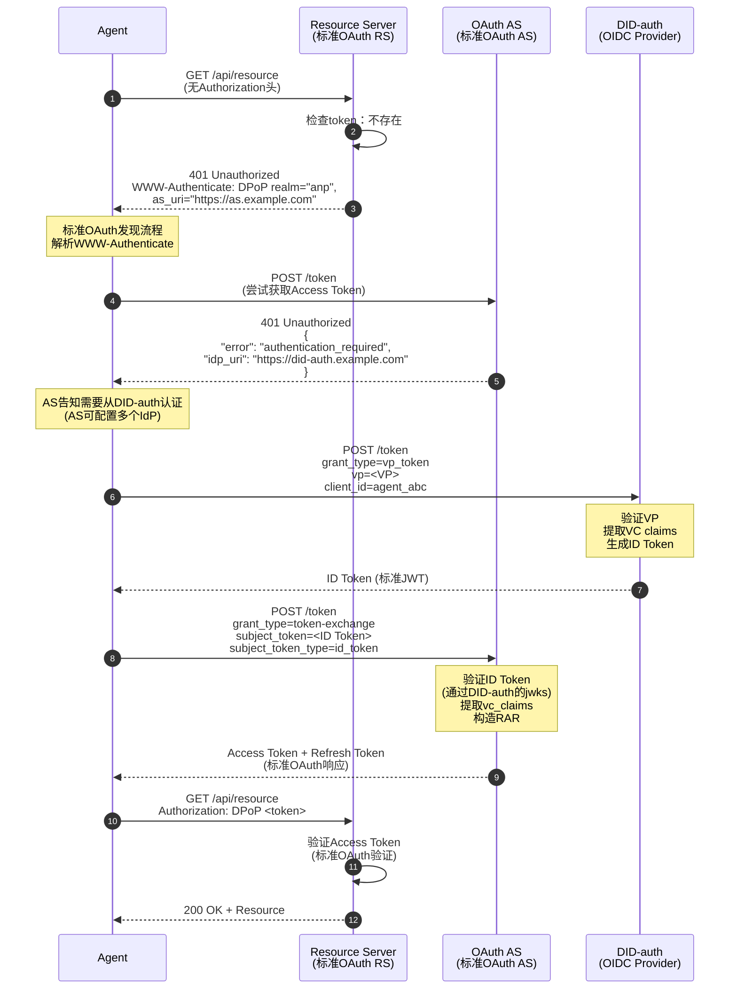
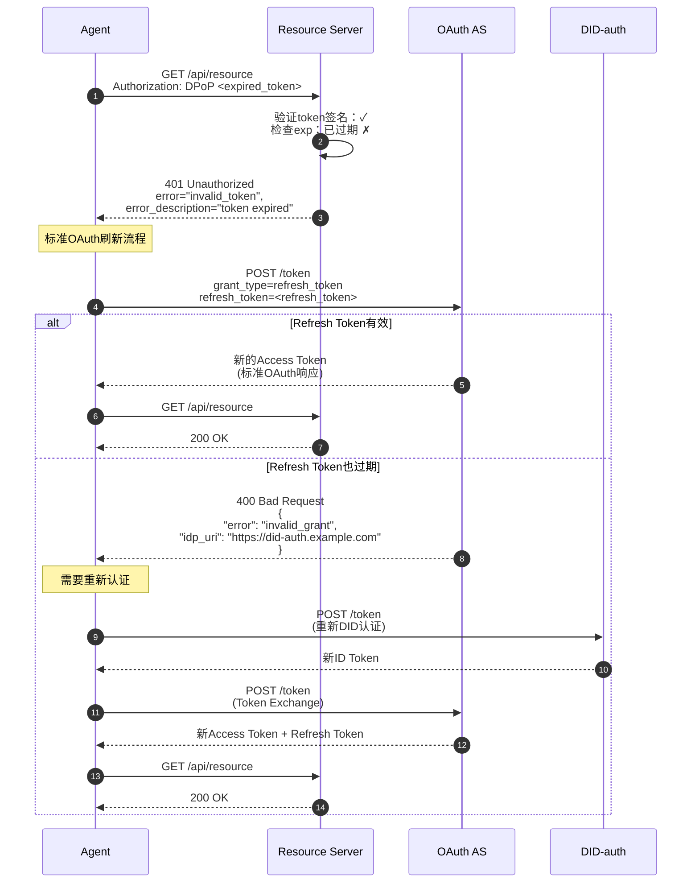
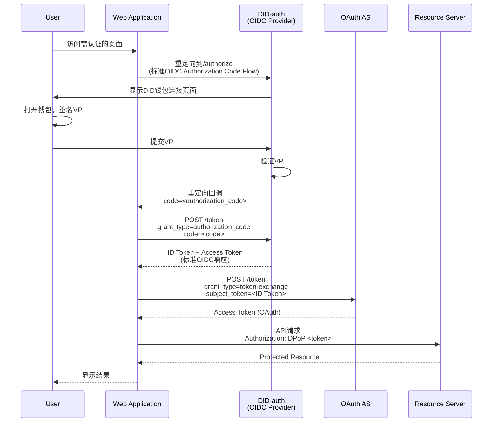
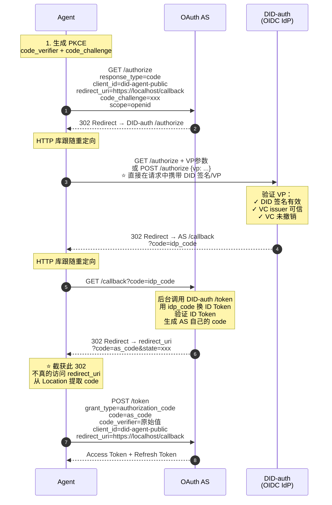
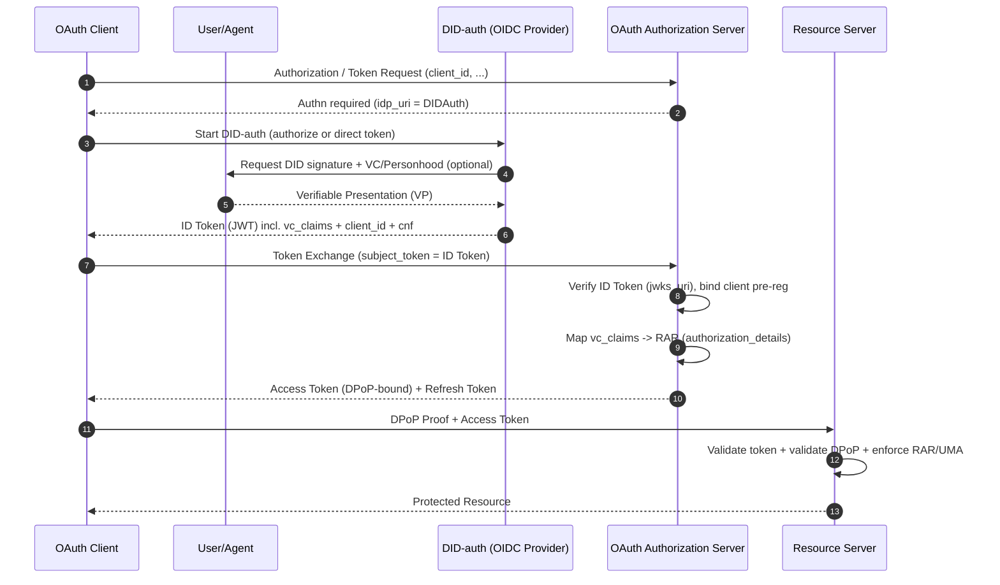

# DID-OAuth 完整集成方案

## 核心理念

**WBA DID方案对OAuth架构零影响，通过提供单点Authn服务无缝融入OAuth体系**

```
┌─────────────────────────────────────────────────────────┐
│                    OAuth 生态                            │
│  ┌──────────────┐  ┌──────────────┐  ┌──────────────┐  │
│  │   Client     │  │     AS       │  │     RS       │  │
│  │  (不变)      │  │  (不变)      │  │  (不变)      │  │
│  └──────────────┘  └──────────────┘  └──────────────┘  │
│         │                 │                  │           │
│         │                 │                  │           │
│         │          ┌──────▼──────┐           │           │
│         │          │   Authn层   │           │           │
│         └─────────►│  (可插拔)   │           │           │
│                    └──────────────┘           │           │
│                          │                    │           │
│                    ┌─────▼──────┐             │           │
│                    │ DID-auth   │             │           │
│                    │ (OIDC IdP) │             │           │
│                    └────────────┘             │           │
└─────────────────────────────────────────────────────────┘

关键：DID-auth是OAuth认证层的一个可选实现，不改变OAuth的授权架构
```

---

## 一、OAuth的分层模型与DID的定位

### 1.1 OAuth的两层架构

```
┌─────────────────────────────────────────┐
│         Authn Layer (认证层)             │
│  职责：确认"主体是谁"                     │
│  实现：密码/OIDC/SAML/DID-auth          │
│  输出：认证凭证（如ID Token）            │
└─────────────────────────────────────────┘
                    ↓
┌─────────────────────────────────────────┐
│         Authz Layer (授权层)             │
│  职责：决定"主体能做什么"                 │
│  实现：OAuth AS (token颁发)              │
│  输出：Access Token + Refresh Token      │
└─────────────────────────────────────────┘
                    ↓
┌─────────────────────────────────────────┐
│      Resource Access (资源访问)          │
│  职责：执行访问控制                       │
│  实现：Resource Server                   │
│  验证：Access Token + 策略               │
└─────────────────────────────────────────┘
```

### 1.2 DID的定位

**DID/VC/VP是Authn层的增强实现**：

| 组件 | 作用 | 优势 |
|------|------|------|
| **DID** | 去中心化身份标识 | 无需中心化身份提供商 |
| **VC** | 可验证凭证 | 第三方权威机构背书 |
| **VP** | 可验证呈现 | 可组合、防重放、可审计 |

**关键洞察**：
- ✅ DID增强Authn层（提供更强的身份验证）
- ✅ DID不替代Authz层（仍需OAuth的token机制）
- ✅ DID不影响资源访问层（RS仍验证Access Token）

---

## 二、认证场景拆分：A2A 与 A2R

本方案建议将“认证/授权”需求拆成两类链路来设计与论证：

- **A2A（Agent-to-Agent）**：agent 之间的点对点/多点通信与协作，请求的接收方本身就是 agent（或 agent 网关）。
- **A2R（Agent-to-Resource）**：agent 访问既有的 Resource Server（RS），需要兼容标准 OAuth 资源保护与既有生态。

这样拆分的价值在于：**A2A 可以原生采用 DID 的点对点认证模型以降低中心化压力；A2R 则以 OAuth token 作为既有 RS 的兼容层**。

### 2.1 A2A（Agent-to-Agent）：原生 DID 认证的优势

在 A2A 场景中，通信双方往往都能够理解 DID/VC/VP，并且不一定需要引入中心化授权服务器。

**优势**：
- ✅ **无需 OAuth Authorization Server**：双方可直接用 DID 签名/VP 进行相互认证与消息完整性保护。
- ✅ **无单点瓶颈/单点压力**：不存在所有请求都要先去 AS 换 token 的高频路径，更贴合未来 M2M/Agent 高并发调用。
- ✅ **更自然的点对点信任与委托表达**：用 VC/VP 表达“agent 归属、资质、委托链、step-up 证据”。

> 结论：在“原生 agent 网络”或“agent 之间强耦合协作”的场景，A2A 直接用 DID 做认证通常比 OAuth 更轻。

### 2.2 A2R（Agent-to-Resource）：兼容既有资源，仍应走 OAuth 授权访问

A2R 的关键约束是：**大量既有 RS 只理解 OAuth access token（JWT/DPoP/MTLS 等）**，并不理解 DID/VP。

因此，从兼容性与工程成本角度：
- ✅ agent 应通过 **OAuth 授权** 获取 **Access Token** 来访问 RS
- ✅ RS 维持既有实现：只验证 token（以及 DPoP/策略），不需要理解 DID

> 结论：A2R 应保持 OAuth token 作为资源访问的“最小公分母”。

### 2.3 仅在 Authn 节点部署标准 DID-authn（OIDC IdP）即可

在 A2R 链路中，推荐做法仍是：

1. 在 AS 侧配置一个 **OAuth 标准兼容的 DID-authn（OIDC Provider）**。
2. DID-authn 负责：验证 VP/VC、完成 DID 认证，并签发与 DID 对应的 **ID Token**（JWT）。
3. agent 使用该 **ID Token** 通过 **Token Exchange（RFC 8693）** 向 AS 申请 **Access Token**，再访问 RS。

这保持了清晰边界：
- DID-authn：解决“主体是谁/有什么可验证证据”（Authn）
- AS：解决“给什么权限、发什么 token”（Authz）
- RS：只做 token 校验与策略执行

### 2.4 Agent 侧的凭据形态：Token 存储 vs DID/密钥作为 Client Credential

从 agent 的“运行期凭据”角度，可把落地方式理解为两类（可并存）：

- **方式 A：直接存储与使用 OAuth token**
  - agent 存储 Access Token / Refresh Token
  - 优点：实现简单，完全按 OAuth 生态
  - 风险：需重点防护 token 泄露（配合 DPoP/短时 token/刷新策略）

- **方式 B：将 DID 的公私钥能力用于客户端凭据（client authentication）**
  - 不是把 DID 当作 `client_id`，而是让 agent 用“私钥证明”完成 token 端点的 client auth（工程上更接近 `private_key_jwt` / mTLS 这类模式）
  - 优点：更适合每租户一个 agent 实例的长期运行与精细吊销/轮换

> 注：这里的“DID 私钥证明”与 OAuth 的 client authentication 是两个体系，建议以 OAuth 标准方式（`private_key_jwt`/mTLS/DPoP）承载；DID 体系更多用于主体身份与证据（VC/VP）。

### 2.5 终端标准兼容要求：client_id 预注册 / 动态注册与 DID 无关，但 agent 必须支持

从“端到端标准兼容”的角度，agent 访问 OAuth AS/RS 时通常仍需要具备一个合法的 OAuth client 身份：

- **静态预注册（Client Pre-registration）**：运维/控制台提前创建 `client_id` 并约束元数据
- **动态注册（RFC 7591 Client Dynamic Registration）**：agent（或其控制面）调用注册端点获取 `client_id`（以及可能的凭据）

关键点：
- 这两种注册模式是 **OAuth 客户端治理机制**，与 DID 本身无关。
- 对于“每租户一个 agent 实例”，动态注册常用于规模化发放 `client_id`；但注册端点必须有强鉴权（initial access token/mTLS/或基于 VC 的准入）。

### 2.6 综合结论：A2A 原生 DID，A2R 走 OAuth + DID-authn

综合考虑未来 M2M/agent 的高频趋势：
- **A2A**：优先采用 **原生 DID** 认证（更轻、无 AS 单点压力）。
- **A2R**：保持 **OAuth 访问控制**，通过在 AS 侧引入 **DID-authn（OIDC IdP）** 作为认证方式，让 agent 以 ID Token → Token Exchange → Access Token 的方式访问既有 RS。

---

## 二、DID-auth作为单点Authn服务

### 2.1 架构定位

**DID-auth = 标准OIDC Provider + DID/VC/VP验证能力**

```
┌────────────────────────────────────────────────────┐
│              DID-auth (OIDC Provider)              │
│                                                    │
│  ┌──────────────────────────────────────────────┐ │
│  │  标准OIDC端点                                 │ │
│  │  ├── /.well-known/openid-configuration       │ │
│  │  ├── /token (ID Token颁发)                   │ │
│  │  ├── /jwks (公钥端点)                        │ │
│  │  └── /authorize (浏览器场景)                 │ │
│  └──────────────────────────────────────────────┘ │
│                                                    │
│  ┌──────────────────────────────────────────────┐ │
│  │  DID/VC/VP验证能力                           │ │
│  │  ├── DID解析                                 │ │
│  │  ├── VP签名验证                              │ │
│  │  ├── VC签名验证                              │ │
│  │  ├── Personhood VC验证                       │ │
│  │  └── VC撤销检查                              │ │
│  └──────────────────────────────────────────────┘ │
│                                                    │
│  输出：标准ID Token (JWT)                          │
│        包含vc_claims (已验证的VC内容)              │
└────────────────────────────────────────────────────┘
```

### 2.2 对OAuth生态的影响

| OAuth组件 | 是否需要修改 | 说明 |
|-----------|-------------|------|
| **Client** | ❌ 不需要 | 仍是标准OAuth client，只需支持OIDC |
| **AS** | ⚠️ 最小修改 | 需要信任DID-auth作为IdP，验证ID Token |
| **RS** | ❌ 不需要 | 完全不感知DID，只验证Access Token |
| **Token格式** | ❌ 不需要 | 仍是标准JWT Access Token |
| **授权流程** | ❌ 不需要 | 仍是标准OAuth 2.0流程 |

**结论**：DID-auth作为可插拔的Authn服务，对OAuth架构零破坏性影响。

---

## 三、真实触发场景

### 3.1 Agent场景：首次访问（无Token）



**关键点**：
- RS和AS使用标准OAuth协议
- DID-auth作为OIDC Provider被AS信任
- Agent获得的是标准OAuth Access Token

---

### 3.2 Agent场景：Token过期



**关键机制**：
- 优先使用Refresh Token（标准OAuth流程）
- Refresh失败才重新DID认证
- 整个流程对RS透明

---

### 3.3 浏览器场景：传统重定向流程



**关键特性**：
- 使用标准OIDC Authorization Code Flow
- 有用户交互页面（DID钱包连接）
- 有重定向回调
- WebApp获得标准OAuth Access Token

---

### 3.4 Agent场景：模拟Authorization Code Flow（最大兼容性方案）
当AS不支持Token Exchange (RFC 8693)时，Agent可以通过HTTP库模拟浏览器的Authorization Code Flow，实现最大兼容性。
#### 3.4.1 方案概述
```
┌─────────────────────────────────────────────────────────┐
│                                                         │
│  核心思路：                                              │
│                                                         │
│  • Agent 用 HTTP 库处理 302 重定向（模拟浏览器）        │
│  • IdP (DID-auth) 支持在请求中直接接受 VP 认证          │
│  • Agent 截获最终重定向，从 URL 提取 code               │
│  • 使用标准 Authorization Code 换取 Access Token        │
│                                                         │
│  优势：                                                  │
│  ✅ 兼容性最强（几乎所有 AS 都支持 Auth Code Flow）     │
│  ✅ 不需要 AS 支持 Token Exchange                       │
│  ✅ 安全性由 IdP 的 DID/VC 验证保证                    │
│                                                         │
└─────────────────────────────────────────────────────────┘
```
#### 3.4.2 完整流程

#### 3.4.3 关键实现细节
**1. PKCE 支持（Public Client 必须）**
```python
import hashlib
import base64
import secrets
# 生成 PKCE
code_verifier = secrets.token_urlsafe(32)
code_challenge = base64.urlsafe_b64encode(
hashlib.sha256(code_verifier.encode()).digest()
).decode().rstrip('=')
# 在 /authorize 请求中携带
params = {
"response_type": "code",
"client_id": "did-agent-public",
"redirect_uri": "https://localhost/callback",
"code_challenge": code_challenge,
"code_challenge_method": "S256",
"scope": "openid",
"state": secrets.token_urlsafe(16)
}
# 在 /token 请求中携带 code_verifier
token_data = {
"grant_type": "authorization_code",
"code": as_code,
"client_id": "did-agent-public",
"redirect_uri": "https://localhost/callback",
"code_verifier": code_verifier  # 必须
}
```
**2. DID-auth 支持 API 认证（不返回 HTML 页面）**
```
┌─────────────────────────────────────────────────────────┐
│                                                         │
│  DID-auth /authorize 端点需要支持：                      │
│                                                         │
│  方式 A：GET 请求带 VP 参数                             │
│  GET /authorize?                                        │
│    response_type=code&                                  │
│    client_id=xxx&                                       │
│    vp_token=<base64url编码的VP>&                       │
│    redirect_uri=...                                     │
│                                                         │
│  方式 B：POST 请求带 JSON body                          │
│  POST /authorize                                        │
│  Content-Type: application/json                         │
│  {                                                      │
│    "response_type": "code",                            │
│    "client_id": "xxx",                                 │
│    "vp": { ... VP内容 ... },                           │
│    "redirect_uri": "..."                               │
│  }                                                      │
│                                                         │
│  验证通过后直接返回 302，不返回 HTML                    │
│                                                         │
└─────────────────────────────────────────────────────────┘
```
**3. 截获最终 302 重定向**
```python
import httpx
from urllib.parse import urlparse, parse_qs
# 配置 HTTP 客户端
client = httpx.Client(follow_redirects=False)  # 不自动跟随最后一个重定向
# 手动处理重定向链
response = client.get(authorize_url, params=params)
while response.status_code in (301, 302, 303, 307, 308):
location = response.headers["location"]
# 检查是否是最终重定向（到 redirect_uri）
if location.startswith("https://localhost/callback"):
# 截获！从 URL 提取 code
parsed = urlparse(location)
query = parse_qs(parsed.query)
as_code = query["code"][0]
break
# 如果是到 DID-auth，需要附带 VP
if "did-auth.example.com" in location:
response = client.post(
location,
json={"vp": vp_object},
follow_redirects=False
)
else:
response = client.get(location, follow_redirects=False)
# 用 code 换 token
token_response = client.post(
"https://as.example.com/token",
data=token_data
)
access_token = token_response.json()["access_token"]
```
**4. redirect_uri 配置（虚拟地址）**
```json
{
"client_id": "did-agent-public",
"client_name": "DID Agent Public Client",
"token_endpoint_auth_method": "none",
"redirect_uris": [
"https://localhost/callback",
"http://localhost:8080/callback",
"app://callback"
],
"grant_types": ["authorization_code", "refresh_token"],
"response_types": ["code"]
}
```
#### 3.4.4 安全模型分析
```
┌─────────────────────────────────────────────────────────┐
│                                                         │
│  安全屏障转移：                                          │
│                                                         │
│  传统 OAuth：                                           │
│    安全依赖 → AS 的 client 注册 + client_secret        │
│                                                         │
│  本方案：                                                │
│    安全依赖 → IdP 的 DID/VC 验证                       │
│                                                         │
│  client_id 的作用降级为：                               │
│    • 满足 AS 形式要求                                   │
│    • 绑定 redirect_uri（AS 验证用）                    │
│    • 配置 PKCE 要求                                     │
│                                                         │
│  真正的身份验证：                                        │
│    ✓ DID 私钥签名（密码学不可伪造）                    │
│    ✓ VC 颁发方验证（权威机构背书）                     │
│    ✓ VC 撤销检查（动态准入控制）                       │
│                                                         │
└─────────────────────────────────────────────────────────┘
```
**攻击场景防护**：
| 攻击场景 | 防护机制 |
|---------|---------|
| 攻击者知道 client_id | 无法通过 IdP 的 DID/VC 验证 |
| 攻击者知道 redirect_uri | 没有有效 VP，拿不到 code |
| 攻击者有 DID 无 VC | VC issuer 不在信任列表，被拒绝 |
| 攻击者截获 code | PKCE 保护，没有 code_verifier 无法换 token |
#### 3.4.5 与 Token Exchange 方案对比
| 维度 | Token Exchange | 模拟 Auth Code Flow |
|------|---------------|-------------------|
| **AS 要求** | 需支持 RFC 8693 | 只需支持标准 Auth Code |
| **兼容性** | 部分 AS 支持 | 几乎所有 AS 支持 |
| **流程复杂度** | 简单（2 次 POST） | 较复杂（多次重定向） |
| **IdP 要求** | 标准 /token 端点 | 需支持 API 认证 |
| **安全性** | 同等 | 同等（DID/VC 验证） |
**选择建议**：
```
┌─────────────────────────────────────────────────────────┐
│                                                         │
│  优先使用 Token Exchange：                               │
│    AS 支持 RFC 8693 时                                  │
│    流程更简单，代码更少                                  │
│                                                         │
│  使用模拟 Auth Code Flow：                              │
│    AS 不支持 Token Exchange 时                          │
│    需要最大兼容性时                                      │
│    如 AWS Cognito 等受限环境                           │
│                                                         │
└─────────────────────────────────────────────────────────┘
```

---

## 四、关键交互机制

### 4.1 WWW-Authenticate机制（RS → Client）

**标准OAuth 2.0 Bearer Token错误响应**：

```http
HTTP/1.1 401 Unauthorized
WWW-Authenticate: DPoP realm="anp-resource-server",
  as_uri="https://as.example.com",
  error="invalid_token",
  error_description="The access token expired"
```

**Client解析后获得**：
- Token类型要求（DPoP）
- Authorization Server位置
- 错误原因

**标准依据**：RFC 6750 (Bearer Token Usage)

---

### 4.2 认证要求响应（AS → Client）

**当Client缺少认证凭证时**：

```http
HTTP/1.1 401 Unauthorized
Content-Type: application/json

{
  "error": "authentication_required",
  "error_description": "Authentication with identity provider required",
  "idp_uri": "https://did-auth.example.com",
  "idp_metadata_uri": "https://did-auth.example.com/.well-known/openid-configuration"
}
```

**Client行为**：
1. 获取IdP的metadata（OIDC Discovery）
2. 根据client类型和AS能力选择认证流程
   - **Agent（Token Exchange可用）**：直接POST /token → Token Exchange（首选）
   - **Agent（Token Exchange不可用）**：模拟Auth Code Flow → GET /authorize（兼容方案）
   - **浏览器**：重定向到/authorize → 传统重定向流程

---

### 4.3 DID认证交互（Client → DID-auth）

#### 方式A：直接Token端点（配合Token Exchange）

**Agent场景（直接API）**：

```http
POST /token HTTP/1.1
Host: did-auth.example.com
Content-Type: application/json
DPoP: <dpop_proof>

{
  "grant_type": "vp_token",
  "vp": {
    "type": "VerifiablePresentation",
    "verifiableCredential": [...],
    "proof": {
      "type": "Ed25519Signature2020",
      "challenge": "<nonce>",
      "proofValue": "..."
    }
  },
  "client_id": "agent_abc"
}
```

**响应**：

```json
{
  "id_token": "eyJhbGc...",
  "token_type": "Bearer",
  "expires_in": 300
}
```

**ID Token内容**：

```json
{
  "iss": "https://did-auth.example.com",
  "sub": "did:web:example.com:user:alice",
  "aud": "agent_abc",
  "exp": 1735804800,
  "iat": 1735801200,
  
  "vc_claims": {
    "personhood": {
      "verified": true,
      "level": "high",
      "issuer": "did:web:trusted-issuer.example"
    },
    "kyc": {
      "verified": true,
      "level": 2
    }
  },
  
  "cnf": {
    "jkt": "<dpop_public_key_thumbprint>"
  }
}
```

**关键字段**：
- `vc_claims`：已验证的VC内容（明文，可信）
- `cnf`：DPoP绑定（防token窃取）

---

#### 方式B：Authorize端点（配合Authorization Code Flow）

**Agent场景（API认证，无HTML页面）**：

```http
POST /authorize HTTP/1.1
Host: did-auth.example.com
Content-Type: application/json

{
  "response_type": "code",
  "client_id": "did-agent-public",
  "redirect_uri": "https://localhost/callback",
  "state": "xyz123",
  "code_challenge": "...",
  "code_challenge_method": "S256",
  "vp": {
    "type": "VerifiablePresentation",
    "verifiableCredential": [...],
    "proof": {
      "type": "Ed25519Signature2020",
      "challenge": "<nonce>",
      "proofValue": "..."
    }
  }
}
```

**响应**（VP验证通过）：

```http
HTTP/1.1 302 Found
Location: https://as.example.com/callback?code=SplxlOBeZQQYbYS6WxSbIA&state=xyz123
```

**使用场景**：
- AS不支持Token Exchange (RFC 8693)
- 需要最大兼容性
- Agent可以处理HTTP重定向链

**安全要点**：
- 必须配合PKCE使用
- VP验证替代传统的用户密码认证
- Agent截获最终302重定向，提取code

> 详细流程参见第3.4节

---

### 4.4 Token Exchange（Client → AS）

**⭐ 推荐方式**（当AS支持RFC 8693时）

**使用RFC 8693标准**：

```http
POST /token HTTP/1.1
Host: as.example.com
Content-Type: application/x-www-form-urlencoded
DPoP: <dpop_proof>

grant_type=urn:ietf:params:oauth:grant-type:token-exchange
&subject_token=<ID Token>
&subject_token_type=urn:ietf:params:oauth:token-type:id_token
&client_id=agent_abc
&scope=anp:social_graph
```

**AS处理流程**：

1. **验证ID Token** - 从DID-auth获取jwks验证签名
2. **提取vc_claims** - 获取已验证的VC内容
3. **构造RAR** - 根据vc_claims动态生成权限
4. **绑定DPoP** - 将公钥指纹写入Access Token

**响应**：

```json
{
  "access_token": "eyJhbGc...",
  "token_type": "DPoP",
  "expires_in": 3600,
  "refresh_token": "8xLOxBtZp8...",
  "authorization_details": [
    {
      "type": "anp.social_graph_discovery",
      "actions": ["query", "distance"],
      "constraints": {"max_depth": 3},
      "evidence": {"personhood_level": "high"}
    }
  ]
}
```

---

## 五、VC Claims到RAR的映射机制

### 5.1 为什么需要VC Claims？

**传统OAuth的局限**：

```
传统OAuth只知道"谁"：
用户登录 → AS只知道sub="alice"
         → 授予固定scope="read write"
         → 无法根据用户属性动态调整权限
```

**VC Claims的价值**：

```
有了VC Claims，AS知道"谁的什么属性"：
用户提交VP → DID-auth验证VC
           → 提取：personhood=verified, kyc_level=2
           → 这些信息进入ID Token
           → AS根据这些可信属性构造RAR
           → 动态授予细粒度权限
```

**关键洞察**：
- VC claims是**已验证的可信明文**（DID-auth已验证签名）
- AS可以**安全地使用**这些claims做授权决策
- 不同的VC组合 → 不同的权限级别

---

### 5.2 映射规则示例

**场景1：普通用户（无特殊VC）**

```
ID Token: {"vc_claims": {}}
↓
RAR: {
  "actions": ["query"],
  "constraints": {"max_depth": 1, "rate_limit": "10/hour"}
}
```

**场景2：已验证personhood**

```
ID Token: {"vc_claims": {"personhood": {"verified": true}}}
↓
RAR: {
  "actions": ["query", "distance", "neighbors"],
  "constraints": {"max_depth": 3, "rate_limit": "100/hour"},
  "evidence": {"personhood_level": "high"}
}
```

**场景3：高KYC + personhood**

```
ID Token: {
  "vc_claims": {
    "personhood": {"verified": true},
    "kyc": {"level": 3}
  }
}
↓
RAR: {
  "actions": ["query", "distance", "neighbors", "introduce"],
  "constraints": {"max_depth": 5, "rate_limit": "500/hour"},
  "evidence": {"personhood_level": "high", "kyc_level": 3}
}
```

**映射机制总结**：

| VC Claims | 授予的actions | max_depth | rate_limit |
|-----------|--------------|-----------|------------|
| 无 | query | 1 | 10/hour |
| personhood | query, distance, neighbors | 3 | 100/hour |
| personhood + KYC | query, distance, neighbors, introduce | 5 | 500/hour |

---

## 六、与OAuth生态的兼容性

### 6.1 Authn/Authz安全边界：为什么DID不会“破坏”OAuth

OAuth可以抽象为两层关注点：

- **Authn（认证层）**：回答“主体是谁”。OAuth本身不规定认证方式，工程上通常由密码、短信、SAML、OIDC等实现。
- **Authz（授权层）**：回答“主体能做什么”，并将授权结果封装为 **Access Token / Refresh Token**，由Client持有并在访问RS时出示，RS仅按标准验证与执行策略。

因此，OAuth生态里围绕token安全与授权表达发展出的机制（例如**Refresh Token、PKCE、DPoP、RAR、UMA**）本质上都是**授权工程**，与认证方式（Authn）解耦。

**DID/VC/VP的定位**也应当严格在Authn侧：
- DID提供可验证的主体标识
- VC提供可验证的属性/背书
- VP提供一次性、可组合、可审计的证明

> 结论：DID-auth只是把“如何认证”替换为DID/VP验证；OAuth的token颁发、刷新、资源访问控制仍保持不变。

### 6.2 OAuth client pre-registration：必须保留的安全假设

OAuth的安全模型要求：**Client必须预注册（client_id、redirect_uri等）**，否则无法可靠约束重定向、安全回调与token签发对象。

#### 6.2.1 本方案对client预注册的处理

本方案保持这一要求不变，但**安全屏障发生了转移**：

```
┌─────────────────────────────────────────────────────────┐
│                                                         │
│  传统OAuth的安全模型：                                   │
│    client_id + client_secret（或mTLS）                 │
│    → 防止未授权client获取token                          │
│                                                         │
│  DID-OAuth集成方案的安全模型：                           │
│    client_id（形式要求）+ DID/VC验证（实质安全）        │
│    → 安全重心从client凭据转移到主体身份验证              │
│                                                         │
└─────────────────────────────────────────────────────────┘
```

#### 6.2.2 client_id的作用变化

| 维度 | 传统OAuth | DID-OAuth方案 |
|------|----------|-------------|
| **安全作用** | ⭐⭐⭐ 核心安全屏障 | ⭐ 形式合规要求 |
| **redirect_uri约束** | ✅ 防止重定向攻击 | ✅ 保持此功能 |
| **PKCE要求** | 可选（Public Client必须） | ✅ 必须（方案3.4） |
| **真正的认证** | client_secret / mTLS | ⭐⭐⭐ DID私钥签名 + VC验证 |
| **动态注册** | 支持（RFC 7591） | 支持（可用VC做准入控制） |

#### 6.2.3 DID-auth认证输出

DID-auth在完成认证后**携带/引用client的预注册信息**，以便AS在后续token颁发中绑定：

- DID-auth认证输出（面向AS可验证）：
  - `sub`：主体DID（已通过VP验证）
  - `vc_claims`：已验证VC内容（或其摘要/引用）
  - `client_id`：预注册的客户端标识（形式要求）
  - `azp`（Authorized Party）：实际发起认证的客户端
  - 可选：`redirect_uri` / `client_metadata`引用
  - 可选：`cnf`（DPoP/PoP绑定）

AS将"**主体信息（DID验证）** + **client预注册信息（形式绑定）**"结合，再按标准OAuth流程签发Access Token/Refresh Token。

#### 6.2.4 Public Client配置示例

**用于方案3.4（模拟Authorization Code Flow）**：

```json
{
  "client_id": "did-agent-public",
  "client_name": "DID Agent Public Client",
  "client_type": "public",
  "token_endpoint_auth_method": "none",
  "redirect_uris": [
    "https://localhost/callback",
    "http://localhost:8080/callback",
    "app://callback"
  ],
  "grant_types": ["authorization_code", "refresh_token"],
  "response_types": ["code"],
  "require_pkce": true,
  "require_pushed_authorization_requests": false,
  
  "_comment": "安全说明",
  "_security_model": "DID/VC verification at IdP, not client_secret"
}
```

**关键点**：
- `token_endpoint_auth_method: "none"`：不使用client_secret
- `require_pkce: true`：强制PKCE保护code交换
- 真正的安全由DID-auth的VP验证保证

### 6.3 通用兼容序列图（DID-auth → OAuth Token → RS）

> 说明：下图给出不区分浏览器/Agent的抽象主链路；具体触发形态可参考第3章的Agent与浏览器两类时序图。



### 6.4 标准兼容性分析

| OAuth标准 | 兼容性 | 说明 |
|-----------|--------|------|
| **RFC 6749** (OAuth 2.0) | ✅ 完全兼容 | 使用标准token端点和流程 |
| **RFC 6750** (Bearer Token) | ✅ 完全兼容 | 支持标准WWW-Authenticate |
| **RFC 7519** (JWT) | ✅ 完全兼容 | Access Token使用标准JWT |
| **RFC 7636** (PKCE) | ✅ 完全兼容 | 方案3.4必须使用PKCE |
| **RFC 8693** (Token Exchange) | ✅ 完全兼容 | ID Token换Access Token（方案3.1首选） |
| **RFC 9068** (JWT Access Token) | ✅ 完全兼容 | 标准JWT Access Token格式 |
| **RFC 9449** (DPoP) | ✅ 完全兼容 | Token绑定到密钥 |
| **OIDC Core** | ✅ 完全兼容 | DID-auth实现标准OIDC Provider |
| **RAR (RFC 9396)** | ✅ 完全兼容 | authorization_details标准 |

**结论**：DID-auth方案完全基于现有OAuth/OIDC标准，无需创建新协议。

---

### 6.5 DPoP / RAR / UMA：在授权层的自然落位

本方案中三者的职责边界清晰：

- **DPoP（RFC 9449）**：解决“token被窃取后可重放”的问题。
  - DID-auth侧：Client可提供DPoP公钥（或其thumbprint），DID-auth在ID Token中返回`cnf.jkt`/`cnf.jwk`。
  - AS侧：将PoP绑定信息写入Access Token的`cnf`，并在token交换/颁发时强制一致性。
  - RS侧：按标准校验DPoP proof与token的`cnf`匹配。

- **RAR（RFC 9396）**：解决“scope过粗、难审计、难表达复杂能力”的问题。
  - DID-auth侧：提供可信的`vc_claims`（或证据引用），为授权决策提供输入。
  - AS侧：将`vc_claims -> authorization_details`（RAR）作为授权构造引擎。
  - RS侧：只需解析并执行`authorization_details`，无需理解DID/VC。

- **UMA（用户管理授权）**：解决“用户可控、跨域共享、细粒度策略”的问题。
  - VC可表达资源所有权、主体合法性（例如personhood），UMA policy可引用这些条件。
  - 落地方式：AS签发的token携带RAR（或UMA相关声明），RS在策略点执行。

### 6.6 零信任视角：DID-VC的动态增信（Step-up Authn）

零信任强调“每次访问都需要动态评估风险，并可能要求更强认证”。DID/VC/VP天然适合做自动化的增信输入：

- 可按风险等级组合多个VC一次性形成VP（例如：DID身份VC、personhood VC、设备绑定VC、关系VC、风险评估VC等）。
- AS侧只需验证一次签名链，并将结果映射为token claims / RAR / UMA条件。

> 这使得“动态增信”从多次交互/多家IdP协调，变为一次VP提交 + 一次验证 + 一次授权映射。

### 6.7 现有OAuth生态集成

**与主流OAuth AS的集成**：

```
┌─────────────────────────────────────────┐
│      现有OAuth AS (如Keycloak)         │
│  ┌───────────────────────────────────┐  │
│  │  Identity Provider配置            │  │
│  │  ├── Google (OIDC)                │  │
│  │  ├── Azure AD (OIDC)              │  │
│  │  ├── SAML IdP                     │  │
│  │  └── DID-auth (OIDC) ← 新增      │  │
│  └───────────────────────────────────┘  │
│                                         │
│  配置方式：                              │
│  - 添加OIDC Provider                    │
│  - 配置issuer URL                       │
│  - 配置jwks_uri                         │
│  - 映射vc_claims到用户属性              │
└─────────────────────────────────────────┘
```

**无需修改**：
- Client应用代码
- Resource Server验证逻辑
- Token格式
- API端点

**只需配置**：
- 在AS中添加DID-auth作为可信IdP
- 配置vc_claims到RAR的映射规则

---

## 七、实现清单

### 7.1 DID-auth需实现

**标准OIDC端点**：
- [ ] GET `/.well-known/openid-configuration` (服务发现)
- [ ] GET `/jwks` (公钥端点)
- [ ] POST `/token` (ID Token颁发)
- [ ] GET `/authorize` (浏览器场景)
- [ ] POST `/authorize` (Agent API认证场景) ← 新增

**Agent API认证支持（/authorize 端点）**：
- [ ] 接受 GET 请求中的 vp_token 参数
- [ ] 接受 POST 请求中的 VP JSON body
- [ ] VP 验证通过后直接返回 302（不返回 HTML）
- [ ] 与标准 OIDC Authorization Code Flow 兼容

**DID/VC/VP验证**：
- [ ] DID解析（支持did:web等方法）
- [ ] VP签名验证
- [ ] VC签名验证
- [ ] Personhood VC验证
- [ ] VC撤销检查
- [ ] Challenge/nonce管理

**安全机制**：
- [ ] client_id白名单管理
- [ ] DPoP验证
- [ ] Rate limiting

---

### 7.2 OAuth AS需实现

**Client预注册与绑定（保持OAuth安全模型）**：
- [ ] client预注册管理（`client_id`、`redirect_uri`、认证方式、DPoP要求等）
- [ ] 在Token Exchange阶段校验`client_id`与ID Token / 认证上下文一致
- [ ] 将client元数据约束（如redirect_uri、DPoP要求、token_policy）纳入签发决策


**OIDC集成**：
- [ ] 配置DID-auth作为可信IdP
- [ ] 从DID-auth获取jwks验证ID Token
- [ ] Token Exchange支持（RFC 8693）

**VC Claims处理**：
- [ ] 提取ID Token中的vc_claims
- [ ] vc_claims到RAR的映射逻辑
- [ ] RAR构造引擎

**Token管理**：
- [ ] DPoP binding到Access Token
- [ ] Refresh Token管理
- [ ] Token撤销

---

### 7.3 Resource Server需实现

**标准OAuth验证**：
- [ ] Access Token签名验证
- [ ] Token过期检查
- [ ] DPoP验证

**RAR enforcement**：
- [ ] 解析authorization_details
- [ ] 检查actions是否允许
- [ ] 检查constraints是否满足
- [ ] 检查evidence要求

**无需实现**：
- ❌ DID解析
- ❌ VP验证
- ❌ VC验证

---

## 八、总结

### 8.1 核心结论

**DID-auth对OAuth架构的影响：零**

```
┌─────────────────────────────────────────┐
│  DID-auth = 标准OIDC Provider           │
│           + DID/VC/VP验证能力           │
│                                         │
│  定位：OAuth认证层的可插拔实现           │
│  输出：标准ID Token                     │
│  集成：通过OIDC标准协议                  │
└─────────────────────────────────────────┘
```

**关键优势**：

1. **完全标准化** - 基于OIDC、OAuth 2.0、Token Exchange等成熟标准
2. **零破坏性** - Client、RS无需修改，AS最小配置
3. **职责清晰** - DID-auth专注Authn，AS专注Authz
4. **灵活扩展** - VC claims提供属性基础的动态授权
5. **安全增强** - DPoP绑定、VP防重放、全程签名链

---

### 8.2 与传统方案对比

| 维度 | 传统OAuth | DID-OAuth集成方案 |
|------|----------|------------------|
| **身份验证** | 密码/短信/扫码 | DID签名 + VP |
| **身份提供商** | 中心化IdP | 去中心化DID-auth |
| **属性证明** | IdP自己声明 | 第三方VC背书 |
| **授权依据** | 固定scope | 动态RAR（基于VC claims） |
| **Token安全** | Bearer Token | DPoP绑定 |
| **可审计性** | 有限 | 完整签名链 + evidence |
| **标准兼容** | ✓ | ✓ (完全兼容) |

---

### 8.3 适用场景

**Agent场景**（推荐）：
- ✅ 无需浏览器交互
- ✅ 自动化认证流程
- ✅ 密钥自动签名
- ✅ 适合M2M通信

**Agent 获取 Token 的两种方式**：
| 方式 | Token Exchange | 模拟 Auth Code Flow |
|------|---------------|-------------------|
| **AS 要求** | 支持 RFC 8693 | 标准 Auth Code 即可 |
| **适用场景** | 现代 AS（Keycloak、Auth0） | 传统 AS、受限环境 |
| **实现复杂度** | 低 | 中 |
| **推荐程度** | ⭐⭐⭐ 首选 | ⭐⭐ 兼容方案 |

**浏览器场景**（兼容）：
- ✅ 标准OIDC重定向流程
- ✅ DID钱包集成
- ✅ 用户体验友好

**企业场景**：
- ✅ 与现有OAuth AS集成
- ✅ 支持多IdP并存
- ✅ 渐进式迁移

---

### 8.4 未来扩展方向

1. **跨域ID Token复用** - 一个ID Token换取多个AS的Access Token
2. **VC撤销实时检查** - 集成VC状态列表
3. **零知识证明** - 选择性披露VC claims
4. **去中心化AS** - 基于DID的分布式授权服务
5. **UMA集成** - 用户管理的细粒度资源授权

---

### 8.5 关键要点

**对于架构师**：
- DID-auth是OAuth的Authn插件，不是替代品
- 可以与现有OAuth基础设施无缝集成
- 支持渐进式采用，无需全面重构

**对于开发者**：
- Client代码无需修改（标准OAuth client）
- RS代码无需修改（标准token验证）
- AS只需配置DID-auth为可信IdP

**对于安全团队**：
- 全程签名链可审计
- DPoP防token窃取
- VC claims提供可验证的属性证明
- 符合零信任架构原则

---

## 附录：参考标准

- **RFC 6749** - OAuth 2.0 Authorization Framework
- **RFC 6750** - OAuth 2.0 Bearer Token Usage
- **RFC 7519** - JSON Web Token (JWT)
- **RFC 8693** - OAuth 2.0 Token Exchange
- **RFC 9068** - JSON Web Token (JWT) Profile for OAuth 2.0 Access Tokens
- **RFC 9396** - OAuth 2.0 Rich Authorization Requests (RAR)
- **RFC 9449** - OAuth 2.0 Demonstrating Proof of Possession (DPoP)
- **OIDC Core** - OpenID Connect Core 1.0
- **W3C DID Core** - Decentralized Identifiers (DIDs) v1.0
- **W3C VC Data Model** - Verifiable Credentials Data Model v1.1

