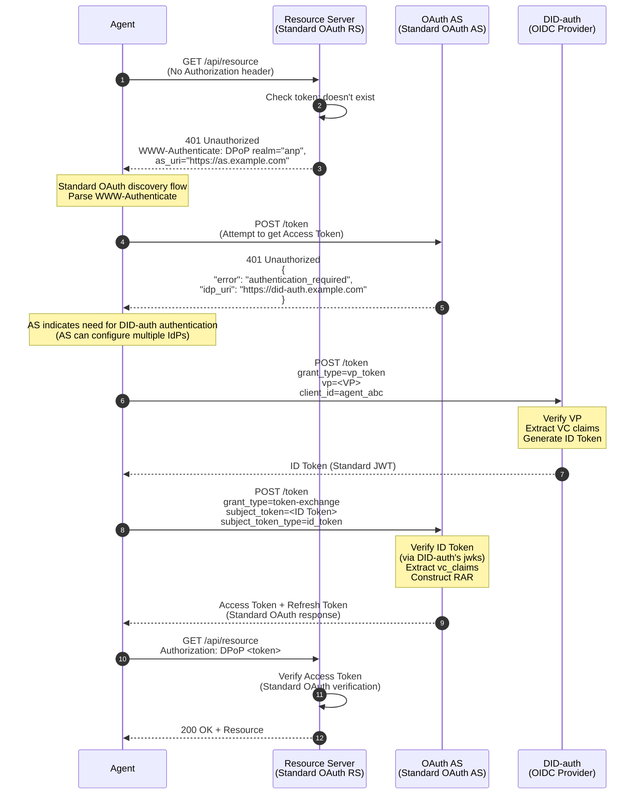
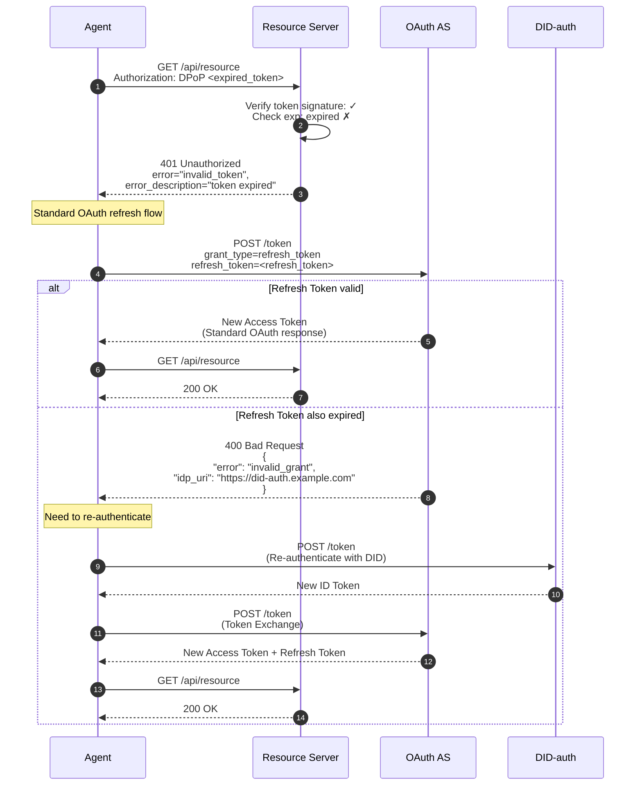
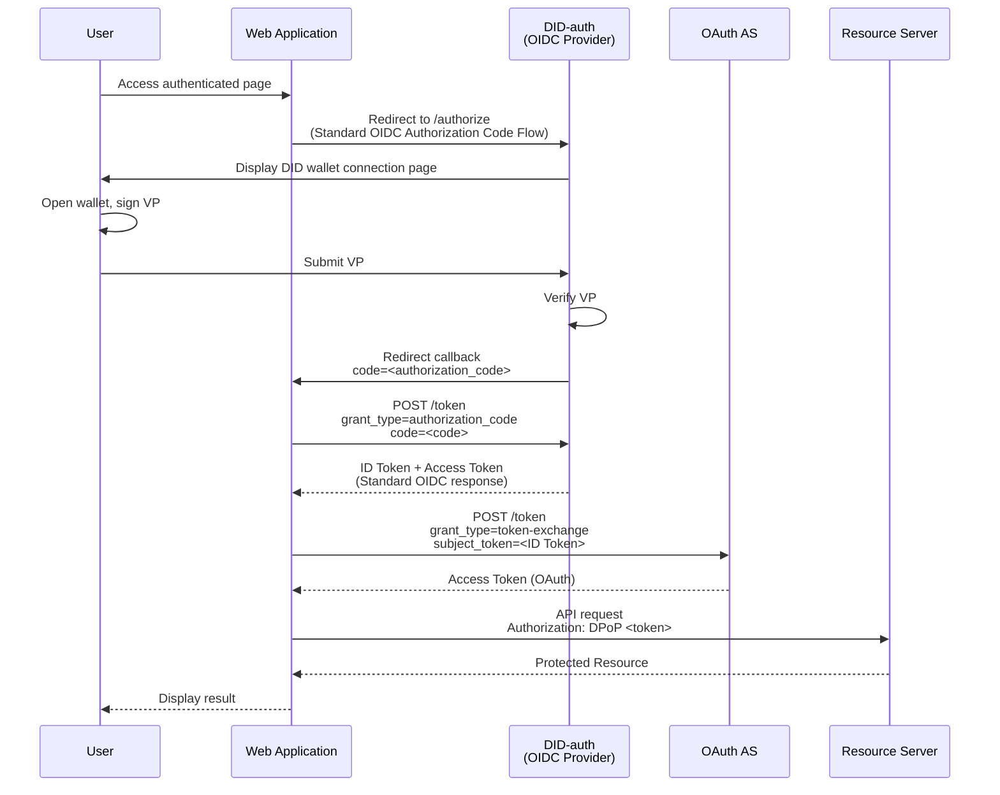
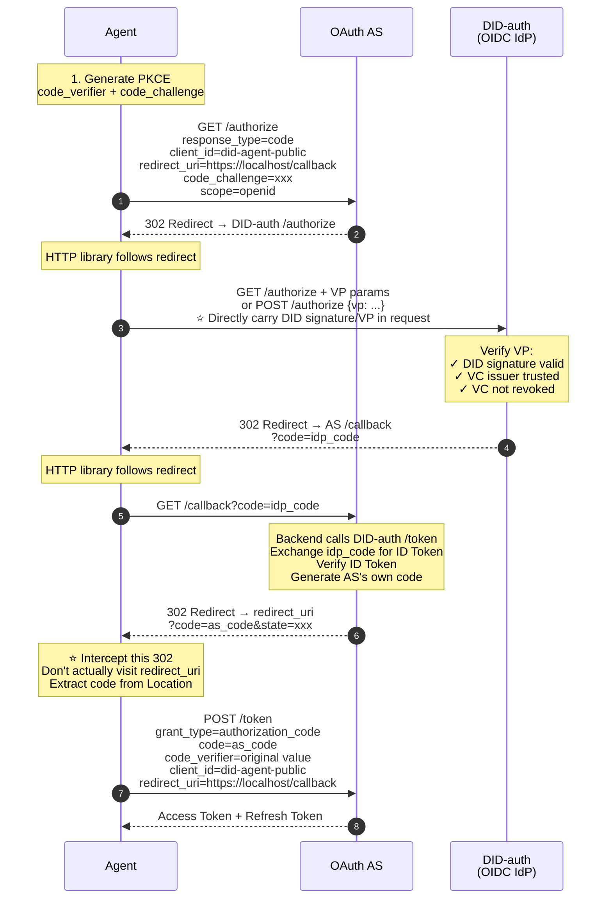
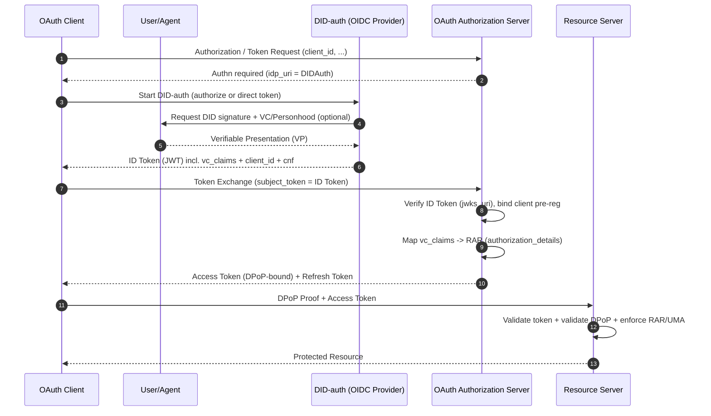

# DID-OAuth Complete Integration Solution

## Core Concept

**WBA DID solution has zero impact on OAuth architecture, seamlessly integrating into the OAuth ecosystem by providing single-point Authn services**

```
┌─────────────────────────────────────────────────────────┐
│                    OAuth Ecosystem                       │
│  ┌──────────────┐  ┌──────────────┐  ┌──────────────┐  │
│  │   Client     │  │     AS       │  │     RS       │  │
│  │  (unchanged) │  │  (unchanged) │  │  (unchanged) │  │
│  └──────────────┘  └──────────────┘  └──────────────┘  │
│         │                 │                  │           │
│         │                 │                  │           │
│         │          ┌──────▼──────┐           │           │
│         │          │   Authn     │           │           │
│         └─────────►│  (pluggable)│           │           │
│                    └──────────────┘           │           │
│                          │                    │           │
│                    ┌─────▼──────┐             │           │
│                    │ DID-auth   │             │           │
│                    │ (OIDC IdP) │             │           │
│                    └────────────┘             │           │
└─────────────────────────────────────────────────────────┘

Key: DID-auth is an optional implementation of OAuth's authentication layer,
     not changing OAuth's authorization architecture
```

---

## I. OAuth's Layered Model and DID's Positioning

### 1.1 OAuth's Two-Layer Architecture

```
┌─────────────────────────────────────────┐
│         Authn Layer (Authentication)     │
│  Responsibility: Confirm "who is the     │
│                  subject"                │
│  Implementation: Password/OIDC/SAML/     │
│                  DID-auth                │
│  Output: Authentication credentials      │
│          (e.g., ID Token)                │
└─────────────────────────────────────────┘
                    ↓
┌─────────────────────────────────────────┐
│         Authz Layer (Authorization)      │
│  Responsibility: Decide "what the        │
│                  subject can do"         │
│  Implementation: OAuth AS (token         │
│                  issuance)               │
│  Output: Access Token + Refresh Token    │
└─────────────────────────────────────────┘
                    ↓
┌─────────────────────────────────────────┐
│      Resource Access                     │
│  Responsibility: Execute access control  │
│  Implementation: Resource Server         │
│  Verification: Access Token + Policy     │
└─────────────────────────────────────────┘
```

### 1.2 DID's Positioning

**DID/VC/VP is an enhanced implementation of the Authn layer**:

| Component | Role | Advantage |
|------|------|---------|
| **DID** | Decentralized identity identifier | No centralized identity provider needed |
| **VC** | Verifiable credential | Third-party authority endorsement |
| **VP** | Verifiable presentation | Composable, replay-resistant, auditable |

**Key Insights**:
- ✅ DID enhances the Authn layer (provides stronger identity verification)
- ✅ DID does not replace the Authz layer (still needs OAuth's token mechanism)
- ✅ DID does not affect the resource access layer (RS still verifies Access Token)

---

## II. Authentication Scenario Breakdown: A2A vs A2R

This solution recommends splitting "authentication/authorization" requirements into two types of chains for design and validation:

- **A2A (Agent-to-Agent)**: Point-to-point/multi-point communication and collaboration between agents, where the request receiver is itself an agent (or agent gateway).
- **A2R (Agent-to-Resource)**: Agent accessing existing Resource Servers (RS), requiring compatibility with standard OAuth resource protection and existing ecosystems.

The value of this split: **A2A can natively adopt DID's point-to-point authentication model to reduce centralization pressure; A2R uses OAuth tokens as a compatibility layer for existing RS**.

### 2.1 A2A (Agent-to-Agent): Advantages of Native DID Authentication

In A2A scenarios, both communicating parties can often understand DID/VC/VP and don't necessarily need to introduce a centralized authorization server.

**Advantages**:
- ✅ **No OAuth Authorization Server needed**: Both parties can directly use DID signatures/VP for mutual authentication and message integrity protection.
- ✅ **No single point bottleneck/pressure**: No high-frequency path where all requests must first go to AS to exchange tokens, more suitable for future M2M/Agent high-concurrency calls.
- ✅ **More natural point-to-point trust and delegation expression**: Use VC/VP to express "agent ownership, qualifications, delegation chain, step-up evidence".

> Conclusion: In "native agent networks" or "tightly coupled agent collaboration" scenarios, A2A directly using DID for authentication is usually lighter than OAuth.

### 2.2 A2R (Agent-to-Resource): Compatible with Existing Resources, Should Still Use OAuth Authorization Access

The key constraint of A2R is: **Many existing RS only understand OAuth access tokens (JWT/DPoP/MTLS, etc.)** and don't understand DID/VP.

Therefore, from compatibility and engineering cost perspectives:
- ✅ Agents should obtain **Access Tokens** through **OAuth authorization** to access RS
- ✅ RS maintains existing implementation: only validates tokens (and DPoP/policy), doesn't need to understand DID

> Conclusion: A2R should maintain OAuth tokens as the "lowest common denominator" for resource access.

### 2.3 Deploy Standard DID-authn (OIDC IdP) Only at Authn Node

In the A2R chain, the recommended approach is still:

1. Configure a **standard OAuth-compatible DID-authn (OIDC Provider)** on the AS side.
2. DID-authn is responsible for: verifying VP/VC, completing DID authentication, and issuing **ID Token** (JWT) corresponding to the DID.
3. Agent uses this **ID Token** to apply for **Access Token** from AS through **Token Exchange (RFC 8693)**, then accesses RS.

This maintains clear boundaries:
- DID-authn: Solves "who is the subject/what verifiable evidence" (Authn)
- AS: Solves "what permissions to give, what token to issue" (Authz)
- RS: Only validates tokens and executes policies

### 2.4 Agent-side Credential Forms: Token Storage vs DID/Keys as Client Credential

From the agent's "runtime credential" perspective, implementation methods can be understood as two types (can coexist):

- **Method A: Directly store and use OAuth tokens**
  - Agent stores Access Token / Refresh Token
  - Advantage: Simple implementation, fully follows OAuth ecosystem
  - Risk: Need to focus on preventing token leakage (with DPoP/short-lived tokens/refresh strategy)

- **Method B: Use DID public/private key capabilities for client credentials (client authentication)**
  - Not using DID as `client_id`, but letting agent use "private key proof" to complete client auth at token endpoint (engineering-wise closer to `private_key_jwt` / mTLS patterns)
  - Advantage: More suitable for long-term operation and fine-grained revocation/rotation of one agent instance per tenant

> Note: The "DID private key proof" here and OAuth's client authentication are two systems; it's recommended to carry it in OAuth standard ways (`private_key_jwt`/mTLS/DPoP); DID system is more for subject identity and evidence (VC/VP).

### 2.5 Terminal Standard Compatibility Requirements: client_id Pre-registration / Dynamic Registration Independent of DID, but Agent Must Support

From an "end-to-end standard compatibility" perspective, agents accessing OAuth AS/RS typically still need to have a legitimate OAuth client identity:

- **Static Pre-registration (Client Pre-registration)**: Operations/console creates `client_id` in advance and constrains metadata
- **Dynamic Registration (RFC 7591 Client Dynamic Registration)**: Agent (or its control plane) calls registration endpoint to obtain `client_id` (and possibly credentials)

Key points:
- These two registration modes are **OAuth client governance mechanisms**, independent of DID itself.
- For "one agent instance per tenant", dynamic registration is commonly used for scaled `client_id` distribution; but registration endpoint must have strong authentication (initial access token/mTLS/or VC-based admission).

### 2.6 Comprehensive Conclusion: A2A Native DID, A2R Uses OAuth + DID-authn

Comprehensively considering future M2M/agent high-frequency trends:
- **A2A**: Prioritize **native DID** authentication (lighter, no AS single point pressure).
- **A2R**: Maintain **OAuth access control**, by introducing **DID-authn (OIDC IdP)** on AS side as authentication method, letting agent access existing RS through ID Token → Token Exchange → Access Token.

---

## II. DID-auth as Single-Point Authn Service

### 2.1 Architecture Positioning

**DID-auth = Standard OIDC Provider + DID/VC/VP Verification Capability**

```
┌────────────────────────────────────────────────────┐
│              DID-auth (OIDC Provider)              │
│                                                    │
│  ┌──────────────────────────────────────────────┐ │
│  │  Standard OIDC Endpoints                     │ │
│  │  ├── /.well-known/openid-configuration       │ │
│  │  ├── /token (ID Token issuance)              │ │
│  │  ├── /jwks (public key endpoint)             │ │
│  │  └── /authorize (browser scenario)           │ │
│  └──────────────────────────────────────────────┘ │
│                                                    │
│  ┌──────────────────────────────────────────────┐ │
│  │  DID/VC/VP Verification Capability           │ │
│  │  ├── DID resolution                          │ │
│  │  ├── VP signature verification               │ │
│  │  ├── VC signature verification               │ │
│  │  ├── Personhood VC verification              │ │
│  │  └── VC revocation check                     │ │
│  └──────────────────────────────────────────────┘ │
│                                                    │
│  Output: Standard ID Token (JWT)                   │
│          Contains vc_claims (verified VC content)  │
└────────────────────────────────────────────────────┘
```

### 2.2 Impact on OAuth Ecosystem

| OAuth Component | Needs Modification | Description |
|-----------|-------------|------|
| **Client** | ❌ No | Still standard OAuth client, only needs OIDC support |
| **AS** | ⚠️ Minimal | Needs to trust DID-auth as IdP, verify ID Token |
| **RS** | ❌ No | Completely unaware of DID, only verifies Access Token |
| **Token Format** | ❌ No | Still standard JWT Access Token |
| **Authorization Flow** | ❌ No | Still standard OAuth 2.0 flow |

**Conclusion**: DID-auth as a pluggable Authn service has zero destructive impact on OAuth architecture.

---

## III. Real Trigger Scenarios

### 3.1 Agent Scenario: First Access (No Token)



**Key Points**:
- RS and AS use standard OAuth protocol
- DID-auth acts as OIDC Provider trusted by AS
- Agent obtains standard OAuth Access Token

---

### 3.2 Agent Scenario: Token Expiration



**Key Mechanisms**:
- Prioritize using Refresh Token (standard OAuth flow)
- Only re-authenticate with DID when Refresh fails
- Entire flow is transparent to RS

---

### 3.3 Browser Scenario: Traditional Redirect Flow



**Key Features**:
- Uses standard OIDC Authorization Code Flow
- Has user interaction page (DID wallet connection)
- Has redirect callback
- WebApp obtains standard OAuth Access Token

---

### 3.4 Agent Scenario: Simulating Authorization Code Flow (Maximum Compatibility Solution)

When AS doesn't support Token Exchange (RFC 8693), Agent can simulate browser's Authorization Code Flow using HTTP library for maximum compatibility.

#### 3.4.1 Solution Overview

```
┌─────────────────────────────────────────────────────────┐
│                                                         │
│  Core Idea:                                             │
│                                                         │
│  • Agent uses HTTP library to handle 302 redirects     │
│    (simulating browser)                                 │
│  • IdP (DID-auth) supports accepting VP authentication │
│    directly in request                                  │
│  • Agent intercepts final redirect, extracts code      │
│    from URL                                             │
│  • Uses standard Authorization Code to exchange for    │
│    Access Token                                         │
│                                                         │
│  Advantages:                                            │
│  ✅ Strongest compatibility (almost all AS support     │
│     Auth Code Flow)                                     │
│  ✅ Doesn't require AS to support Token Exchange       │
│  ✅ Security guaranteed by IdP's DID/VC verification   │
│                                                         │
└─────────────────────────────────────────────────────────┘
```

#### 3.4.2 Complete Flow



#### 3.4.3 Key Implementation Details

**1. PKCE Support (Required for Public Client)**

```python
import hashlib
import base64
import secrets

# Generate PKCE
code_verifier = secrets.token_urlsafe(32)
code_challenge = base64.urlsafe_b64encode(
    hashlib.sha256(code_verifier.encode()).digest()
).decode().rstrip('=')

# Carry in /authorize request
params = {
    "response_type": "code",
    "client_id": "did-agent-public",
    "redirect_uri": "https://localhost/callback",
    "code_challenge": code_challenge,
    "code_challenge_method": "S256",
    "scope": "openid",
    "state": secrets.token_urlsafe(16)
}

# Carry code_verifier in /token request
token_data = {
    "grant_type": "authorization_code",
    "code": as_code,
    "client_id": "did-agent-public",
    "redirect_uri": "https://localhost/callback",
    "code_verifier": code_verifier  # Required
}
```

**2. DID-auth Supports API Authentication (No HTML Page Return)**

```
┌─────────────────────────────────────────────────────────┐
│                                                         │
│  DID-auth /authorize endpoint needs to support:        │
│                                                         │
│  Method A: GET request with VP parameter               │
│  GET /authorize?                                        │
│    response_type=code&                                  │
│    client_id=xxx&                                       │
│    vp_token=<base64url encoded VP>&                    │
│    redirect_uri=...                                     │
│                                                         │
│  Method B: POST request with JSON body                 │
│  POST /authorize                                        │
│  Content-Type: application/json                         │
│  {                                                      │
│    "response_type": "code",                            │
│    "client_id": "xxx",                                 │
│    "vp": { ... VP content ... },                       │
│    "redirect_uri": "..."                               │
│  }                                                      │
│                                                         │
│  After verification, directly return 302, no HTML      │
│                                                         │
└─────────────────────────────────────────────────────────┘
```

**3. Intercepting Final 302 Redirect**

```python
import httpx
from urllib.parse import urlparse, parse_qs

# Configure HTTP client
client = httpx.Client(follow_redirects=False)  # Don't auto-follow last redirect

# Manually handle redirect chain
response = client.get(authorize_url, params=params)
while response.status_code in (301, 302, 303, 307, 308):
    location = response.headers["location"]

    # Check if this is final redirect (to redirect_uri)
    if location.startswith("https://localhost/callback"):
        # Intercepted! Extract code from URL
        parsed = urlparse(location)
        query = parse_qs(parsed.query)
        as_code = query["code"][0]
        break

    # If redirecting to DID-auth, need to attach VP
    if "did-auth.example.com" in location:
        response = client.post(
            location,
            json={"vp": vp_object},
            follow_redirects=False
        )
    else:
        response = client.get(location, follow_redirects=False)

# Exchange code for token
token_response = client.post(
    "https://as.example.com/token",
    data=token_data
)
access_token = token_response.json()["access_token"]
```

**4. redirect_uri Configuration (Virtual Address)**

```json
{
  "client_id": "did-agent-public",
  "client_name": "DID Agent Public Client",
  "token_endpoint_auth_method": "none",
  "redirect_uris": [
    "https://localhost/callback",
    "http://localhost:8080/callback",
    "app://callback"
  ],
  "grant_types": ["authorization_code", "refresh_token"],
  "response_types": ["code"]
}
```

#### 3.4.4 Security Model Analysis

```
┌─────────────────────────────────────────────────────────┐
│                                                         │
│  Security Barrier Transfer:                            │
│                                                         │
│  Traditional OAuth:                                     │
│    Security relies on → AS's client registration +     │
│                         client_secret                   │
│                                                         │
│  This Solution:                                         │
│    Security relies on → IdP's DID/VC verification      │
│                                                         │
│  client_id's role downgraded to:                       │
│    • Satisfy AS formal requirements                    │
│    • Bind redirect_uri (for AS verification)           │
│    • Configure PKCE requirements                       │
│                                                         │
│  Real identity verification:                           │
│    ✓ DID private key signature (cryptographically      │
│      unforgeable)                                       │
│    ✓ VC issuer verification (authority endorsement)    │
│    ✓ VC revocation check (dynamic admission control)   │
│                                                         │
└─────────────────────────────────────────────────────────┘
```

**Attack Scenario Protection**:

| Attack Scenario | Protection Mechanism |
|-----------------|---------------------|
| Attacker knows client_id | Cannot pass IdP's DID/VC verification |
| Attacker knows redirect_uri | No valid VP, cannot get code |
| Attacker has DID but no VC | VC issuer not in trust list, rejected |
| Attacker intercepts code | PKCE protection, cannot exchange token without code_verifier |

#### 3.4.5 Comparison with Token Exchange Solution

| Dimension | Token Exchange | Simulated Auth Code Flow |
|-----------|---------------|-------------------------|
| **AS Requirements** | Needs RFC 8693 support | Only needs standard Auth Code |
| **Compatibility** | Partial AS support | Almost all AS support |
| **Flow Complexity** | Simple (2 POSTs) | More complex (multiple redirects) |
| **IdP Requirements** | Standard /token endpoint | Needs API authentication support |
| **Security** | Equivalent | Equivalent (DID/VC verification) |

**Selection Recommendation**:

```
┌─────────────────────────────────────────────────────────┐
│                                                         │
│  Prioritize Token Exchange:                            │
│    When AS supports RFC 8693                           │
│    Simpler flow, less code                             │
│                                                         │
│  Use Simulated Auth Code Flow:                         │
│    When AS doesn't support Token Exchange              │
│    When maximum compatibility needed                   │
│    E.g., AWS Cognito and other restricted environments │
│                                                         │
└─────────────────────────────────────────────────────────┘
```

---

## IV. Key Interaction Mechanisms

### 4.1 WWW-Authenticate Mechanism (RS → Client)

**Standard OAuth 2.0 Bearer Token Error Response**:

```http
HTTP/1.1 401 Unauthorized
WWW-Authenticate: DPoP realm="anp-resource-server",
  as_uri="https://as.example.com",
  error="invalid_token",
  error_description="The access token expired"
```

**Client Obtains After Parsing**:
- Token type requirement (DPoP)
- Authorization Server location
- Error reason

**Standard Basis**: RFC 6750 (Bearer Token Usage)

---

### 4.2 Authentication Requirement Response (AS → Client)

**When Client lacks authentication credentials**:

```http
HTTP/1.1 401 Unauthorized
Content-Type: application/json

{
  "error": "authentication_required",
  "error_description": "Authentication with identity provider required",
  "idp_uri": "https://did-auth.example.com",
  "idp_metadata_uri": "https://did-auth.example.com/.well-known/openid-configuration"
}
```

**Client Behavior**:
1. Obtain IdP's metadata (OIDC Discovery)
2. Select authentication flow based on client type and AS capabilities
   - **Agent (Token Exchange available)**: Direct POST /token → Token Exchange (preferred)
   - **Agent (Token Exchange unavailable)**: Simulate Auth Code Flow → GET /authorize (compatibility scheme)
   - **Browser**: Redirect to /authorize → Traditional redirect flow

---

### 4.3 DID Authentication Interaction (Client → DID-auth)

#### Method A: Direct Token Endpoint (Paired with Token Exchange)

**Agent scenario (direct API)**:

```http
POST /token HTTP/1.1
Host: did-auth.example.com
Content-Type: application/json
DPoP: <dpop_proof>

{
  "grant_type": "vp_token",
  "vp": {
    "type": "VerifiablePresentation",
    "verifiableCredential": [...],
    "proof": {
      "type": "Ed25519Signature2020",
      "challenge": "<nonce>",
      "proofValue": "..."
    }
  },
  "client_id": "agent_abc"
}
```

**Response**:

```json
{
  "id_token": "eyJhbGc...",
  "token_type": "Bearer",
  "expires_in": 300
}
```

**ID Token Content**:

```json
{
  "iss": "https://did-auth.example.com",
  "sub": "did:web:example.com:user:alice",
  "aud": "agent_abc",
  "exp": 1735804800,
  "iat": 1735801200,
  
  "vc_claims": {
    "personhood": {
      "verified": true,
      "level": "high",
      "issuer": "did:web:trusted-issuer.example"
    },
    "kyc": {
      "verified": true,
      "level": 2
    }
  },
  
  "cnf": {
    "jkt": "<dpop_public_key_thumbprint>"
  }
}
```

**Key Fields**:
- `vc_claims`: Verified VC content (plaintext, trusted)
- `cnf`: DPoP binding (prevents token theft)

---

#### Method B: Authorize Endpoint (Paired with Authorization Code Flow)

**Agent scenario (API authentication, no HTML page)**:

```http
POST /authorize HTTP/1.1
Host: did-auth.example.com
Content-Type: application/json

{
  "response_type": "code",
  "client_id": "did-agent-public",
  "redirect_uri": "https://localhost/callback",
  "state": "xyz123",
  "code_challenge": "...",
  "code_challenge_method": "S256",
  "vp": {
    "type": "VerifiablePresentation",
    "verifiableCredential": [...],
    "proof": {
      "type": "Ed25519Signature2020",
      "challenge": "<nonce>",
      "proofValue": "..."
    }
  }
}
```

**Response** (VP verification passed):

```http
HTTP/1.1 302 Found
Location: https://as.example.com/callback?code=SplxlOBeZQQYbYS6WxSbIA&state=xyz123
```

**Usage Scenarios**:
- AS does not support Token Exchange (RFC 8693)
- Maximum compatibility required
- Agent can handle HTTP redirect chains

**Security Key Points**:
- Must be used with PKCE
- VP verification replaces traditional user/password authentication
- Agent intercepts the final 302 redirect and extracts code

> Detailed flow refer to section 3.4

---

### 4.4 Token Exchange (Client → AS)

**⭐ Recommended Method** (when AS supports RFC 8693)

**Using RFC 8693 standard**:

```http
POST /token HTTP/1.1
Host: as.example.com
Content-Type: application/x-www-form-urlencoded
DPoP: <dpop_proof>

grant_type=urn:ietf:params:oauth:grant-type:token-exchange
&subject_token=<ID Token>
&subject_token_type=urn:ietf:params:oauth:token-type:id_token
&client_id=agent_abc
&scope=anp:social_graph
```

**AS Processing Flow**:
1. **Verify ID Token** - Fetch jwks from DID-auth to verify signature
2. **Extract vc_claims** - Obtain verified VC content
3. **Construct RAR** - Dynamically generate permissions based on vc_claims
4. **Bind DPoP** - Write public key fingerprint into Access Token

**Response**:

```json
{
  "access_token": "eyJhbGc...",
  "token_type": "DPoP",
  "expires_in": 3600,
  "refresh_token": "8xLOxBtZp8...",
  "authorization_details": [
    {
      "type": "anp.social_graph_discovery",
      "actions": ["query", "distance"],
      "constraints": {"max_depth": 3},
      "evidence": {"personhood_level": "high"}
    }
  ]
}
```

---

## V. VC Claims to RAR Mapping Mechanism

### 5.1 Why VC Claims Are Needed?

**Traditional OAuth Limitations**:

```
Traditional OAuth only knows "who":
User login → AS only knows sub="alice"
          → Grants fixed scope="read write"
          → Cannot dynamically adjust permissions based on user attributes
```

**Value of VC Claims**:

```
With VC Claims, AS knows "who's what attributes":
User submits VP → DID-auth verifies VC
           → Extracts: personhood=verified, kyc_level=2
           → This information enters ID Token
           → AS constructs RAR based on these trusted attributes
           → Dynamically grants fine-grained permissions
```

**Key Insights**:
- VC claims are **verified trusted plaintext** (DID-auth has verified signatures)
- AS can **safely use** these claims for authorization decisions
- Different VC combinations → Different permission levels

---

### 5.2 Mapping Rule Examples

**Scenario 1: Ordinary User (No Special VC)**

```
ID Token: {"vc_claims": {}}
↓
RAR: {
  "actions": ["query"],
  "constraints": {"max_depth": 1, "rate_limit": "10/hour"}
}
```

**Scenario 2: Verified Personhood**

```
ID Token: {"vc_claims": {"personhood": {"verified": true}}}
↓
RAR: {
  "actions": ["query", "distance", "neighbors"],
  "constraints": {"max_depth": 3, "rate_limit": "100/hour"},
  "evidence": {"personhood_level": "high"}
}
```

**Scenario 3: High KYC + Personhood**

```
ID Token: {
  "vc_claims": {
    "personhood": {"verified": true},
    "kyc": {"level": 3}
  }
}
↓
RAR: {
  "actions": ["query", "distance", "neighbors", "introduce"],
  "constraints": {"max_depth": 5, "rate_limit": "500/hour"},
  "evidence": {"personhood_level": "high", "kyc_level": 3}
}
```

**Mapping Mechanism Summary**:

VC Claims | Granted actions | max_depth | rate_limit |
|-----------|--------------|-----------|------------|
None | query | 1 | 10/hour |
personhood | query, distance, neighbors | 3 | 100/hour |
personhood + KYC | query, distance, neighbors, introduce | 5 | 500/hour |

---

## VI. Compatibility with OAuth Ecosystem

### 6.1 Authn/Authz Security Boundaries: Why DID Won't "Break" OAuth

OAuth can be abstracted into two layers of concern:

- **Authn (Authentication Layer)**: Answers "who is the subject". OAuth itself does not specify authentication methods; in practice, they are implemented by passwords, SMS, SAML, OIDC, etc.
- **Authz (Authorization Layer)**: Answers "what the subject can do", encapsulates authorization results into **Access Token / Refresh Token**, held by Client and presented to RS during access, RS only verifies and executes policies per standard.

Therefore, mechanisms developed around token security and authorization expression in the OAuth ecosystem (e.g., **Refresh Token, PKCE, DPoP, RAR, UMA**) are essentially **authorization engineering**, decoupled from authentication methods (Authn).

**Positioning of DID/VC/VP should also strictly be on the Authn side**:
- DID provides verifiable subject identifier
- VC provides verifiable attributes/endorsements
- VP provides one-time, composable, auditable proof

> Conclusion: DID-auth merely replaces "how to authenticate" with DID/VP verification; OAuth's token issuance, refresh, resource access control remain unchanged.

### 6.2 OAuth Client Pre-registration: Essential Security Assumption to Retain

OAuth's security model requires: **Client must be pre-registered (client_id, redirect_uri, etc.)**, otherwise cannot reliably constrain redirects, secure callbacks, and token issuance targets.

#### 6.2.1 Handling of Client Pre-registration in This Solution

This solution keeps this requirement unchanged, but **the security barrier has shifted**:

```
Traditional OAuth Security Model:
  client_id + client_secret (or mTLS)
  → Prevents unauthorized clients from obtaining tokens

DID-OAuth Integration Solution Security Model:
  client_id (formal requirement) + DID/VC verification (substantive security)
  → Security focus shifts from client credentials to subject identity verification
```

#### 6.2.2 Changes in client_id Role

Dimension | Traditional OAuth | DID-OAuth Solution |
|-----------|-------------------|-------------------|
**Security Role** | ⭐⭐⭐ Core security barrier | ⭐ Formal compliance requirement |
**redirect_uri Constraint** | ✅ Prevents redirect attacks | ✅ Retains this function |
**PKCE Requirement** | Optional (mandatory for Public Client) | ✅ Mandatory (scheme 3.4) |
**True Authentication** | client_secret / mTLS | ⭐⭐⭐ DID private key signature + VC verification |
**Dynamic Registration** | Supported (RFC 7591) | Supported (VC for admission control) |

#### 6.2.3 DID-auth Authentication Output

After completing authentication, DID-auth **carries/references client's pre-registration info** for AS to bind in subsequent token issuance:

- DID-auth authentication output (verifiable by AS):
  - `sub`: Subject DID (verified via VP)
  - `vc_claims`: Verified VC content (or summary/reference)
  - `client_id`: Pre-registered client identifier (formal requirement)
  - `azp` (Authorized Party): Actual client initiating authentication
  - Optional: `redirect_uri` / `client_metadata` reference
  - Optional: `cnf` (DPoP/PoP binding)

AS combines "**subject info (DID verified)** + **client pre-registration info (formal binding)**", then issues Access Token/Refresh Token per standard OAuth flow.

#### 6.2.4 Public Client Configuration Example

**For scheme 3.4 (Simulated Authorization Code Flow)**:

```json
{
  "client_id": "did-agent-public",
  "client_name": "DID Agent Public Client",
  "client_type": "public",
  "token_endpoint_auth_method": "none",
  "redirect_uris": [
    "https://localhost/callback",
    "http://localhost:8080/callback",
    "app://callback"
  ],
  "grant_types": ["authorization_code", "refresh_token"],
  "response_types": ["code"],
  "require_pkce": true,
  "require_pushed_authorization_requests": false,
  
  "_comment": "Security Note",
  "_security_model": "DID/VC verification at IdP, not client_secret"
}
```

**Key Points**:
- `token_endpoint_auth_method: "none"`: No client_secret used
- `require_pkce: true`: Enforce PKCE for code exchange protection
- True security guaranteed by DID-auth's VP verification

### 6.3 General Compatibility Sequence Diagram (DID-auth → OAuth Token → RS)

> Note: The following diagram gives the abstract main flow without distinguishing browser/Agent; specific trigger forms refer to Agent and browser sequence diagrams in Chapter 3.



### 6.4 Standard Compatibility Analysis

OAuth Standard | Compatibility | Description |
|----------------|---------------|-------------|
**RFC 6749** (OAuth 2.0) | ✅ Fully compatible | Uses standard token endpoint and flow |
**RFC 6750** (Bearer Token) | ✅ Fully compatible | Supports standard WWW-Authenticate |
**RFC 7519** (JWT) | ✅ Fully compatible | Access Token uses standard JWT |
**RFC 7636** (PKCE) | ✅ Fully compatible | Mandatory in scheme 3.4 |
**RFC 8693** (Token Exchange) | ✅ Fully compatible | ID Token exchange for Access Token (preferred in scheme 3.1) |
**RFC 9068** (JWT Access Token) | ✅ Fully compatible | Standard JWT Access Token format |
**RFC 9449** (DPoP) | ✅ Fully compatible | Token bound to key |
**OIDC Core** | ✅ Fully compatible | DID-auth implements standard OIDC Provider |
**RAR (RFC 9396)** | ✅ Fully compatible | Standard authorization_details |

**Conclusion**: DID-auth solution is fully based on existing OAuth/OIDC standards, no new protocols needed.

---

### 6.5 DPoP / RAR / UMA: Natural Landing in Authorization Layer

In this solution, the responsibilities of the three are clearly bounded:

- **DPoP (RFC 9449)**: Solves "token stolen and replayable" problem.
  - DID-auth side: Client can provide DPoP public key (or thumbprint), DID-auth returns `cnf.jkt`/`cnf.jwk` in ID Token.
  - AS side: Writes PoP binding info into Access Token's `cnf`, enforces consistency during token exchange/issuance.
  - RS side: Validates DPoP proof matches token's `cnf` per standard.

- **RAR (RFC 9396)**: Solves "scope too coarse, hard to audit, hard to express complex capabilities" problem.
  - DID-auth side: Provides trusted `vc_claims` (or evidence reference) as input for authorization decisions.
  - AS side: `vc_claims -> authorization_details` (RAR) as authorization construction engine.
  - RS side: Only parses and executes `authorization_details`, no need to understand DID/VC.

- **UMA (User-Managed Authorization)**: Solves "user-controllable, cross-domain sharing, fine-grained policy" problem.
  - VC can express resource ownership, subject legitimacy (e.g., personhood), UMA policy can reference these conditions.
  - Implementation: AS-issued token carries RAR (or UMA-related claims), RS executes at policy point.

### 6.6 Zero Trust Perspective: DID-VC Dynamic Assurance (Step-up Authn)

Zero trust emphasizes "dynamic risk assessment for every access, possibly requiring stronger authentication". DID/VC/VP naturally suits automated assurance input:

- Multiple VCs can be combined into one VP based on risk level (e.g., DID identity VC, personhood VC, device binding VC, relationship VC, risk assessment VC).
- AS side only verifies signature chain once, maps result to token claims / RAR / UMA conditions.

> This turns "dynamic assurance" from multiple interactions/multi-IdP coordination into one VP submission + one verification + one authorization mapping.

### 6.7 Integration with Existing OAuth Ecosystem

**Integration with Mainstream OAuth AS**:

```
Existing OAuth AS (e.g., Keycloak)
 ┌───────────────────────────────────┐
 │  Identity Provider Configuration  │
 │  ├── Google (OIDC)                │
 │  ├── Azure AD (OIDC)              │
 │  ├── SAML IdP                     │
 │  └── DID-auth (OIDC) ← New        │
 └───────────────────────────────────┘
                                     
 Configuration:
 - Add OIDC Provider
 - Configure issuer URL
 - Configure jwks_uri
 - Map vc_claims to user attributes
```

**No Modification Needed**:
- Client application code
- Resource Server validation logic
- Token format
- API endpoints

**Only Configuration Needed**:
- Add DID-auth as trusted IdP in AS
- Configure vc_claims to RAR mapping rules

---

## VII. Implementation Checklist

### 7.1 DID-auth Needs to Implement

**Standard OIDC Endpoints**:
- [ ] GET `/.well-known/openid-configuration` (service discovery)
- [ ] GET `/jwks` (public key endpoint)
- [ ] POST `/token` (ID Token issuance)
- [ ] GET `/authorize` (browser scenario)
- [ ] POST `/authorize` (Agent API authentication scenario) ← New

**Agent API Authentication Support (/authorize endpoint)**:
- [ ] Accept vp_token param in GET request
- [ ] Accept VP JSON body in POST request
- [ ] Direct 302 return after VP verification (no HTML)
- [ ] Compatible with standard OIDC Authorization Code Flow

**DID/VC/VP Verification**:
- [ ] DID resolution (support did:web etc.)
- [ ] VP signature verification
- [ ] VC signature verification
- [ ] Personhood VC verification
- [ ] VC revocation check
- [ ] Challenge/nonce management

**Security Mechanisms**:
- [ ] client_id whitelist management
- [ ] DPoP verification
- [ ] Rate limiting

---

### 7.2 OAuth AS Needs to Implement

**Client Pre-registration and Binding (Retain OAuth Security Model)**:
- [ ] Client pre-registration management (`client_id`, `redirect_uri`, auth method, DPoP requirement, etc.)
- [ ] Validate `client_id` consistency with ID Token / auth context during Token Exchange
- [ ] Incorporate client metadata constraints (e.g., redirect_uri, DPoP req, token_policy) into issuance decisions

**OIDC Integration**:
- [ ] Configure DID-auth as trusted IdP
- [ ] Fetch jwks from DID-auth to verify ID Token
- [ ] Token Exchange support (RFC 8693)

**VC Claims Processing**:
- [ ] Extract vc_claims from ID Token
- [ ] vc_claims to RAR mapping logic
- [ ] RAR construction engine

**Token Management**:
- [ ] DPoP binding to Access Token
- [ ] Refresh Token management
- [ ] Token revocation

---

### 7.3 Resource Server Needs to Implement

**Standard OAuth Validation**:
- [ ] Access Token signature verification
- [ ] Token expiration check
- [ ] DPoP verification

**RAR Enforcement**:
- [ ] Parse authorization_details
- [ ] Check if actions allowed
- [ ] Check if constraints satisfied
- [ ] Check evidence requirements

**No Need to Implement**:
- ❌ DID resolution
- ❌ VP verification
- ❌ VC verification

---

## VIII. Summary

### 8.1 Core Conclusions

**Impact of DID-auth on OAuth Architecture: Zero**

```
DID-auth = Standard OIDC Provider
         + DID/VC/VP Verification Capability

Positioning: Pluggable implementation of OAuth authentication layer
Output: Standard ID Token
Integration: Via OIDC standard protocol
```

**Key Advantages**:

1. **Fully Standardized** - Based on mature standards like OIDC, OAuth 2.0, Token Exchange
2. **Zero Destructive** - No changes to Client/RS, minimal AS config
3. **Clear Responsibilities** - DID-auth focuses on Authn, AS on Authz
4. **Flexible Extension** - VC claims enable attribute-based dynamic authorization
5. **Security Enhancement** - DPoP binding, VP replay protection, full signature chain

---

### 8.2 Comparison with Traditional Solutions

Dimension | Traditional OAuth | DID-OAuth Integration Solution |
|-----------|-------------------|-------------------------------|
**Identity Verification** | Password/SMS/QR code | DID signature + VP |
**Identity Provider** | Centralized IdP | Decentralized DID-auth |
**Attribute Proof** | IdP self-declaration | Third-party VC endorsement |
**Authorization Basis** | Fixed scope | Dynamic RAR (based on VC claims) |
**Token Security** | Bearer Token | DPoP binding |
**Auditability** | Limited | Full signature chain + evidence |
**Standard Compatibility** | ✓ | ✓ (fully compatible) |

---

### 8.3 Applicable Scenarios

**Agent Scenarios** (Recommended):
- ✅ No browser interaction needed
- ✅ Automated authentication flow
- ✅ Automatic key signing
- ✅ Suitable for M2M communication

**Agent Token Acquisition Methods**:

Method | Token Exchange | Simulated Auth Code Flow |
|--------|----------------|--------------------------|
**AS Requirement** | Supports RFC 8693 | Standard Auth Code sufficient |
**Applicable Scene** | Modern AS (Keycloak, Auth0) | Traditional AS, restricted env |
**Implementation Complexity** | Low | Medium |
**Recommendation** | ⭐⭐⭐ Preferred | ⭐⭐ Compatibility |

**Browser Scenarios** (Compatible):
- ✅ Standard OIDC redirect flow
- ✅ DID wallet integration
- ✅ User-friendly experience

**Enterprise Scenarios**:
- ✅ Integrate with existing OAuth AS
- ✅ Support multiple IdPs coexistence
- ✅ Progressive migration

---

### 8.4 Future Extension Directions

1. **Cross-domain ID Token Reuse** - One ID Token exchanges for Access Tokens from multiple AS
2. **Real-time VC Revocation Check** - Integrate VC status lists
3. **Zero-Knowledge Proofs** - Selective disclosure of VC claims
4. **Decentralized AS** - DID-based distributed authorization service
5. **UMA Integration** - User-managed fine-grained resource authorization

---

### 8.5 Key Takeaways

**For Architects**:
- DID-auth is an Authn plugin for OAuth, not a replacement
- Seamlessly integrates with existing OAuth infrastructure
- Supports progressive adoption, no full refactor needed

**For Developers**:
- Client code unchanged (standard OAuth client)
- RS code unchanged (standard token validation)
- AS only needs to configure DID-auth as trusted IdP

**For Security Teams**:
- Full signature chain auditable
- DPoP prevents token theft
- VC claims provide verifiable attribute proofs
- Conforms to zero trust architecture principles

---

## Appendix: Reference Standards

- **RFC 6749** - OAuth 2.0 Authorization Framework
- **RFC 6750** - OAuth 2.0 Bearer Token Usage
- **RFC 7519** - JSON Web Token (JWT)
- **RFC 8693** - OAuth 2.0 Token Exchange
- **RFC 9068** - JSON Web Token (JWT) Profile for OAuth 2.0 Access Tokens
- **RFC 9396** - OAuth 2.0 Rich Authorization Requests (RAR)
- **RFC 9449** - OAuth 2.0 Demonstrating Proof of Possession (DPoP)
- **OIDC Core** - OpenID Connect Core 1.0
- **W3C DID Core** - Decentralized Identifiers (DIDs) v1.0
- **W3C VC Data Model** - Verifiable Credentials Data Model v1.1
